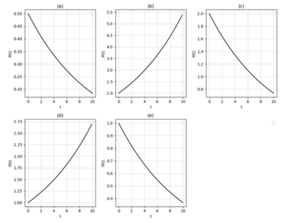
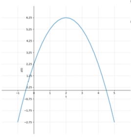
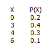
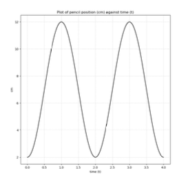

# SCIE1500 Final Examination — Semester 2, 2025

**Analytical Methods for Scientists**

---

## PART I

**Answer ALL multiple choice questions.**

---

**Question 1.** Which of the following is true about recreational fishing?

(a) The social value of recreational fishing is equal to what people spend to engage in the activity.

(b) We can estimate the value of recreational fishing based on the market value of the fish anglers catch.

(c) Recreational fishing is a non-market activity and its value is greater than what people spend to engage in the activity.

(d) Fishing sites that are farther away are preferred by recreational fishers because they are likely to be isolated sites.

(e) None of the above.

---

**Question 2.** What is true about the HIV virus?

(a) It has a high mutation rate and genetic diversity.

(b) It has killed over 30 million people worldwide since it was first confirmed in the early 1980s.

(c) There is no vaccine for the virus.

(d) All of the above.

(e) None of the above.

---

**Question 3.** What is true about the biological interplay between the HIV virus and the host?

(a) The viral load changes exponentially, both when it is increasing immediately after infection and when decreasing following the response of the immune system.

(b) The CD4+ Lymphocyte count changes linearly when it is decreasing immediately after infection and recovering briefly.

(c) Both the viral load and the CD4+ Lymphocyte count follow exponential patterns, when decreasing and increasing.

(d) (a) and (b) are correct.

(e) None of the above.

---

**Question 4.** Governments can support exploration activities by doing what?

(a) By investing in general knowledge about minerals or promoting geoscience.

(b) By subsidising drilling activities.

(c) By directly paying for exploration activities.

(d) All of the above.

(e) None of the above.

---

**Question 5.** Which of the following is true about latent variables?

(a) All latent variables have natural units of measurement.

(b) We cannot include latent variables in our mathematical modelling or analysis.

(c) Latent variables are not directly observed or measured.

(d) All of the above.

(e) None of the above.

---

**Question 6.** What is true about demographic transitions?

(a) Demographic transitions occur when a country's per capita GDP goes over the $\$2500 \; USD$ mark.

(b) Demographic transitions are about societies transitioning from high death rate and high birth rate regimes to low death rate and low birth rate regimes.

(c) Education of women and girls contributes to demographic transitions.

(d) Demographic transitions have occurred in Europe, Australia and North America, but not in Asia or other parts of the world.

(e) Both (b) and (c) are true.

---

**Question 7.** Which of the following qualify as soft economic measures (or incentive-based policy instruments) for the prevention of plastic pollution?

(a) Deposit-refund systems that encourage recycling.

(b) Taxing plastic use to make the cost higher for plastic users.

(c) Banning of plastic use for non-medical purposes.

(d) Banning of single plastic use.

(e) Both (a) and (b) are the correct answers.

---

**Question 8.** Consider a population trajectory over time ($t$) which can be described by the logistic equation: $P(t) = \frac{K}{1+Ae^{-\alpha t}}$. The values of the parameters in the model are as follows: $K=15000$, $A=120$ and $\alpha=0.15$. How many time periods would it take for this population to reach 50% of its carrying capacity? (Round your answer to a whole number.)

(a) 32 time periods

(b) 31 time periods

(c) 27 time periods

(d) 50 time periods

(e) None of the above

---

**Question 9.** Which of the following is an anthropogenic source of metal(loid) contamination in soils?

(a) Mining

(b) Sewage sludge

(c) Pesticide use

(d) Fertiliser use

(e) All of the above

---

**Question 10.** In which of the following cases is the Domain ($D$) for the function not identified correctly?

(a) $y = -3 + 6x, \; D = \{x: x \in \mathbb{R} \}$

(b) $y = \frac{(2x-1)^{1/2}}{2}-2, \; D = \{x: x \in \mathbb{R} \}$

(c) $y = \frac{2}{1-e^{-x}}, \; D = \{x \in \mathbb{R}: x \ne 0 \}$

(d) $y = e^{-0.5x+2}, \; D = \{x: x \in \mathbb{R} \}$

(e) None of the above.

---

**Question 11.** A population of bacteria ($P$) grows exponentially over time ($t$) according to the equation:

$$P(t) = 2e^{0.1t}$$

Which of the plots shown below is consistent with this growth equation? Choose one.

---

**Question 12.** We say there is a public good element in exploration activities because?

(a) The mining industry buys inputs from other industries that are good for creating jobs.

(b) The knowledge generated has wider benefits that go beyond what the companies or agents undertaking the activity hope to capture.

(c) Mining happens in remote places.

(d) Mining happens on crown land (government owned land).

(e) None of the above.

---

**Question 13.** Consider the Schaefer (1957) model of growth:

$$G(S) = g \cdot S \cdot \left(1-\frac{S}{K}\right)$$

where $G(S)$ is fish growth, $g$ is the intrinsic growth rate, $S$ is the stock level and $K$ is the carrying capacity. Which of the following statements is true?

(a) The actual fish growth rate, defined as the ratio of $G(S)$ to $S$, declines as stock increases.

(b) Fish growth (or $G(S)$) is highest when the stock ($S$) is half the maximum carrying capacity ($K$).

(c) Fish growth (or $G(S)$) is always non-negative.

(d) All of the above.

(e) Only (b) and (c) are correct.

---

**Question 14.** What is the area between the graph of $y=\ln x$ and the x-axis from $x=4$ to $x=24$? Provide an answer correct to 3 decimal places.

(a) 11.728

(b) 26.728

(c) 50.728

(d) 70.728

(e) None of the above.

---

**Question 15.** Which of the following is not among the top four threats to land quality globally?

(a) Soil erosion.

(b) Nutrient depletion.

(c) Salinisation.

(d) Acidification.

(e) Soil compaction.

---

**Question 16.** Which of the following statements is not true?

(a) For a human population to sustain its numbers, the total fertility per woman needs to be at least 2.10.

(b) A human population growing at the rate of 1% per year would double in size (roughly) every 70 years.

(c) Demographic transitions have been facilitated by the education of women and girls.

(d) Demographic transition is slowed down by urbanisation.

(e) All of the above.

---

**Question 17.** Consider the trajectory of a population ($P$) described by the logistic equation:

$$P(t) = \frac{K}{1+Ae^{-\alpha t}}$$

where $t$ is time, and $K, A$ and $\alpha$ are positive values. Which of the following statements is true?

(a) The equation can be used to describe biological growth constrained by space and competition for resources.

(b) The value $K$ represents the carrying capacity beyond which the population cannot grow.

(c) The growth in population is always non-negative, increases at first and then declines.

(d) The value of the parameter $A$ is equal to the ratio of carrying capacity to initial population less one, i.e. $\frac{K}{P(0)}-1$.

(e) All of the above.

---

**Question 18.** What determines the growth rate of a population?

(a) The nature of the species or its innate capacity for reproduction, as measured by its intrinsic rate of growth ($r$) or its $R_o$ factor.

(b) The age distribution of the population.

(c) Competition for food and space.

(d) Predation and natural disasters.

(e) All of the above.

---

**Question 19.** Consider a population that grows at the rate of 5 percent per week (i.e. $r_m = 0.05$). If the longevity of individuals in this species is 22 weeks on average, what is the $R_o$ factor for this population? $R_o$ is the rate of increase per head per generation. Provide an answer that is correct when rounded to a whole number.

(a) 12

(b) 120

(c) 2

(d) 24

(e) None of the above.

---

**Question 20.** What is the inverse of the function $f(x)=3+\frac{1}{4}x$?

(a) $f^{-1}(x)=-3+4x$

(b) $f^{-1}(x)=-3-\frac{1}{4}x$

(c) $f^{-1}(x)=\frac{1}{4}-x$

(d) $f^{-1}(x)=-12+3x$

(e) None of the above.

---

**Question 21.** What is the equation of the line that is tangent to the function $y=e^{x-2}+3$ at $x=2$?

(a) $y=-e^{x-2}$

(b) $y=x-2$

(c) $y=x+e$

(d) $y=x+1$

(e) None of the above.

---

**Question 22.** Which of the following quadratic functions does the plot shown below correspond to?

(a) $y = -4x^2 + x + \frac{81}{4}$

(b) $y = -x^2 + 5x + \frac{81}{4}$

(c) $y = -4x^2 + x + \frac{9}{4}$

(d) $y = -x^2 + 4x + \frac{9}{4}$

(e) $y = x^2 - 4x + \frac{9}{4}$

---

**Question 23.** If $f(x) = -e^{-2x+1}$ and $g(x) = -\frac{1}{2}x^2$, what is $f \circ g(x)$?

(a) $(-e^{-2x+1})(-\frac{1}{2})$

(b) $-e^{x^2+1}$

(c) $\frac{1}{2}e^{4x^2-4x+1}$

(d) $xe^{-2x+1}$

(e) None of the above.

---

**Question 24.** The crude birth rate (CBR) for a population is 38 and its crude death rate (CDR) is 14. Both the CBR and CDR figures are per thousand people. What is the rate of growth for this population?

(a) $-14\%$

(b) $-1.4\%$

(c) $24\%$

(d) $2.4\%$

(e) None of the above.

---

**Question 25.** Which of the following is not true about the function $y = (x+2)(x-3)$?

(a) Its range is $\{y \in \mathbb{R}: y \ge -6.25\}$.

(b) It is a concave up function, i.e. it opens up.

(c) The slope of its tangent at the point where $x$ is 2 is 3.

(d) Its second derivative is $y'' = 2$.

(e) None of the above.

---

**Question 26.** Which of the following is not true?

(a) Soil is essential for the production of food, fibre and fuel.

(b) Soil is a renewable resource that is difficult to restore after a severe degradation.

(c) Urbanisation, mining and agriculture are the major sources of land degradation.

(d) The rate of soil formation is many times faster than the rate of soil erosion in Western Australia.

(e) None of the above.

---

**Question 27.** Suppose the probability ($p$) that a person contracts a disease is described as a function of risk ($x$):

$$p = \frac{1}{1+e^{-3x}}$$

Which of the following statements is not correct?

(a) $p$ is $\frac{1}{2}$ if $x=0$.

(b) $p$ is below $\frac{1}{2}$ if $x$ is negative.

(c) $p$ is an increasing function of $x$.

(d) $p$ approaches zero if $x$ goes towards $-\infty$.

(e) None of the above.

---

**Question 28.** What is the derivative of the function $y = \frac{3}{4}x^4 + \frac{1}{4}x^2 - 3x + \ln x$?

(a) $y' = 12x^3 + \frac{3}{x^2} - \frac{1}{2x^{3/2}}$

(b) $y' = x^3 - 3 + \frac{1}{2}x$

(c) $y' = \frac{3}{5}x^5 - \frac{3}{2}x^2 - \frac{3}{2}x$

(d) $y' = 3x^3 + \frac{1}{2} - 3 + \frac{1}{x}$

(e) None of the above.

---

**Question 29.** Consider the sequence $a_i = 3 + 5(i-1)$ for $i = 1, 2, 3, \ldots$ How many of the terms in this sequence are greater or equal to 10 and less than or equal to 150?

(a) 27

(b) 28

(c) 29

(d) 30

(e) None of the above.

---

**Question 30.** What is a geometric sequence?

(a) A sequence of numbers with a common ratio between two consecutive numbers.

(b) A sequence of numbers with a constant consecutive difference between them.

(c) Any sequence of numbers, as long as a number is a product of the preceding number.

(d) A sequence of numbers where the ratio between the $i$-th and the $(i+1)$-th term is equal to the common ratio raised to the power of $i$.

(e) A sequence of numbers with a common ratio that is between 0 and 1.

---

**Question 31.** Which of the following statements is true?

(a) $90°$ converted to radians is equal to $\frac{1}{2}\pi$.

(b) The function $\frac{5}{2}\sin(2x)$ has an amplitude of 2.5.

(c) The period of the function $x(t) = \frac{7}{2}\cos(\pi t)$ is 2 seconds if time ($t$) is measured in seconds.

(d) The frequency of the function $x(t) = \frac{7}{2}\cos(\pi t)$ is $0.5 \text{ Hz}$ if time ($t$) is measured in seconds.

(e) All of the above are true.

---

**Question 32.** If five coins are tossed, which of the following is true?

(a) The size of the sample space is 10, i.e. $5 \times 2$.

(b) The size of the sample space is 32, i.e. $2^5$.

(c) The probability of getting exactly three heads is 0.60.

(d) The probability of getting zero heads is 0.375.

(e) None of the above.

---

**Question 33.** What is the expected value of the random variable $X$ with the probabilities of occurrence $P(X)$ shown below?

(a) 1.0

(b) 2.0

(c) 3.0

(d) 4.0

(e) None of the above.

---

**Question 34.** Consider the following Lotka-Volterra model, where the prey population is denoted by $H$ and the predator population by $P$.

$$\frac{dH}{dt} = \alpha H - \beta HP$$

$$\frac{dP}{dt} = \lambda HP - \gamma P$$

The parameter values are $\alpha = 0.15$, $\beta = 0.005$, $\lambda = 0.0005$, and $\gamma = 0.10$. Which of the following is not true?

(a) $H=0, P=0$ is a fixed point for this system.

(b) $H=200, P=30$ is a fixed point for this system.

(c) The efficiency of predation is 10%.

(d) The efficiency of predation is 0.05%.

(e) If the initial point of the system is not a fixed point, the populations oscillate with constant amplitudes forever.

(f) None of the above.

---

**Question 35.** Health experts suspect that a new variant of a virus is more infectious than an older one, which had an infection rate ($p$) of 50%, i.e. one out of two non-infected persons coming in contact with an infected person would be expected to contract the disease. Suppose you examined a sample of contact tracing data and found that out of 11 recent contact cases, 9 resulted in infections. And suppose you used your knowledge of binomial distributions to determine that the probability of observing 9 or more infections out of 11 contact cases would be $\frac{67}{2^{11}}$, or about 0.033, if the true infection rate ($p$) is indeed 0.50. If you wanted to do a hypothesis test to determine if there is empirical support for the claim that the new variant is more infectious, how would you proceed?

(a) Start with the null and alternative hypotheses set as follows: $H_0: p \le 0.50, \; H_a: p > 0.50$; then draw the conclusion that the evidence rejects the null at the 5% level of statistical significance.

(b) Start with the null and alternative hypotheses set as follows: $H_0: p = 0.50, \; H_a: p \ne 0.50$; then draw the conclusion that the evidence rejects the null at the 5% level of statistical significance.

(c) Start with the null and alternative hypotheses set as follows: $H_0: p \le 0.50, \; H_a: p > 0.50$; then draw the conclusion that the evidence is not sufficient to reject the null at the 5% level of statistical significance.

(d) Start with the null and alternative hypotheses set as follows: $H_0: p = 0.50, \; H_a: p \ne 0.50$; then draw the conclusion that the evidence is not sufficient to reject the null at the 5% level of statistical significance.

(e) Start with the null and alternative hypotheses set as follows: $H_0: p \ge 0.50, \; H_a: p < 0.50$; then draw the conclusion that the evidence is not sufficient to reject the null at the 5% level of statistical significance.

---

**Question 36.** In a research experiment on human motor behaviour, a person moves a pencil on a sheet of paper periodically between the positions 2cm and 12cm completing a round every 2 seconds. See the plot of pencil position against time below. If you make a model of the pencil's location at time $t$, $x(t) = A\cos(B(t+C)) + D$, what should be the values of $A$, $B$, $C$ and $D$ if it is known that the pencil's tip was at position $x=2\text{cm}$ at time $t=0$?

(a) $A=6, B=\pi, C=1, D=7$

(b) $A=6, B=\pi, C=1.5, D=8$

(c) $A=5, B=2\pi, C=1.5, D=7$

(d) $A=5, B=\pi, C=1, D=7$

(e) $A=12, B=2\pi, C=-1.5, D=8$

---

## PART II

**Answer ALL questions in this section.**

---

**Question 37.** Suppose the daytime variation in the number of white blood cells (lymphocytes) can be described as:

$$W'(t) = -0.15 + 0.091t - 0.009t^2 \quad \text{(Bn cells/L/hr)}$$

where *Bn* denotes billion, *L* litre and *hr* hour, and daytime is defined as between 8am ($t=0$) and 6pm ($t=10$), or the hours when clinics are open.

**(a)** Find the antiderivative of $W'(t)$.

**(b)** Suppose the patient's blood cell count at 2pm is expected to be 2.39 billion. Write the equation ($W(t)$) for the number of lymphocytes per litre at time $t$.

---

**Question 38.** A farmer is fattening 100 deer for sale. The deer are currently gaining weight at the rate of 2kg per day, but this rate of gain declines by 100 grams each day into the future. The deer currently weigh 50kg each and cost \$0.50 per animal per day in terms of feed and other operating costs. Suppose you have been asked to advise the farmer on the best time to sell the deer to get the maximum possible profit, with profit defined as the difference between total revenue from the sale of the deer and the total cost incurred between now and the time of sale. The market price of deer is expected to be \$5.00 per kg for the foreseeable future.

**(a)** Show how you would set up a profit maximisation problem for this problem. Use $t$ to denote number of days and $\pi$ to denote profit.

**(b)** Use calculus to solve the optimisation problem and determine for how many more days the farmer should keep the animals on the farm to maximise profit.

**(c)** Present the optimal values of the following: total revenue from sale of deer, total cost of maintaining the deer, and the profit.

---

**Question 39.** The demand and supply equations for a commodity are as shown below:

$$\text{Demand:} \quad Q^d = 100 - 2P$$

$$\text{Supply:} \quad Q^s = -100 + 3P$$

where $P$ is the market price per unit and $Q^d$ and $Q^s$ are the quantity demanded and supplied, respectively. Answer the following questions.

**(a)** What is the maximum price any consumer would pay for this product?

**(b)** What is the minimum price producers would consider supplying the product to the market at?

**(c)** Find the market equilibrium price and quantity values.

**(d)** What is the consumer surplus (CS) associated with the equilibrium outcomes?

**(e)** What is the producer surplus (PS) associated with the equilibrium outcomes?

---

**Question 40.** There are two food items (Food I and Food II) that can be combined to design a diet satisfying a set of minimum nutrient requirements. The nutrient content of the two food items as well as the minimum requirements are as shown below. For example, a unit of Food I offers 4 units of protein, while a unit of Food II offers 5. The diet created should have at least 100 units of protein, 400 units of energy, 10 units of Vitamin A and 5 units of calcium. The cost of food items I and II is \$2 and \$3, respectively. You have been asked to find the least costly diet that combines the two foods to provide at least the minimum dietary requirements.

| Nutrients  | Food I | Food II | Minimum Diet Requirements |
|------------|--------|---------|--------------------------|
| Protein    | 4.00   | 5.00    | 100.00                   |
| Energy     | 10.00  | 25.00   | 400.00                   |
| Vitamin A  | 0.80   | 0.40    | 10.00                    |
| Calcium    | 0.00   | 1.00    | 5.00                     |

**(a)** Formulate a linear programming (LP) problem for finding the cost minimising combination of the two food items. Use $x$ and $y$ to denote the number of food items I and II used to constitute the diet.

**(b)** Draw the feasible region for the LP problem on graph paper. The feasible region is all the combinations of Food I and Food II that satisfy the dietary requirements. The drawing should show the feasible region as a shaded area. Label the vertices of the feasible region using letters A, B, ..., so that you can easily refer to them when answering the next two questions.

**(c)** How many units of Food I and Food II should be combined to make the desired diet in the least costly way?

**(d)** How would your answer to the question above change if the cost of Food I increased to \$5 per unit while that of Food II remained unchanged?

---

**END OF EXAMINATION PAPER**
