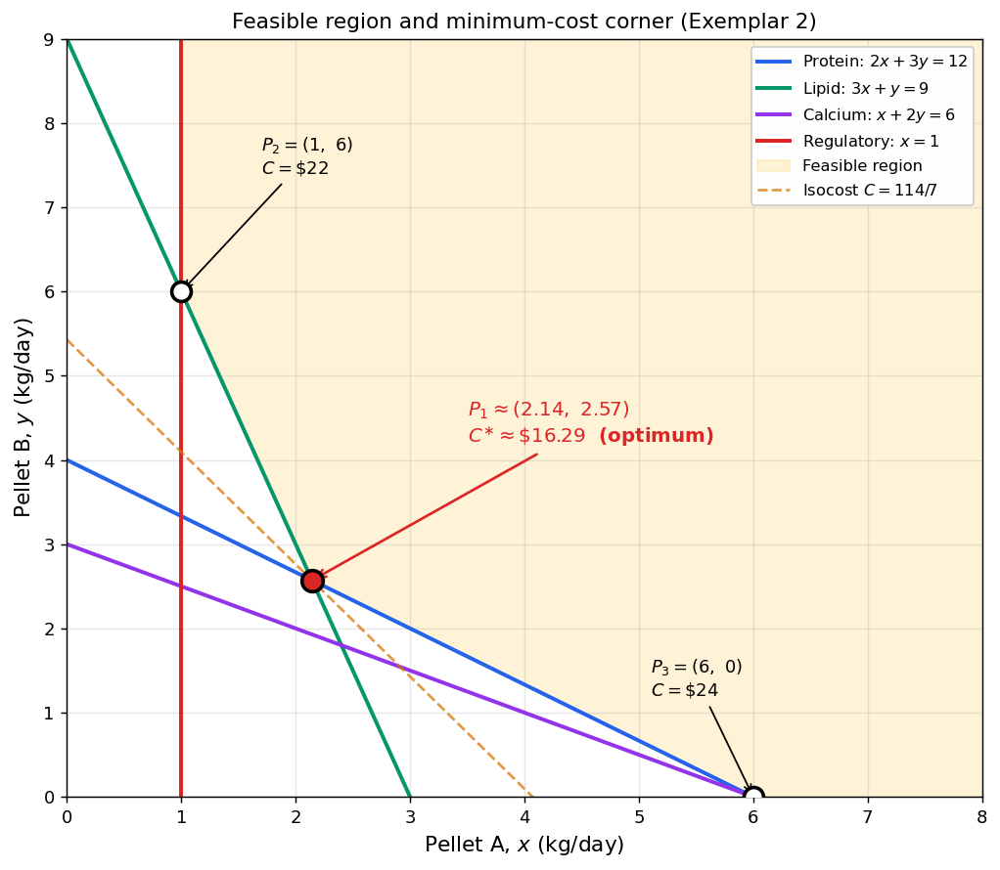

# SCIE1500 — Final Exam Study Guide
**Analytical Methods for Scientists · Semester 1, 2026**

This guide is designed to help you study **effectively**, not to memorise. It does not include practice questions from the paper, because the exam rewards *understanding*, not recall. If you can confidently tick every Learning Outcome below, you are ready.

---

## Part 1 — Exam Blueprint (what the paper looks like)

| Section     | Marks   | Format                                        | What it tests                                              |
| :---------- | :------ | :-------------------------------------------- | :--------------------------------------------------------- |
| **Part I**  | **72**  | 36 multiple-choice × 2 marks                  | Recognition and single-step skills across **all 12 weeks** |
| **Part II** | **48**  | 4 long-answer × 12 marks                      | Setting up, solving, and **interpreting** larger problems  |
| **Total**   | **120** | 2 hours (≈ 1.5 min/MCQ, ≈ 12 min/long-answer) |                                                            |

### How Part I is distributed

MCQs cover **all 12 weeks**, with a mix of single-topic and integrative questions that ask you to connect ideas across weeks. The coverage is broad rather than concentrated on any single week.

> **Implication:** No week is safe to skip. A week you ignore leaves real marks on the table.

> **Time pressure:** 2 hours is tight. Aim for about 1.5 min per MCQ and 12 min per long-answer, leaving roughly 15 min at the end to revisit flagged questions. Do not get stuck on any single MCQ — flag it and move on.

### What Part II looks like

Four extended problems, each broken into 3–5 lettered parts. Each long-answer problem is **integrative** — you'll need to combine skills from several weeks. Typical moves the marker is looking for:

1. **Set up** — define variables, write the model, state the units
2. **Solve** — carry out the calculus / algebra / LP steps
3. **Verify** — check a second-order condition, check a constraint, substitute back
4. **Interpret** — say what the number *means* in the scientific context

Partial marks are available for correct setup even if the algebra slips. Write down your reasoning.

### Materials allowed in the exam

As announced, you may bring:

- **Two double-sided A4 sheets of notes** (hand-written or typed — your choice)
- A **UWA-approved scientific calculator**
- Pens, pencils, eraser, ruler

### What to put on your two A4 sheets

You have four sides of A4 — use them well. This is your highest-leverage preparation task. Here is a prioritised list of what most students find useful to write down. You do **not** need all of it; pick what you are least confident recalling under pressure.

**Sheet 1 — Calculus (Weeks 4–7)**

- Standard derivatives: $\dfrac{d}{dx}[x^n],\ \dfrac{d}{dx}[e^{ax}],\ \dfrac{d}{dx}[\ln x],\ \dfrac{d}{dx}[\sin(kt)],\ \dfrac{d}{dx}[\cos(kt)]$
- Product rule: $(uv)' = u'v + uv'$
- Quotient rule: $(u/v)' = (u'v - uv')/v^2$
- Chain rule: $\dfrac{d}{dx}[f(g(x))] = f'(g(x))\,g'(x)$
- Standard antiderivatives (each with $+C$): $\int x^n\,dx = \dfrac{x^{n+1}}{n+1}$ (for $n \neq -1$), $\int \dfrac{1}{x}\,dx = \ln|x|$, $\int e^{ax}\,dx = \dfrac{1}{a}e^{ax}$
- Second-derivative test ($f'' > 0$ min, $f'' < 0$ max), **write this down** — easy to confuse under stress
- Fundamental Theorem of Calculus (both forms)
- Geometric series: $S_n = a\,\dfrac{r^n - 1}{r - 1}$

**Sheet 2 — Models, Probability & Algebra (Weeks 1–3, 8–12)**

- Logistic model $\dfrac{dP}{dt} = rP\!\left(1 - \dfrac{P}{K}\right)$, solution form $P(t) = \dfrac{K}{1 + A e^{-rt}}$ where $A = (K - P_0)/P_0$
- Schaefer model: growth $G(S) = gS(1 - S/K)$; MSY $= gK/4$ at $S = K/2$
- Lotka–Volterra equilibrium: $(N^*, P^*) = (\gamma/\delta,\ \alpha/\beta)$
- Doubling time: $t_d = \ln 2 / r$; half-life: $t_{1/2} = \ln 2 / |r|$ (with $r < 0$)
- Probability axioms, $P(A \cup B) = P(A) + P(B) - P(A \cap B)$
- Conditional probability and Bayes' formula (the diagnostic-testing version is worth rewriting in your own words)
- Binomial PMF: $P(X = k) = \binom{n}{k} p^k (1-p)^{n-k}$, $E[X] = np$, $\mathrm{Var}(X) = np(1-p)$
- Trig: $\sin^2\theta + \cos^2\theta = 1$; exact values at $0, \pi/6, \pi/4, \pi/3, \pi/2$; sinusoidal parameters $A, B, C, D$ in $A\cos(B(t+C)) + D$; $T = 2\pi/B$
- Market equilibrium: $Q^d = Q^s$
- Consumer surplus $= \int_0^{Q^*}(P^d(Q) - P^*)\,dQ$; Producer surplus $= \int_0^{Q^*}(P^* - P^s(Q))\,dQ$
- Quadratic formula (you *will* need it)

**What is usually *not* worth writing**

- Fully worked examples — you won't have time to copy them during the exam
- Content for a week you haven't studied — formulas you don't understand won't help
- Long prose explanations — use symbols and short captions

**Tip:** prepare your sheets *as you study*, not at the end. Every time you look up a formula while working practice problems, copy it onto your sheet. By the end of revision your sheet is effectively your study log.

---

## Part 2 — Learning Outcomes by Week

For each week below, ask yourself: *Can I do this from scratch, without notes, in about 2 minutes?* Mark each one ✅ / ⚠️ / ❌. Spend your revision time on the ⚠️ and ❌ items.

### Week 1 — Functions and the Language of Scientific Analysis
- [ ] State the **domain** and **range** of common functions (linear, quadratic, rational, root, exponential, logarithm)
- [ ] Identify which values of $x$ make a function undefined (division by zero, square root of negative, log of zero/negative)
- [ ] Form the **composite** $(f \circ g)(x)$ correctly (inner function first)
- [ ] Find the **vertex**, **intercepts**, and **range** of a quadratic function
- [ ] Recognise when a relation is *not* a function (vertical line test)

### Week 2 — Exponential and Logarithmic Functions
- [ ] Sketch $y = A e^{kt}$ and recognise growth (k > 0) vs decay (k < 0)
- [ ] Use the laws of logarithms to simplify $\ln(ab)$, $\ln(a/b)$, $\ln(a^n)$
- [ ] Convert between the continuous form $P(t) = P_0 e^{rt}$ and the doubling-time / half-life form
- [ ] Compute the continuous growth rate from a doubling time (and vice versa)
- [ ] Solve exponential equations by taking logarithms of both sides

### Week 3 — Bounded Growth (Logistic and Schaefer)
- [ ] Recognise the **logistic** model $dP/dt = rP(1 - P/K)$ and identify $r$, $K$
- [ ] State the **equilibria** of the logistic model and classify them (stable / unstable)
- [ ] Recognise the **Schaefer** model $G(S) = gS(1 - S/K)$ and interpret $g$, $K$
- [ ] Explain why growth slows as the population approaches carrying capacity
- [ ] **Invert a function** — both a simple linear function, and a logistic solution $P(t)$ to solve for the **time** $t$ at which a given population level is reached
- [ ] Identify the **vertical and horizontal asymptotes** of a rational or shifted-rational function (e.g., $f(x) = \tfrac{3}{x-2} + 5$)

### Week 4 — Limits, Continuity and the Derivative
- [ ] Evaluate a limit numerically (from a table) and symbolically
- [ ] State what "continuous at a point" means
- [ ] Differentiate a polynomial term-by-term
- [ ] Differentiate $e^x$, $\ln x$, $x^n$, and a sum of these
- [ ] Find the **tangent line** to $y = f(x)$ at a given point (value + slope)

### Week 5 — Differentiation Rules and Optimisation
- [ ] Apply the **product rule** correctly
- [ ] Apply the **quotient rule** correctly
- [ ] Apply the **chain rule** (outside · inside)
- [ ] Locate **stationary points** by solving $f'(x) = 0$
- [ ] Classify stationary points using the **second derivative test** ($f''>0$ min, $f''<0$ max)
- [ ] Set up an **optimisation** word problem: identify the objective, the decision variable, and any constraint
- [ ] Interpret the optimum in context (e.g., "the maximum profit occurs at $t^*$ days and equals …")

### Week 6 — Introduction to Integration
- [ ] Compute the **indefinite integral** of a polynomial (don't forget $+C$)
- [ ] Integrate $e^{ax}$, $1/x$, $x^n$ (for $n \neq -1$)
- [ ] Use an **initial condition** to determine $C$ and state the particular antiderivative
- [ ] Recognise integration as the reverse of differentiation

### Week 7 — Definite Integrals, Area, and Sequences
- [ ] Evaluate a definite integral $\int_a^b f(x)\,dx$ and interpret it as a **net area**
- [ ] Compute **consumer surplus** and **producer surplus** from supply/demand curves
- [ ] State and use the **Fundamental Theorem of Calculus** in both forms
- [ ] Use the **geometric series** formula $S_n = a\,(r^n - 1)/(r - 1)$ for finite sums
- [ ] Recognise when a "total over $n$ periods" problem is a geometric series

### Week 8 — Predator–Prey (Lotka–Volterra) Dynamics
- [ ] Write the Lotka–Volterra system $dN/dt = \alpha N - \beta N P$, $dP/dt = \delta N P - \gamma P$
- [ ] Identify the parameters $\alpha, \beta, \gamma, \delta$ biologically (prey growth, predation, predator death, conversion efficiency)
- [ ] Find the non-trivial **equilibrium** $(N^*, P^*) = (\gamma/\delta,\ \alpha/\beta)$
- [ ] Perform **comparative statics**: if $\alpha$ increases, what happens to $N^*$ and $P^*$?
- [ ] Explain why prey and predator populations oscillate

### Week 9 — Probability and Combinatorics
- [ ] Apply $P(A \cup B) = P(A) + P(B) - P(A \cap B)$
- [ ] Apply $P(A \cap B) = P(A)P(B)$ for **independent** events
- [ ] Use **conditional probability** $P(A|B) = P(A \cap B) / P(B)$
- [ ] Apply **Bayes' theorem** to diagnostic-testing problems (sensitivity, specificity, prevalence → PPV / NPV)
- [ ] Use binomial coefficients $\binom{n}{k}$ for counting outcomes
- [ ] Recognise when events are mutually exclusive vs independent (they are *not* the same)

### Week 10 — Random Variables and Hypothesis Testing
- [ ] Compute the **expected value** $E[X] = \sum x\,P(X=x)$
- [ ] Compute the **variance** and **standard deviation** of a discrete random variable
- [ ] Recognise the **binomial** distribution and use $X \sim \text{Bin}(n, p)$
- [ ] Compute tail probabilities such as $P(X \ge k)$ for a binomial variable
- [ ] State a null and alternative hypothesis correctly
- [ ] Given a **$p$-value** and a significance level $\alpha$, state the correct conclusion and what it means in context

### Week 11 — Trigonometry and Sinusoidal Models
- [ ] Know the exact values of $\sin$, $\cos$, $\tan$ at $0, \pi/6, \pi/4, \pi/3, \pi/2$
- [ ] Differentiate $\sin(kt)$ and $\cos(kt)$ using the chain rule
- [ ] Identify the **amplitude**, **period**, **phase shift**, and **vertical shift** of $x(t) = A\cos(B(t+C)) + D$
- [ ] Compute **period** $T = 2\pi/B$ and **frequency** $f = 1/T$
- [ ] Build a sinusoidal model from a verbal description (max, min, period, starting value)

### Week 12 — Simultaneous Equations and Linear Programming
- [ ] Solve a 2×2 linear system (substitution or elimination)
- [ ] Find a **market equilibrium** by setting supply equal to demand
- [ ] Formulate a linear-programming problem: objective, decision variables, constraints, non-negativity
- [ ] Sketch the **feasible region** and label all vertices
- [ ] Apply the **corner-point theorem** to find the optimum
- [ ] Identify which constraints are **binding** at the optimum
- [ ] Perform a simple **sensitivity analysis** when one coefficient changes

---

## Part 3 — Integrative skills (across weeks)

These are the hinge ideas that appear in the long-answer section. If you only have one day left, focus here.

1. **Rate → total**: given $dy/dt$, integrate and apply an initial condition to recover $y(t)$
2. **Optimisation with calculus**: set up $\pi(t)$, take $d\pi/dt = 0$, check $d^2\pi/dt^2 < 0$
3. **LP graphical method**: formulate → sketch → enumerate corners → evaluate objective → verify binding constraints → sensitivity
4. **Bounded-growth dynamics**: set $dS/dt = 0$ to find equilibria, interpret what happens if $S$ starts below or above $S_{\text{MSY}}$
5. **Interpret when asked**: where a question explicitly asks you to *explain* or *interpret*, a short plain-English sentence about what the number means scientifically will earn the marks. Don't pad answers with interpretation when none is requested — follow what the question asks.

---

## Part 4 — Common traps markers see

These cost students marks every year:

- ❌ Forgetting $+C$ on an indefinite integral
- ❌ Writing $dy/dx$ when the problem asks for $dP/dt$ (use the right variable)
- ❌ Dropping the chain rule on $\sin(4\pi t)$ — the derivative is $4\pi \cos(4\pi t)$, not $\cos(4\pi t)$
- ❌ LP sketch without labelled axes, boundary lines, or vertex coordinates
- ❌ Stating a stationary point is a maximum without checking the second-order condition
- ❌ Confusing "mutually exclusive" with "independent" in probability
- ❌ Stopping at the numerical answer and not writing the **interpretation sentence**
- ❌ Rounding too early — keep 4+ significant figures until the final line
- ❌ Missing units on the final answer (kg, \$/day, tonnes/year, etc.)

---

## Part 5 — A recommended 3-pass study protocol

**Pass 1 — Concepts (1 day).** Go through the checklist above. Mark ✅ / ⚠️ / ❌ honestly.

**Pass 2 — Skills (2–3 days).** For each ⚠️ item, redo one problem from the **Student Lab Handbook worksheet** for that week *without looking at the solution first*. For each ❌ item, re-read the weekly lesson and re-watch the concept video before attempting anything.

**Pass 3 — Integration (1 day).** Under timed conditions: redo the Week 10 mock exam questions; redo one lab worksheet each from Weeks 5, 7, 8, and 12 (these are among the most integrative weeks); and attempt any practice questions in the app that you previously struggled with.

---

## Part 6 — Resources you already have

- **SciQuant Assistant app** — Weekly lessons, practice questions, and the Tools tab (calculator, equation solver, graphing tool, periodic table, flashcards).
  > ⚠️ **Important — update your app.** The lessons and practice questions are being revised to reflect the enhancements made to the lecture slides throughout the semester. A new release will be available by **Tuesday 28 April**. Please **download and install the updated version** from the usual distribution link before you start your revision in earnest — the current bundled lessons will be replaced by the refreshed versions.
- **Student Lab Handbook (worksheets)** — All weekly problem briefs in one document
- **Formula Sheet** — In the Course Overview of the app
- **Week 10 Mock Exam** — Treat it as a full dress rehearsal

---

## Part 7 — Before you walk in

- Bring your student card, a **UWA-approved scientific calculator** (get it approved *before* exam day and check the battery), two pens, a pencil, and a ruler
- Arrive early
- Read the whole paper first. Note which long-answer question you're most confident on and do it first.
- Budget your time
- On MCQs — if you're stuck, eliminate the options that are obviously wrong and narrow your choice down to the remaining ones. There is no penalty for guessing.
- Show working on long-answer questions *even if* you're not confident of the final answer. Setup marks are real.

Good luck. You have done the work this semester — this exam gives you a chance to show what you now understand.

---

# Appendix — Exemplar Part II Problems (with full solutions)

These five problems are written in the **style, scope and difficulty** of Part II of the paper. They are **not** from the exam. They are designed to let you practise the full workflow:

> **set up → solve → verify → interpret**

For each problem, sit down with blank paper, set a **15-minute timer**, and work from setup to interpretation without notes or peeking — this mirrors the pace you will need on the day (12 min per Part II question, plus a small buffer for practice). If you genuinely stall before the timer ends, glance at the *hint* only; save the full solution for the post-attempt review. Do not read ahead.

---

## Exemplar Problem 1 — Optimisation (Weeks 5, 6)

**Context: optimal nitrogen rate for wheat.**

A grower manages $N = 40$ hectares of wheat and must choose the nitrogen fertiliser application rate $x$ (kg N per hectare, $x \ge 0$) that **maximises profit**. Over the relevant range, the per-hectare marginal yield response to nitrogen (in kg of extra grain per kg of N applied) is
$$\frac{dY}{dx} = 30 - 0.5\,x,$$
so the first kilogram of nitrogen gives a large yield boost and each further kilogram gives progressively less. Assume the additional yield at zero N is $Y(0) = 0$. Nitrogen costs \$2.00 per kg applied, and the extra wheat sells for \$0.40 per kg.

**(a)** [3 marks] Write the per-hectare additional-yield function $Y(x)$.

**(b)** [3 marks] Derive an expression for the total **profit** $\pi(x)$ from the 40 ha (extra revenue minus nitrogen cost).

**(c)** [3 marks] Find the nitrogen rate $x^*$ that maximises $\pi(x)$ and verify it is a maximum using the second-order condition.

**(d)** [3 marks] Compute $Y(x^*)$, the total extra revenue, the total nitrogen cost, and the maximum profit.

*Hint: $\pi(x) = 40 \times [0.40\,Y(x) - 2\,x]$. Take $d\pi/dx = 0$.*

### Solution

**Part (a) — Additional-yield function.**

Integrate the marginal response and apply $Y(0) = 0$:
$$Y(x) = \int (30 - 0.5\,x)\,dx = 30\,x - 0.25\,x^2 + C, \qquad Y(0) = 0 \;\Rightarrow\; C = 0.$$
$$\boxed{\,Y(x) = 30\,x - 0.25\,x^2 \quad (\text{kg/ha})\,}$$

**Part (b) — Total profit function.**

Per-hectare profit is extra revenue minus nitrogen cost per hectare:
$$\pi_{\text{ha}}(x) = 0.40\,Y(x) - 2\,x = 0.40(30x - 0.25x^2) - 2x = 10\,x - 0.1\,x^2.$$
Total profit over the 40 ha:
$$\boxed{\,\pi(x) = 40\,(10x - 0.1x^2) = 400\,x - 4\,x^2 \quad (\text{dollars})\,}$$

**Part (c) — Optimum nitrogen rate.**

Stationary point:
$$\pi'(x) = 400 - 8\,x = 0 \;\Longrightarrow\; x^* = 50 \text{ kg N/ha}.$$
Second-order check:
$$\pi''(x) = -8 < 0 \;\Rightarrow\; x^* = 50 \text{ is a maximum.} \;\checkmark$$

**Part (d) — Numerical values at the optimum.**

| Quantity            | Calculation                   | Value                |
| :------------------ | :---------------------------- | :------------------- |
| Extra yield per ha  | $Y(50) = 30(50) - 0.25(50)^2$ | $875$ kg/ha          |
| Total extra revenue | $40 \times 0.40 \times 875$   | $\$14{,}000$         |
| Total nitrogen cost | $40 \times 2 \times 50$       | $\$4{,}000$          |
| **Maximum profit**  | $\$14{,}000 - \$4{,}000$      | $\boxed{\$10{,}000}$ |

*Interpretation: Applying 50 kg N/ha maximises profit. Beyond that rate, the marginal yield response $dY/dx$ has fallen below the cost per kilogram of nitrogen, so each extra kg of N loses money.*

---

## Exemplar Problem 2 — Linear Programming (Week 12)

**Context: aquaculture feed blend.**

An aquaculture manager mixes two feed ingredients, Pellet A and Pellet B, in quantities $x$ and $y$ kg per tank per day. Nutrient contents, minimum daily requirements and prices are summarised below.

| Nutrient (per kg of pellet) | Pellet A | Pellet B | Minimum per tank/day |
| :-------------------------- | :------- | :------- | :------------------- |
| Protein (g)                 | 2        | 3        | 12                   |
| Lipid (g)                   | 3        | 1        | 9                    |
| Calcium (g)                 | 1        | 2        | 6                    |
| **Cost (\$/kg)**            | 4        | 3        | —                    |

In addition, a **regulatory requirement** specifies that each tank must receive **at least 1 kg of Pellet A per day** (it carries a medicated additive). The manager wants to **minimise daily cost** $C = 4x + 3y$ subject to all nutrient and regulatory constraints (and $x, y \ge 0$).

**(a)** [2 marks] Write the complete LP formulation.

**(b)** [4 marks] Sketch the feasible region, labelling all boundary lines and the corner points of the feasible region.

**(c)** [3 marks] Apply the corner-point theorem to find the minimum-cost feed mix. State $(x^*, y^*)$ and the minimum cost.

**(d)** [2 marks] Which constraints are **binding** at the optimum, and which are slack?

**(e)** [1 mark] **Sensitivity.** If the cost of Pellet B rises from \$3 to \$5 per kg (all else unchanged), recompute the minimum-cost mix.

*Hint: write each constraint as an equality, find the pairwise intersections, and test only the corners that satisfy **all four** inequality constraints simultaneously.*

### Solution

**Part (a) — LP formulation.**

$$\begin{aligned}
\min_{x,y}\quad & C = 4x + 3y \\
\text{s.t.}\quad & 2x + 3y \ge 12 && (\text{protein}) \\
& 3x + y \ge 9 && (\text{lipid}) \\
& x + 2y \ge 6 && (\text{calcium}) \\
& x \ge 1 && (\text{regulatory}) \\
& x,\ y \ge 0.
\end{aligned}$$

**Part (b) — Feasible region and corner points.**

Boundary lines:

- **Protein** $2x + 3y = 12$: passes through $(0, 4)$ and $(6, 0)$
- **Lipid** $3x + y = 9$: passes through $(0, 9)$ and $(3, 0)$
- **Calcium** $x + 2y = 6$: passes through $(0, 3)$ and $(6, 0)$
- **Regulatory** $x = 1$: vertical line

Check each candidate intersection against *all four* inequality constraints:

| Intersection      | Coordinates     | Feasible?                              |
| :---------------- | :-------------- | :------------------------------------- |
| Protein ∩ Lipid   | $(15/7,\ 18/7)$ | ✓  $P_1$                               |
| Lipid ∩ $x = 1$   | $(1,\ 6)$       | ✓  $P_2$                               |
| Protein ∩ Calcium | $(6,\ 0)$       | ✓  $P_3$                               |
| Protein ∩ $x = 1$ | $(1,\ 10/3)$    | ✗ (lipid: $3 + 10/3 \approx 6.33 < 9$) |
| Lipid ∩ Calcium   | $(12/5,\ 9/5)$  | ✗ (protein: $10.2 < 12$)               |
| Calcium ∩ $x = 1$ | $(1,\ 5/2)$     | ✗ (lipid: $3 + 2.5 = 5.5 < 9$)         |

The feasible region is bounded below by the three binding-capable constraints (protein, lipid, calcium) and on the left by the regulatory line $x = 1$. Three corners are feasible: $P_1 \approx (2.14,\ 2.57),\ P_2 = (1,\ 6),\ P_3 = (6,\ 0)$.

**Part (c) — Corner-point theorem.**

| Corner | $x$    | $y$    | $C = 4x + 3y$                         |
| :----- | :----- | :----- | :------------------------------------ |
| $P_1$  | $15/7$ | $18/7$ | $60/7 + 54/7 = 114/7 \approx \$16.29$ |
| $P_2$  | $1$    | $6$    | $4 + 18 = \$22.00$                    |
| $P_3$  | $6$    | $0$    | $24 + 0 = \$24.00$                    |

$$\boxed{\,(x^*, y^*) = (15/7,\ 18/7) \approx (2.14,\ 2.57)\ \text{kg/tank/day}; \quad C^* \approx \$16.29\,}$$

**Part (d) — Binding and slack constraints at $P_1$.**

- Protein: $2(15/7) + 3(18/7) = 84/7 = 12$ — **binding**
- Lipid: $3(15/7) + 18/7 = 63/7 = 9$ — **binding**
- Calcium: $15/7 + 36/7 = 51/7 \approx 7.29 > 6$ — slack by $9/7$
- Regulatory: $x = 15/7 \approx 2.14 > 1$ — slack by $8/7$

**Part (e) — Sensitivity to Pellet B price.**

New objective $C' = 4x + 5y$. Re-evaluate the three feasible corners (the feasible region is unchanged):

| Corner | $C' = 4x + 5y$                        |
| :----- | :------------------------------------ |
| $P_1$  | $60/7 + 90/7 = 150/7 \approx \$21.43$ |
| $P_2$  | $4 + 30 = \$34.00$                    |
| $P_3$  | $24 + 0 = \$24.00$                    |

**Optimum remains at $P_1$**, new cost $\approx \$21.43$.

*Interpretation: Even a ~67% rise in Pellet B's price does not shift the optimum. The rule from the corner-point theorem is: the optimum changes only when the isocost line $4x + c_B\,y = C$ becomes flatter (or steeper) than one of the two constraints binding at the current optimum. At $P_1$ the binding constraints are protein ($2x + 3y = 12$, slope $-2/3$) and lipid ($3x + y = 9$, slope $-3$). The isocost slope is $-4/c_B$. The optimum stays at $P_1$ as long as $-3 \le -4/c_B \le -2/3$, i.e.\ $4/3 \le c_B \le 6$. For $c_B > 6$ the optimum jumps to $P_3 = (6,\,0)$ (drop Pellet B altogether); for $c_B < 4/3$ it jumps to $P_2 = (1,\,6)$ (use only the regulatory minimum of Pellet A). Since \$5 lies inside $[4/3,\,6]$, the mix is unchanged; the cost simply rises from \$16.29 to \$21.43.*

---

## Exemplar Problem 3 — Bounded Growth Dynamics (Weeks 3, 7)

**Context: commercial kangaroo harvest on a rangeland station.**

A red kangaroo population of size $S$ (animals) on a large pastoral property grows logistically, and is harvested each year by a licensed commercial operator:
$$\frac{dS}{dt} = r\,S\!\left(1 - \frac{S}{K}\right) - H,$$
where $r = 0.4$ per year is the intrinsic growth rate, $K = 500$ animals is the rangeland's carrying capacity, and $H$ is the annual cull quota (animals removed per year) set by the wildlife agency.

**(a)** [3 marks] Find the **maximum sustainable yield** (MSY) — the largest constant harvest the population can support at equilibrium ($dS/dt = 0$) — and the population $S_{\mathrm{MSY}}$ at which it is achieved. Show that $\mathrm{MSY} = rK/4$ and $S_{\mathrm{MSY}} = K/2$.

**(b)** [3 marks] The current population is $S_0 = 400$. If the agency sets $H$ equal to the MSY from part (a), compute $dS/dt$ at $S = 400$. Does the population grow or shrink, and toward what long-run level?

**(c)** [3 marks] Suppose instead the agency wants to *hold* the population at $S = 400$ (to keep a viable breeding stock while avoiding overgrazing at $K$). What annual cull $H$ just achieves that?

**(d)** [3 marks] Each harvested animal yields a carcass sold for \$300. Compute the annual revenue of the industry when the quota is set at MSY. In one sentence, explain why setting $H$ **above** MSY would eventually collapse the population.

*Hint: MSY is the maximum of $G(S) = r S\,(1 - S/K)$, which occurs at $S = K/2$.*

### Solution

**Part (a) — Maximum sustainable yield.**

At equilibrium $dS/dt = 0 \;\Rightarrow\; H = G(S) \equiv r\,S\,(1 - S/K)$. Maximise $G$:
$$G'(S) = r - \tfrac{2rS}{K} = 0 \;\Longrightarrow\; S_{\mathrm{MSY}} = \tfrac{K}{2} = 250\ \text{animals}.$$
Second derivative $G''(S) = -2r/K < 0$ confirms a maximum. Therefore
$$\boxed{\,\mathrm{MSY} = G(K/2) = \tfrac{rK}{4} = \tfrac{0.4 \times 500}{4} = 50\ \text{animals/year}\,}$$

**Part (b) — Dynamics at $S_0 = 400$, $H = 50$.**

$$\frac{dS}{dt}\bigg|_{S=400} = 0.4(400)\!\left(1 - \tfrac{400}{500}\right) - 50 = 160 \times 0.2 - 50 = 32 - 50 = -18\ \text{animals/year}.$$
**The population is shrinking by 18 animals/year.** Because $H = 50$ equals MSY, the harvest line $H = 50$ is *tangent* to the recruitment curve $G(S) = rS(1 - S/K)$ at $S = S_{\mathrm{MSY}} = 250$. Setting $G(S) = 50$ gives $S^2 - 500S + 62{,}500 = 0$, a perfect square with the single (double) root $S = 250$. So there is only **one** equilibrium under this policy. Since $G(S) < 50$ for every $S \ne 250$, we have $dS/dt < 0$ for all $S > 250$ (and for all $S < 250$ as well): from $S_0 = 400$ the population declines monotonically and asymptotically approaches $S = 250$ from above. This equilibrium is only **semi-stable** (tangent): any perturbation below $250$ would send the population crashing to extinction, so operating at MSY carries no safety margin.

**Part (c) — Quota needed to hold $S = 400$.**

$$H = G(400) = 0.4(400)\!\left(1 - \tfrac{400}{500}\right) = 160 \times 0.2 = 32\ \text{animals/year}.$$
This is **less than** MSY ($32 < 50$), as expected: populations above $S_{\mathrm{MSY}}$ have lower recruitment and so support smaller sustainable harvests.

**Part (d) — Annual revenue at MSY.**

$$\text{Annual revenue} = 50 \times \$300 = \boxed{\$15{,}000\ \text{per year}}.$$

*Interpretation: Setting $H > \mathrm{MSY}$ initially gives higher returns, but the population falls; once $S$ drops below $S_{\mathrm{MSY}} = 250$, the now-reduced recruitment can no longer keep up with the same cull and the population collapses — together with the industry that depends on it.*

---

## Exemplar Problem 4 — Rate → Total with Initial Condition (Weeks 6, 7)

**Context: drug clearance.**

After an intravenous dose, the plasma concentration $c(t)$ (mg/L) of a drug changes at rate
$$\frac{dc}{dt} = -0.5 + 0.06\,t - 0.003\,t^2 \quad (\text{mg/L per hour}),\qquad t \ge 0.$$
A measurement at $t = 2$ hours gives $c(2) = 7.80$ mg/L.

**(a)** [3 marks] Find the general antiderivative $c(t)$, including the integration constant $C$.

**(b)** [3 marks] Use $c(2) = 7.80$ to determine $C$ and state the particular solution.

**(c)** [2 marks] Compute $c(0)$ and $c(10)$.

**(d)** [2 marks] Interpret biologically what the **sign** of $dc/dt$ at $t = 0$ and at $t = 10$ says about how the plasma concentration is changing.

**(e)** [2 marks] Sketch $c(t)$ on $0 \le t \le 20$ hours, indicating the measurement at $t = 2$ and any interior minimum.

### Solution

**Part (a) — General antiderivative.**

$$c(t) = \int \left(-0.5 + 0.06\,t - 0.003\,t^2\right) dt = -0.5\,t + 0.03\,t^2 - 0.001\,t^3 + C.$$

**Part (b) — Particular solution.**

At $t = 2$: $c(2) = -1 + 0.12 - 0.008 + C = -0.888 + C = 7.80 \;\Rightarrow\; C = 8.688$.

$$\boxed{\,c(t) = -0.5\,t + 0.03\,t^2 - 0.001\,t^3 + 8.688 \quad (\text{mg/L})\,}$$

**Part (c) — Values at $t = 0$ and $t = 10$.**

| $t$ (h) | Calculation          | $c(t)$ (mg/L) |
| :------ | :------------------- | :------------ |
| $0$     | $0 + 0 - 0 + 8.688$  | $8.688$       |
| $10$    | $-5 + 3 - 1 + 8.688$ | $5.688$       |

**Part (d) — Interpretation of the rate's sign.**

| $t$ (h) | $dc/dt$ (mg/L per h)      | Biological meaning                                           |
| :------ | :------------------------ | :----------------------------------------------------------- |
| $0$     | $-0.5 + 0 - 0 = -0.5$     | Concentration **falling rapidly** immediately after dose.    |
| $10$    | $-0.5 + 0.6 - 0.3 = -0.2$ | Still **falling**, but more slowly — clearance is weakening. |

**Part (e) — Sketch guidance.**

Does an interior minimum exist? Solve $dc/dt = 0$:
$$-0.003\,t^2 + 0.06\,t - 0.5 = 0 \;\Longleftrightarrow\; t^2 - 20\,t + \tfrac{500}{3} = 0.$$
Discriminant $= 400 - 4 \times \tfrac{500}{3} = 400 - 666.\overline{6} < 0 \;\Rightarrow\;$ **no real root**.

Therefore $dc/dt < 0$ for all $t \ge 0$: $c(t)$ is **monotonically decreasing** on $[0, 20]$. The minimum on this interval is at $t = 20$:
$$c(20) = -10 + 12 - 8 + 8.688 = 2.688\ \text{mg/L}.$$

Sketch: curve starts at $c(0) = 8.688$, passes through $(2,\ 7.80)$, and decreases smoothly to $(20,\ 2.688)$.

*Learning point: always check whether the stationary point of $dc/dt$ actually lies in your domain. When the derivative is a quadratic function, a negative discriminant means the rate never changes sign and the function is monotonic.*

---

## Exemplar Problem 5 — Inflow–Outflow Dynamics and Long-Run Equilibrium (Weeks 6, 7)

**Context: lake nutrient dilution.**

A small lake of constant volume $V = 2{,}000{,}000$ L receives fertiliser run-off carrying nutrient at a steady rate of $5{,}000$ mg per hour. The lake is well-mixed (the concentration is uniform everywhere) and drains to a river; drainage removes nutrient at a rate proportional to the current concentration, with proportionality constant $0.05$ per hour. Let $C(t)$ denote the nutrient concentration in the lake (mg/L) at time $t$ (hours). The lake is initially clean: $C(0) = 0$.

**(a)** [3 marks] Starting from a mass balance on the nutrient in the lake (rate in minus rate out), show that the concentration satisfies
$$\frac{dC}{dt} = 0.0025 - 0.05\,C.$$

**(b)** [2 marks] Find the long-run concentration $C_{\mathrm{eq}}$ that the lake approaches as $t \to \infty$.

**(c)** [4 marks] Solve the differential equation in part (a) by separation of variables, using the initial condition $C(0) = 0$, and write $C(t)$ explicitly (no integrals or derivatives remaining).

**(d)** [3 marks] Compute the time $t_{90}$ at which the concentration reaches $90\%$ of the long-run value.

*Practice note: this problem shares its mathematical structure (linear first-order ODE, separation of variables, exponential approach to a steady state) with the draining-water-tank question on the **Week 10 Mock Exam**. If you work this one cleanly, revisit the mock paper — you should find the same pattern and very similar algebra.*

### Solution

**Part (a) — Mass balance.**

Let $M(t)$ (mg) be the total mass of nutrient in the lake. The volume $V$ is constant and the lake is well-mixed, so $C(t) = M(t)/V$ and $dM/dt = V\,dC/dt$. The mass balance is:
$$\frac{dM}{dt} = (\text{rate in}) - (\text{rate out}) = 5000 - 0.05\,M.$$
Dividing by $V = 2 \times 10^6$:
$$\frac{dC}{dt} = \frac{5000}{2 \times 10^6} - 0.05\,\frac{M}{V} = 0.0025 - 0.05\,C.$$
$$\boxed{\,\frac{dC}{dt} = 0.0025 - 0.05\,C \quad (\text{mg/L per hour})\,}$$

**Part (b) — Long-run equilibrium concentration.**

At equilibrium, $dC/dt = 0$:
$$0 = 0.0025 - 0.05\,C_{\mathrm{eq}} \;\Longrightarrow\; \boxed{\,C_{\mathrm{eq}} = \frac{0.0025}{0.05} = 0.05\ \text{mg/L}\,}$$

**Part (c) — Explicit solution by separation of variables.**

In principle we can just separate the ODE directly:
$$\frac{dC}{0.0025 - 0.05\,C} = dt,$$
integrate both sides, and solve for $C$. That works fine. But the algebra is much cleaner — and the *meaning* of the answer much more transparent — if we first factor out the coefficient of $C$. Because $0.0025 = 0.05 \times C_{\mathrm{eq}}$ (from part (b)), we can rewrite the right-hand side as
$$\frac{dC}{dt} = 0.05\,(C_{\mathrm{eq}} - C).$$
This step is **not strictly necessary**, but it has two payoffs:

1. the integral becomes a single clean logarithm of $C_{\mathrm{eq}} - C$, and
2. it reveals the pattern at the heart of every "approach-to-equilibrium" problem: *the rate of change is proportional to the gap from equilibrium*.

Recognise that pattern once, and you can reuse it for cooling, drug infusion, pollutant dilution, and lake nutrients alike.

Separate:
$$\frac{dC}{C_{\mathrm{eq}} - C} = 0.05\,dt.$$
Integrate both sides:
$$-\ln|C_{\mathrm{eq}} - C| = 0.05\,t + A \;\Longrightarrow\; C_{\mathrm{eq}} - C = B\,e^{-0.05\,t},$$
where $B$ is a constant to be fixed by the initial condition. Apply $C(0) = 0$: $C_{\mathrm{eq}} - 0 = B \Rightarrow B = C_{\mathrm{eq}} = 0.05$. Therefore
$$\boxed{\,C(t) = C_{\mathrm{eq}}\,(1 - e^{-0.05\,t}) = 0.05\,(1 - e^{-0.05\,t}) \quad (\text{mg/L})\,}$$

**Part (d) — Time to 90% of the long-run value.**

Set $C(t_{90}) = 0.9\,C_{\mathrm{eq}} = 0.045$:
$$0.05\,(1 - e^{-0.05\,t_{90}}) = 0.045 \;\Longrightarrow\; 1 - e^{-0.05\,t_{90}} = 0.9 \;\Longrightarrow\; e^{-0.05\,t_{90}} = 0.1.$$
Take natural logs:
$$-0.05\,t_{90} = \ln(0.1) = -\ln 10 \;\Longrightarrow\; t_{90} = \frac{\ln 10}{0.05} \approx \frac{2.3026}{0.05} \approx \boxed{46.05\ \text{hours}}.$$

*Interpretation: The lake approaches $C_{\mathrm{eq}} = 0.05$ mg/L exponentially, and reaches 90% of this long-run level after about $46$ hours. The mathematical structure here — separation of variables on a linear first-order ODE, giving an exponential approach to a steady state — is the same as the draining-tank problem on the **Week 10 Mock Exam**. Revisit that paper: you should find the same setup and very similar algebra, even though the physical context is completely different.*
