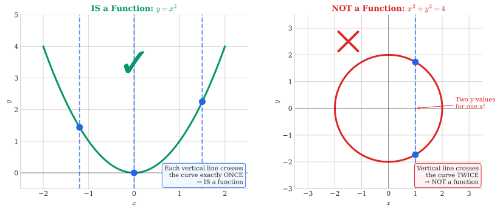
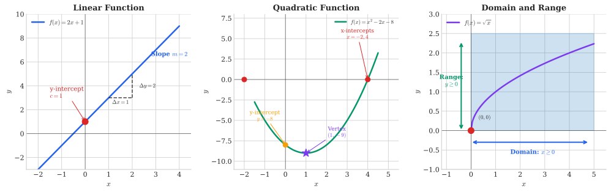

# Week 1: Functions and the Language of Scientific Analysis

## Act I: Understanding Systems — Chapter 1

> *"The first task of any analytical scientist is to describe what they observe. Functions give us that language."*

---

## Theme: "Understanding Functional Relationships"

**Science Context:** Ocean plastic pollution, global production data, Australian coastal management

**Learning Outcomes:** At the end of this week you should be able to:

1. Understand the definition of a function and use function notation
2. Identify the domain and range of a function from equations and graphs
3. Recognise and work with linear functions, including slope as a rate of change
4. Recognise and work with quadratic functions, including vertex, intercepts and symmetry
5. Identify even and odd functions and explain their symmetry properties
6. Apply physical domain constraints when modelling real-world phenomena

**Exam Alignment:** Q10, Q22, Q25

---

## 1. The Challenge: Ocean Plastic Pollution

### Why Study This Problem?

Our oceans provide humanity with extraordinary benefits: over 50% of the world's oxygen, climate regulation across 70% of Earth's surface, $282 billion in economic activity (US alone), and food security for billions. Yet these vital systems face growing threats—chief among them, **plastic pollution**.

Consider the scale of the problem:

- We produce **200 times more plastic** than we did in 1950
- An estimated **4.8 to 12.7 million metric tonnes** of plastic entered the oceans in 2010 alone (Jambeck et al., 2015)
- Six major **plastic garbage patches** now exist in ocean gyres
- Some projections suggest there could be **more plastic than fish** (by weight) in our oceans by 2050

As analytical scientists, our job isn't just to be alarmed—it's to *quantify*, *model*, and ultimately *inform decisions*. The Reisser et al. (2013) study of Australian waters demonstrates this approach: researchers collected surface samples, then used mathematical models to estimate depth-integrated plastic concentrations using the function:

$$C_i = \frac{C_s}{1 - e^{-d \cdot w_b \cdot A_0^{-1}}}$$

where $C_s$ is surface concentration, $d$ is sampling depth, $w_b$ is buoyant velocity of plastics, and $A_0$ is near-surface turbulence. This single equation captures how surface measurements relate to total ocean plastic—**that's the power of functions**.

### The Data We'll Explore

This week, you'll work with two real datasets:

1. **Global Plastics Production (1950–2015)**: Annual production in metric tonnes, showing the dramatic growth trajectory
2. **Jambeck et al. (2015) Table 1**: Country-level data on plastic waste generation and mismanagement for the top 20 polluting nations

These data will serve as our laboratory for understanding functions, domains, and the mathematical relationships that underpin environmental science.

---

## 2. What Is a Function?

A **function** $f$ is a rule that assigns to each input value $x$ (from a set called the **domain**) exactly one output value $f(x)$ (in a set called the **range**).

$$f: \text{Domain} \to \text{Range}$$

### The Formal Definition

We say $y$ is a function of $x$ if each value of $x$ gives **only one** value of $y$. This distinguishes functions from general relationships.

**Example of a function:** $y = 2x + 1$  
When $x = 2$, we get exactly $y = 5$. Each input yields one output.

**Example that is NOT a function:** $x^2 + y^2 = 1$ (a circle)  
When $x = 0$, we get $y = \pm 1$. Two outputs for one input—not a function.

### The Vertical Line Test

A graph represents a function if and only if **no vertical line intersects the curve more than once**. If a vertical line can hit the graph twice, the same $x$-value produces two $y$-values, violating the function definition.



### Domain and Range

- **Domain $D$**: The set of all valid input values for which $f$ can be computed
- **Range $R$**: The set of all possible output values that $f$ can produce

**Interval Notation:**
- Closed interval: $x \in [a, b] \Rightarrow a \leq x \leq b$
- Open interval: $x \in (a, b) \Rightarrow a < x < b$
- Semi-open interval: $x \in (a, b] \Rightarrow a < x \leq b$

### Examples

1. $f(x) = x^2$: Domain $D = \{x : x \in \mathbb{R}\}$, Range $R = \{y \in \mathbb{R} : y \geq 0\}$
2. $f(x) = \sqrt{x}$: Domain $D = \{x : x \geq 0, x \in \mathbb{R}\}$, Range $R = \{y \in \mathbb{R} : y \geq 0\}$
3. $f(x) = 2^x$: Domain $D = \{x : x \in \mathbb{R}\}$, Range $R = \{y \in \mathbb{R} : y > 0\}$



---

## 3. Linear Functions

### General Form

$$f(x) = mx + c$$

where:
- $m$ is the **slope** (rate of change)
- $c$ is the **y-intercept**

**Domain:** $D = \{x : x \in \mathbb{R}\}$  
**Range:** $R = \{y : y \in \mathbb{R}\}$

### Scientific Meaning

Linear functions describe **constant rates of change**. If a quantity increases by the same amount in each time period, the relationship is linear.

### Pollution Context: Modelling Plastic Production Trends

Looking at the global plastics production data from 1950–1970, one might approximate early growth as roughly linear. However, examining the full dataset reveals this is inadequate—production accelerates over time, suggesting we need more sophisticated function types.

**Example:** Suppose we model early plastic production as:
$$P(t) = 2 + 0.5t \quad \text{(million tonnes, where } t = 0 \text{ is 1950)}$$

At $t = 0$: $P(0) = 2$ million tonnes  
At $t = 20$: $P(20) = 12$ million tonnes

But the actual 1970 production was 35 million tonnes—linear growth drastically underestimates reality.

---

## 4. Quadratic Functions

### General Form

$$f(x) = ax^2 + bx + c$$

**Domain:** $D = \{x : x \in \mathbb{R}\}$  
**Range:** Depends on $a$; if $a > 0$, the parabola opens upward and $R = \{y : y \geq y_{vertex}\}$

### Key Features

1. **Vertex (turning point):** Located at $x = -\frac{b}{2a}$
2. **Concavity:** Opens upward if $a > 0$, downward if $a < 0$
3. **X-intercepts (roots):** Found via the quadratic formula:
$$x = \frac{-b \pm \sqrt{b^2 - 4ac}}{2a}$$
4. **Y-intercept:** The value $c$ (when $x = 0$)

### Sketching a Quadratic

1. Find x-intercepts (if any): set $y = 0$ and solve for $x$
2. Find y-intercept: set $x = 0$ and solve for $y$
3. Find the vertex: $x_{vertex} = -\frac{b}{2a}$, then compute $y_{vertex}$
4. Note: If two x-intercepts exist, their midpoint is the x-coordinate of the vertex

### Example: $y = x^2 - 2x - 8$

**X-intercepts:** $0 = x^2 - 2x - 8 = (x-4)(x+2)$, so $x = 4$ or $x = -2$  
**Y-intercept:** $y = 0 - 0 - 8 = -8$  
**Vertex:** $x = -\frac{-2}{2(1)} = 1$, then $y = 1 - 2 - 8 = -9$

The vertex is at $(1, -9)$, and the parabola opens upward since $a = 1 > 0$.

### Scientific Meaning

Quadratic functions model **accelerating or decelerating change**—the rate of change itself is changing. This describes many real phenomena:

- Cleanup efficiency that peaks then declines
- Fish growth that accelerates then slows (foreshadowing the Schaefer model)
- Accumulated plastic that grows at an increasing rate

---

## 5. Function Symmetry

### Even Functions

A function is **even** if $f(-x) = f(x)$ for all $x$ in the domain.

- Graph is symmetric about the **y-axis**
- Example: $f(x) = x^2$

### Odd Functions

A function is **odd** if $f(-x) = -f(x)$ for all $x$ in the domain.

- Graph is symmetric about the **origin**
- Example: $f(x) = x^3$

Understanding symmetry can simplify analysis and help identify function types from graphical data.

---

## 6. Domain Restrictions in Scientific Modelling

**Getting domains right is essential for valid science.** A model predicting negative concentrations or undefined values is scientifically meaningless.

### Common Restrictions

| Expression Type | Restriction | Example |
|----------------|-------------|---------|
| $\frac{1}{g(x)}$ | $g(x) \neq 0$ | $\frac{1}{x-2}$: $x \neq 2$ |
| $\sqrt{g(x)}$ | $g(x) \geq 0$ | $\sqrt{x-3}$: $x \geq 3$ |
| $\ln(g(x))$ | $g(x) > 0$ | $\ln(x+1)$: $x > -1$ |

### Example: Identifying Domain

For $f(x) = \sqrt{x - 1}$:

**Step 1:** The square root requires $x - 1 \geq 0$  
**Step 2:** Solving: $x \geq 1$  
**Domain:** $D = \{x \in \mathbb{R} : x \geq 1\}$

### Physical Domain Constraints

Beyond mathematical restrictions, physical constraints often limit domains further:

- Time: $t \geq 0$ (can't measure before an experiment starts)
- Population: $P \geq 0$ (populations can't be negative)
- Concentration: $C \geq 0$
- Proportions: $0 \leq p \leq 1$

The Jambeck data illustrates this: coastal population, waste generation rates, and mismanaged plastic waste are all inherently non-negative quantities.

---

## 7. Python: Visualizing Global Plastic Production

As analytical scientists, we don't just calculate—we **visualize**. The lab exercises use pandas to work with the real datasets. Here's a preview of plotting the global plastics production data:

```python
import pandas as pd
import matplotlib.pyplot as plt

# Read the data from GitHub (works in Google Colab and local Jupyter)
url = "https://raw.githubusercontent.com/ahailu95/scie1500-content/main/SCIE1500Materials/Week_1/LabFiles/global-plastics-production.csv"
gpp = pd.read_csv(url)

# Create time trend and scaled production variables
gpp["t"] = gpp["Year"] - 1949  # t = 1 for 1950
gpp["GPP (MMT)"] = gpp["GPP (MT)"] / 1_000_000  # Convert to million metric tonnes

# Create the plot
gpp.plot(x="Year", 
         y="GPP (MMT)",
         title="Global Plastic Production (1950-2015)",
         xlabel="Year",
         ylabel="Production (Million Metric Tonnes)",
         kind="line",          
         grid=True,
         color="red",
         legend=False)

plt.tight_layout()
plt.show()
```

**What you'll observe:** The trajectory is clearly **not linear**—production accelerates dramatically, especially from the 1970s onward. This motivates our study of exponential and other function types in coming weeks.

---

## 8. Looking Ahead: From Functions to Growth Models

This week, you've learned to:
- Define and recognize functions
- Work with linear and quadratic function forms
- Identify valid domains from mathematical and physical constraints
- Use the vertical line test
- Understand function symmetry

**In Week 2**, you'll add logarithmic and logistic functions—essential for modeling *bounded* growth where populations or accumulations can't grow forever.

**In Week 3**, you'll encounter the **Schaefer Growth Model** for fish populations—a quadratic function that describes how fish stocks grow when limited by carrying capacity. You'll use the function skills from this week (domains, quadratics, vertex formula) to analyse it.

**The journey of the analytical scientist has begun.**

---

## Key Formulas Summary

| Concept | Formula/Definition |
|---------|-------------------|
| Function definition | Each $x$ gives exactly one $y$ |
| Linear function | $f(x) = mx + c$ |
| Quadratic function | $f(x) = ax^2 + bx + c$ |
| Quadratic vertex | $x = -\frac{b}{2a}$ |
| Quadratic formula | $x = \frac{-b \pm \sqrt{b^2 - 4ac}}{2a}$ |
| Even function | $f(-x) = f(x)$ |
| Odd function | $f(-x) = -f(x)$ |

---

## References

- Jambeck, J.R., et al. (2015). Plastic waste inputs from land into the ocean. *Science*, 347(6223), 768-771.
- Reisser, J., et al. (2013). Marine Plastic Pollution in Waters around Australia. *PLoS ONE*, 8(11): e80466.

---

*Next: Week 2 — Logarithmic and Logistic Functions: Modeling Bounded Growth*
