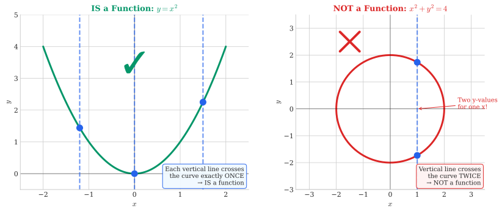
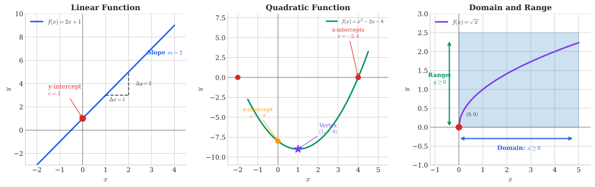

# Week 1: Functions and the Language of Scientific Analysis

## Act I: Understanding Systems — Chapter 1

> *"The first task of any analytical scientist is to describe what they observe. Functions give us that language."*

---

## Theme: "Understanding Functional Relationships"

**Science Context:** Ocean plastic pollution, global production data, Australian coastal management

**Learning Outcomes:** At the end of this week you should be able to:

1. Understand the definition of a function and use function notation
2. Identify the domain and range of a function from equations and graphs
3. Recognise and work with linear functions, including slope as a rate of change
4. Recognise and work with quadratic functions, including vertex, intercepts and symmetry
5. Identify even and odd functions and explain their symmetry properties
6. Apply physical domain constraints when modelling real-world phenomena

---

> **📓 About "Try it in Python" boxes:** Throughout this lesson, these boxes reference specific code examples by ID — e.g. **W1-CS03** means *Week 1, Code Snippet 3*. Find the matching code under **Notes → Python Code Snippets** for this week; each entry there is labelled with its ID.

## 1. The Challenge: Ocean Plastic Pollution

### Why Study This Problem?

Our job is not only to notice that plastic pollution matters, but to frame it in a way that leads naturally to mathematical modelling.

- Our oceans are foundational to oxygen production, climate regulation, food systems, and economic activity.
- Global plastic production is now about 200 times larger than it was in 1950.
- An estimated 4.8 to 12.7 million metric tonnes of plastic entered the oceans in 2010 alone.
- Plastic pollution is therefore a quantitative science problem, not only an environmental one.
- This week uses that context to introduce functions as tools for describing, modelling, and interpreting real systems.

Additional scale markers help underline the urgency:

- Six major **plastic garbage patches** now exist in ocean gyres
- Some projections suggest there could be **more plastic than fish** (by weight) in our oceans by 2050

As analytical scientists, our job isn't just to be alarmed—it's to *quantify*, *model*, and ultimately *inform decisions*. The Reisser et al. (2013) study of Australian waters demonstrates this approach: researchers collected surface samples, then used mathematical models to estimate depth-integrated plastic concentrations using the function:

$$C_i = \frac{C_s}{1 - e^{-d \cdot w_b \cdot A_0^{-1}}}$$

where $C_s$ is surface concentration, $d$ is sampling depth, $w_b$ is buoyant velocity of plastics, and $A_0$ is near-surface turbulence. This single equation captures how surface measurements relate to total ocean plastic—**that's the power of functions**.

The core ideas from that study are worth stating explicitly:

- Reisser et al. (2013) sampled plastic around Australia using surface net tows.
- The key scientific issue is that wind mixing pushes buoyant plastic below the surface, so raw surface counts underestimate total plastic load.
- The mathematical move is to use a function that maps measured surface concentration to a depth-integrated estimate.
- Their reported surface concentration was 4,256 pieces/km², while the corrected depth-integrated estimate was 8,966 pieces/km².
- This is the teaching pivot for Week 1: mathematics changes what scientists conclude from the same data.

### The Data We'll Explore

This week, you'll work with two real datasets:

1. **Global Plastics Production (1950–2015)**: Annual production in metric tonnes, showing the dramatic growth trajectory
2. **Jambeck et al. (2015) Table 1**: Country-level data on plastic waste generation and mismanagement for the top 20 polluting nations

These data will serve as our laboratory for understanding functions, domains, and the mathematical relationships that underpin environmental science.

---


## 2. What Is a Function?

A **function** $f$ is a rule that assigns to each input value $x$ (from a set called the **domain**) exactly one output value $f(x)$ (in a set called the **range**).

$$f: \text{Domain} \to \text{Range}$$

The core Week 1 ideas can be summarised compactly:

- A function assigns each valid input exactly one output.
- We write this idea as $f : \mathrm{Domain} \to \mathrm{Range}$.
- The **domain** is the set of all valid input values.
- The **range** is the set of outputs the function can actually produce.
- In science, those sets are not just algebraic; they are constrained by what is physically meaningful.
- A graph fails to represent a function if one input corresponds to more than one output.

### The Formal Definition

We say $y$ is a function of $x$ if each value of $x$ gives **only one** value of $y$. This distinguishes functions from general relationships.

**Example of a function:** $y = 2x + 1$  
When $x = 2$, we get exactly $y = 5$. Each input yields one output.

**Example that is NOT a function:** $x^2 + y^2 = 1$ (a circle)  
When $x = 0$, we get $y = \pm 1$. Two outputs for one input—not a function.

### The Vertical Line Test

A graph represents a function if and only if **no vertical line intersects the curve more than once**. If a vertical line can hit the graph twice, the same $x$-value produces two $y$-values, violating the function definition.



### Domain and Range

- **Domain $D$**: The set of all valid input values for which $f$ can be computed
- **Range $R$**: The set of all possible output values that $f$ can produce

**Interval Notation:**
- Closed interval: $x \in [a, b] \Rightarrow a \leq x \leq b$
- Open interval: $x \in (a, b) \Rightarrow a < x < b$
- Semi-open interval: $x \in (a, b] \Rightarrow a < x \leq b$

### Examples

1. $f(x) = x^2$: Domain $D = \{x : x \in \mathbb{R}\}$, Range $R = \{y \in \mathbb{R} : y \geq 0\}$
2. $f(x) = \sqrt{x}$: Domain $D = \{x : x \geq 0, x \in \mathbb{R}\}$, Range $R = \{y \in \mathbb{R} : y \geq 0\}$
3. $f(x) = 2^x$: Domain $D = \{x : x \in \mathbb{R}\}$, Range $R = \{y \in \mathbb{R} : y > 0\}$

### First Worked Example: Plastic Production as a Function

- Let $P(t)$ denote global plastic production in million tonnes, where $t$ is years since 1950.
- Then $P(0) = 2$ and $P(65) = 380$ are two anchor points from the data.
- The average rate of change from 1950 to 2015 is
  $$\frac{P(65)-P(0)}{65-0} = \frac{380-2}{65} \approx 5.82\text{ million tonnes per year.}$$
- This example shows how a function turns a real environmental dataset into inputs, outputs, and interpretable rates of change.
- It also reminds us to distinguish the **mathematical domain** from the **physical domain** of a model.




## 3. Linear Functions
### General Form

$$f(x) = mx + c$$

where:
- $m$ is the **slope** (rate of change)
- $c$ is the **y-intercept**

**Domain:** $D = \{x : x \in \mathbb{R}\}$  
**Range:** $R = \{y : y \in \mathbb{R}\}$

### Scientific Meaning

Linear functions describe **constant rates of change**. If a quantity increases by the same amount in each time period, the relationship is linear.

### Interpreting the Slope and Intercept

- The slope $m$ tells us how much the output changes for each one-unit change in the input.
- A positive slope means the quantity increases as the input increases.
- A negative slope means the quantity decreases as the input increases.
- The intercept $c$ tells us the modelled value when the input is zero.
- In scientific modelling, slope must be interpreted with units, not just as a naked number.
- A linear model is useful when change is approximately constant, but it becomes misleading when the data clearly bends away from a straight line.

In scientific modelling, the units of slope matter. If production is measured in million tonnes and time in years, then slope has units of **million tonnes per year**.

### Pollution Context: Modelling Plastic Production Trends

Looking at the global plastics production data from 1950–1970, one might approximate early growth as roughly linear. However, examining the full dataset reveals this is inadequate—production accelerates over time, suggesting we need more sophisticated function types.

**Example:** Suppose we model early plastic production as:
$$P(t) = 2 + 0.5t \quad \text{(million tonnes, where } t = 0 \text{ is 1950)}$$

At $t = 0$: $P(0) = 2$ million tonnes  
At $t = 20$: $P(20) = 12$ million tonnes

But the actual 1970 production was 35 million tonnes—linear growth drastically underestimates reality.

This is a useful modelling lesson: a linear function may be easy to interpret, but simplicity is not enough if the data clearly bends away from a straight line.

### Geometric Interpretation

- Lines with the same slope are **parallel**.
- Larger positive slopes give steeper upward lines.
- Larger negative slopes give steeper downward lines.
- Changing the intercept shifts the line up or down without changing its steepness.

> **📓 Try it in Python**
>
> - **W1-CS01** — *Standard Imports for Week 1*: The `numpy` / `pandas` / `matplotlib` setup used by every example below.
> - **W1-CS02** — *Defining a Linear Function*: Encode $f(x) = ax + b$ and evaluate it at one or many points.
> - **W1-CS10** — *Plotting Multiple Linear Functions*: Compare slopes side-by-side on one figure.
> - **W1-CS14** — *Evaluating a Function at Multiple Points*: Use NumPy arrays to vectorise evaluation.
>
> Find these under **Notes → Python Code Snippets** for this week.


## 4. Quadratic Functions

### General Form

$$f(x) = ax^2 + bx + c$$

**Domain:** $D = \{x : x \in \mathbb{R}\}$  
**Range:** Depends on $a$; if $a > 0$, the parabola opens upward and $R = \{y : y \geq y_{vertex}\}$

### Key Features

1. **Vertex (turning point):** Located at $x = -\frac{b}{2a}$
2. **Concavity:** Opens upward if $a > 0$, downward if $a < 0$
3. **X-intercepts (roots):** Found via the quadratic formula:
$$x = \frac{-b \pm \sqrt{b^2 - 4ac}}{2a}$$
4. **Y-intercept:** The value $c$ (when $x = 0$)
5. **Axis of symmetry:** The vertical line $x = -\frac{b}{2a}$

### Sketching a Quadratic

1. Find x-intercepts (if any): set $y = 0$ and solve for $x$
2. Find y-intercept: set $x = 0$ and solve for $y$
3. Find the vertex: $x_{vertex} = -\frac{b}{2a}$, then compute $y_{vertex}$
4. Note: If two x-intercepts exist, their midpoint is the x-coordinate of the vertex
5. Use the sign of $a$ to decide whether the parabola opens upward or downward

### Example: $y = x^2 - 2x - 8$

**X-intercepts:** $0 = x^2 - 2x - 8 = (x-4)(x+2)$, so $x = 4$ or $x = -2$  
**Y-intercept:** $y = 0 - 0 - 8 = -8$  
**Vertex:** $x = -\frac{-2}{2(1)} = 1$, then $y = 1 - 2 - 8 = -9$

The vertex is at $(1, -9)$, the axis of symmetry is $x = 1$, and the parabola opens upward since $a = 1 > 0$.

### The Discriminant as a Quick Diagnostic

The expression

$$\Delta = b^2 - 4ac$$

tells us how many real roots the quadratic has:

- If $\Delta > 0$, there are **two distinct real roots**.
- If $\Delta = 0$, there is **one repeated real root**.
- If $\Delta < 0$, there are **no real roots**.

This is useful because it tells us something about the graph before we even solve the equation completely.

- Quadratic functions are useful when the rate of change is itself changing.
- The vertex is often the most important feature because it identifies a maximum or minimum.
- The axis of symmetry helps us understand the balance of the graph around that turning point.
- The discriminant $b^2 - 4ac$ tells us whether the model has two, one, or no real x-intercepts.
- In scientific applications, the key question is often not just the output value, but where the turning point occurs and what it means.

### Scientific Meaning

Quadratic functions model **accelerating or decelerating change**—the rate of change itself is changing. This describes many real phenomena:

- Cleanup efficiency that peaks then declines
- Fish growth that accelerates then slows (foreshadowing the Schaefer model)
- Accumulated plastic that grows at an increasing rate

The key scientific question is often not just “what is the output?” but “where is the turning point?” That is why the vertex matters so much in optimisation and sustainability problems.

> **📓 Try it in Python**
>
> - **W1-CS03** — *Defining a Quadratic Function*: Encode $f(x) = ax^2 + bx + c$ as Python code.
> - **W1-CS11** — *Plotting Quadratic Functions*: Visualise the parabola for $y = x^2 - 2x - 8$.
> - **W1-CS12** — *Finding Quadratic Vertex*: Compute the vertex algebraically and confirm graphically.
> - **W1-CS13** — *Quadratic Formula*: Solve for the roots $x = \tfrac{-b \pm \sqrt{b^2 - 4ac}}{2a}$.
>
> Find these under **Notes → Python Code Snippets** for this week.


## 5. Function Symmetry

### Even Functions

A function is **even** if $f(-x) = f(x)$ for all $x$ in the domain.

- Graph is symmetric about the **y-axis**
- Example: $f(x) = x^2$

### Odd Functions

A function is **odd** if $f(-x) = -f(x)$ for all $x$ in the domain.

- Graph is symmetric about the **origin**
- Example: $f(x) = x^3$

Understanding symmetry can simplify analysis and help identify function types from graphical data.

---

## 6. Domain Restrictions in Scientific Modelling

**Getting domains right is essential for valid science.** A model predicting negative concentrations or undefined values is scientifically meaningless.

### Common Restrictions

| Expression Type  | Restriction   | Example                     |
| ---------------- | ------------- | --------------------------- |
| $\frac{1}{g(x)}$ | $g(x) \neq 0$ | $\frac{1}{x-2}$: $x \neq 2$ |
| $\sqrt{g(x)}$    | $g(x) \geq 0$ | $\sqrt{x-3}$: $x \geq 3$    |
| $\ln(g(x))$      | $g(x) > 0$    | $\ln(x+1)$: $x > -1$        |

### Example: Identifying Domain

For $f(x) = \sqrt{x - 1}$:

**Step 1:** The square root requires $x - 1 \geq 0$  
**Step 2:** Solving: $x \geq 1$  
**Domain:** $D = \{x \in \mathbb{R} : x \geq 1\}$

### Physical Domain Constraints

Beyond mathematical restrictions, physical constraints often limit domains further:

- Time: $t \geq 0$ (can't measure before an experiment starts)
- Population: $P \geq 0$ (populations can't be negative)
- Concentration: $C \geq 0$
- Proportions: $0 \leq p \leq 1$

The Jambeck data illustrates this: coastal population, waste generation rates, and mismanaged plastic waste are all inherently non-negative quantities.

---

## 7. Python: Visualizing Global Plastic Production

As analytical scientists, we don't just calculate—we **visualize**. The lab exercises use pandas to work with the real datasets. Here's a preview of plotting the global plastics production data:

```python
import pandas as pd
import matplotlib.pyplot as plt

# Read the data from GitHub (works in Google Colab and local Jupyter)
url = "https://raw.githubusercontent.com/ahailu95/scie1500-content/main/SCIE1500Materials/Week_1/LabFiles/global-plastics-production.csv"
gpp = pd.read_csv(url)

# Create time trend and scaled production variables
gpp["t"] = gpp["Year"] - 1949  # t = 1 for 1950
gpp["GPP (MMT)"] = gpp["GPP (MT)"] / 1_000_000  # Convert to million metric tonnes

# Create the plot
gpp.plot(x="Year", 
         y="GPP (MMT)",
         title="Global Plastic Production (1950-2015)",
         xlabel="Year",
         ylabel="Production (Million Metric Tonnes)",
         kind="line",          
         grid=True,
         color="red",
         legend=False)

plt.tight_layout()
plt.show()
```

**What you'll observe:** The trajectory is clearly **not linear**—production accelerates dramatically, especially from the 1970s onward. This motivates our study of exponential and other function types in coming weeks.

To judge the shape more explicitly:

- A **linear** model is plausible only if roughly the same amount is added in each equal time step.
- If the increases themselves are getting larger, the data is no longer behaving like a straight-line trend.
- Upward curvature is evidence that the rate of change is increasing, so a **non-linear** model is needed.
- A **quadratic** model can capture increasing rate over a limited window, while an **exponential** model is often the better long-run description of compounding growth.
- The modelling question is not just “which curve fits?” but “which mathematical shape best explains what the system is doing?”

> **📓 Try it in Python**
>
> Build the lab plotting workflow piece by piece:
> - **W1-CS07** — *Loading Global Plastics Data*: Read the CSV from GitHub with `pandas`.
> - **W1-CS08** — *Creating Derived Variables*: Add the `t` and `GPP (MMT)` columns used throughout the lab.
> - **W1-CS09** — *Plotting Global Plastic Production*: Draw the trend line shown above.
> - **W1-CS04** — *Piecewise Function with if-else*: Useful for modelling regulation thresholds.
> - **W1-CS05** — *Reisser Depth-Integration Model* and **W1-CS06** — *Plotting the Reisser Model*: The depth-weighted average plastic concentration formula and its visualisation.
>
> Find these under **Notes → Python Code Snippets** for this week.

---

## 8. Looking Ahead: From Functions to Growth Models

This week, you've learned to:
- Define and recognize functions
- Work with linear and quadratic function forms
- Identify valid domains from mathematical and physical constraints
- Use the vertical line test
- Understand function symmetry

**In Week 2**, you'll add exponential and logarithmic functions—essential for modeling growth and decay processes like plastic production and radioactive decay.

**In Week 3**, you'll encounter the **Schaefer Growth Model** for fish populations—a quadratic function that describes how fish stocks grow when limited by carrying capacity. You'll use the function skills from this week (domains, quadratics, vertex formula) to analyse it.

**The journey of the analytical scientist has begun.**

---

## Key Formulas Summary

| Concept             | Formula/Definition                       |
| ------------------- | ---------------------------------------- |
| Function definition | Each $x$ gives exactly one $y$           |
| Linear function     | $f(x) = mx + c$                          |
| Quadratic function  | $f(x) = ax^2 + bx + c$                   |
| Quadratic vertex    | $x = -\frac{b}{2a}$                      |
| Quadratic formula   | $x = \frac{-b \pm \sqrt{b^2 - 4ac}}{2a}$ |
| Even function       | $f(-x) = f(x)$                           |
| Odd function        | $f(-x) = -f(x)$                          |

---

## References

- Jambeck, J.R., et al. (2015). Plastic waste inputs from land into the ocean. *Science*, 347(6223), 768-771.
- Reisser, J., et al. (2013). Marine Plastic Pollution in Waters around Australia. *PLoS ONE*, 8(11): e80466.

---

*Next: Week 2 — Logarithmic and Logistic Functions: Modeling Bounded Growth*
