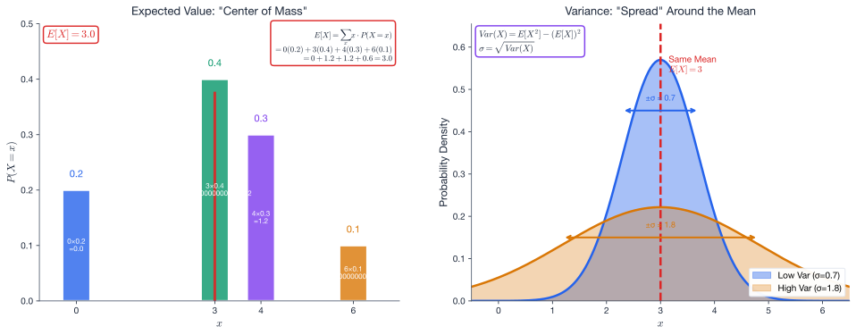
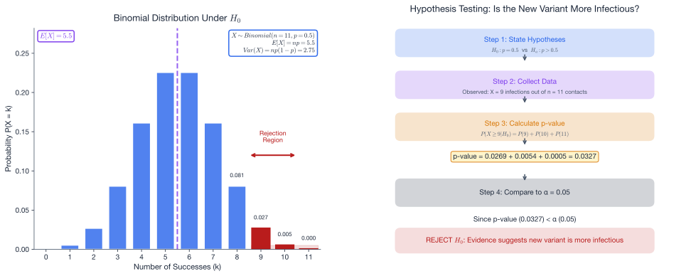

# Week 10: Random Variables and Hypothesis Testing

## Act III: Predicting Interactions — Chapter 3

> *"The question is not whether disease spreads randomly, but whether the evidence allows us to distinguish a new threat from statistical noise. Hypothesis testing gives science its teeth."*

---

## Theme: "Random Variables and Hypothesis Testing"

**Learning Outcomes:** At the end of this week you should be able to:

1. Define a **random variable**, distinguish discrete from continuous, and interpret its **probability mass function (PMF)**.
2. Calculate the **expected value** and **variance** of a discrete random variable.
3. Apply the **Bernoulli** and **Binomial** distributions — including their PMF formulas — to compute probabilities.
4. Read tail probabilities from the **Normal distribution** using **Z-scores** and the empirical rule.
5. Set up and execute a **hypothesis test** (null vs. alternative hypothesis, p-value, decision rule).
6. Distinguish **one-tailed** from **two-tailed** tests, and understand **Type I** and **Type II errors**.

---

> **📓 About "Try it in Python" boxes:** Throughout this lesson, these boxes reference specific code examples by ID — e.g. **W10-CS03** means *Week 10, Code Snippet 3*. Find the matching code under **Notes → Python Code Snippets** for this week; each entry there is labelled with its ID.

## 1. Random Variables

### 1.1 Building the Idea

A natural first answer is: *"a number that comes from a random experiment."* That is a good start — but it leaves three important questions open.

**1. What counts as a "number"?**
Outcomes in a random experiment are often non-numerical — heads or tails, infected or not, pass or fail. We need an *explicit rule* that converts each outcome into a number. Without that conversion no arithmetic is possible: no averages, no variances, no tail probabilities.

**2. What makes it "random"?**
The value is genuinely undetermined until the experiment runs — not just unmeasured. Before the coin lands, the value of $X$ simply does not exist yet. That is what distinguishes a random variable from an ordinary algebraic variable.

**3. Which number maps to which outcome?**
Different assignment rules yield different random variables with different distributions. Choosing heads $\mapsto 1$, tails $\mapsto 0$ is one variable; choosing heads $\mapsto 5$, tails $\mapsto -3$ is a completely different variable — same experiment, different rule, different distribution. The mapping must be stated explicitly.

> **Concrete example — one fair coin.** Choose the rule "count heads":
> $$X = \begin{cases} 1 & \text{(heads)} \\ 0 & \text{(tails)} \end{cases}$$
> - ✓ **Numerical** — $X \in \{0, 1\}$
> - ✓ **Random** — unknown until the coin lands
> - ✓ **Explicit rule** — every outcome is mapped
>
> Choosing $X = 5$ for heads and $X = -3$ for tails gives a *different* random variable with the same experiment but a completely different distribution.

Pin down all three ingredients and you have a random variable. The next subsection packages them into the formal definition.

### 1.2 The Formal Definition

A **random variable** $X$ is a function that assigns a specific numerical value to every possible outcome of a random experiment.

| Type           | Description              | Examples                                  |
| -------------- | ------------------------ | ----------------------------------------- |
| **Discrete**   | Countable values         | Number of infected cells, coin-flip heads |
| **Continuous** | Any value in an interval | Body temperature, concentration (mg/L)    |

This week we focus primarily on discrete random variables, with the Normal distribution as our one continuous example.

### 1.3 Probability Mass Function (Discrete)

For a discrete random variable the **probability mass function** $p(x) = P(X = x)$ satisfies:

$$\sum_{\text{all } x} p(x) = 1, \qquad p(x) \geq 0$$

> *For **continuous** random variables the analogous object is the **probability density function (PDF)**, where probabilities are areas under a curve rather than sums. The Normal distribution in Section 4 is the main example this week.*

**Example — two fair coins.**  
Let $X$ = number of heads when two fair coins are tossed.

| $x$ | Outcome  | $P(X = x)$ |
| --- | -------- | ---------- |
| 0   | TT       | $1/4$      |
| 1   | HT or TH | $1/2$      |
| 2   | HH       | $1/4$      |

Check: $\tfrac{1}{4} + \tfrac{1}{2} + \tfrac{1}{4} = 1$ ✓

---

## 2. Expected Value and Variance

### 2.1 Expected Value (Mean)

$$E[X] = \sum_x x \cdot p(x)$$

$E[X]$ is the **long-run average** — not necessarily a value $X$ can actually take.

### 2.2 Variance and Standard Deviation

$$\operatorname{Var}(X) = E\!\left[(X - \mu)^2\right] = \sum_x (x-\mu)^2 \, p(x)$$

**Shortcut formula** (usually faster):

$$\operatorname{Var}(X) = E[X^2] - (E[X])^2$$

$$\operatorname{SD}(X) = \sigma = \sqrt{\operatorname{Var}(X)}$$

### 2.3 Worked Example

A lab records the number of mutations $X$ per cell division with the following PMF:

| $x$    | 1   | 2   | 3   | 4   |
| ------ | --- | --- | --- | --- |
| $p(x)$ | 0.2 | 0.3 | 0.3 | 0.2 |

**Step 1 — Expected value:**

$$E[X] = 1(0.2) + 2(0.3) + 3(0.3) + 4(0.2) = 0.2 + 0.6 + 0.9 + 0.8 = 2.5$$

**Step 2 — $E[X^2]$:**

$$E[X^2] = 1^2(0.2) + 2^2(0.3) + 3^2(0.3) + 4^2(0.2) = 0.2 + 1.2 + 2.7 + 3.2 = 7.3$$

**Step 3 — Variance:**

$$\operatorname{Var}(X) = 7.3 - 2.5^2 = 7.3 - 6.25 = 1.05$$

**Step 4 — Standard deviation:**

$$\sigma = \sqrt{1.05} \approx 1.025 \text{ mutations}$$

*Figure: The PMF bars show the distribution; the dashed line marks $\mu = 2.5$. The spread around $\mu$ is captured by $\sigma \approx 1.025$.*

> **📓 Try it in Python**
>
> Set up the toolkit and compute expected value:
> - **W10-CS01** — *Setup and Imports*: Load `numpy`, `scipy.stats`, plotting tools.
> - **W10-CS02** — *Expected Value Calculation*: Compute $E[X]$ from a PMF.
>
> Find these under **Notes → Python Code Snippets** for this week.

---

## 3. Named Discrete Distributions

### 3.1 Bernoulli Distribution

A single trial with two outcomes — **success** (probability $p$) or **failure** (probability $1-p$).

$$X \sim \operatorname{Bernoulli}(p)$$

| Parameter               | Formula  |
| ----------------------- | -------- |
| $E[X]$                  | $p$      |
| $\operatorname{Var}(X)$ | $p(1-p)$ |

**Biology example.** A plant seed has probability $p = 0.4$ of germinating under drought conditions.  
$\operatorname{Var}(X) = 0.4 \times 0.6 = 0.24$.

### 3.2 Binomial Distribution

$n$ **independent** Bernoulli trials, each with success probability $p$.

$$X \sim \operatorname{Bin}(n, p)$$

$$P(X = k) = \binom{n}{k} p^k (1-p)^{n-k}, \qquad k = 0, 1, \ldots, n$$

| Parameter               | Formula   |
| ----------------------- | --------- |
| $E[X]$                  | $np$      |
| $\operatorname{Var}(X)$ | $np(1-p)$ |

### 3.3 Worked Example — Binomial

Ten fair coins are tossed ($n = 10$, $p = 0.5$).  
What is the probability of **8 or more heads**?

$$P(X \geq 8) = P(X=8) + P(X=9) + P(X=10)$$

$$P(X=8) = \binom{10}{8}(0.5)^{10} = 45 \cdot \frac{1}{1024} = \frac{45}{1024}$$

$$P(X=9) = \binom{10}{9}(0.5)^{10} = \frac{10}{1024}, \qquad P(X=10) = \frac{1}{1024}$$

$$P(X \geq 8) = \frac{45+10+1}{1024} = \frac{56}{1024} \approx 0.0547$$

So there is about a 5.5 % chance of 8 or more heads — unusual but not impossible.

*Figure: The Binomial$(10, 0.5)$ PMF. The red shaded bars ($X \geq 8$) represent the upper-tail probability of $\approx 0.055$.*

> **📓 Try it in Python**
>
> Build and visualise the binomial distribution:
> - **W10-CS03** — *Bernoulli Distribution*: Single-trial success/failure model.
> - **W10-CS04** — *Binomial PMF Calculation*: Compute $P(X=k)$.
> - **W10-CS05** — *Visualizing Binomial Distribution*: Bar plot of the PMF.
>
> Find these under **Notes → Python Code Snippets** for this week.

---

## 4. The Normal Distribution and Z-Scores

### 4.1 The Normal Distribution

$$X \sim N(\mu, \sigma^2)$$

The bell-curve density is **symmetric** about $\mu$; $\sigma$ controls the spread.

### 4.2 Empirical Rule (68–95–99.7 Rule)

| Interval          | Approx. probability |
| ----------------- | ------------------- |
| $\mu \pm \sigma$  | 68 %                |
| $\mu \pm 2\sigma$ | 95 %                |
| $\mu \pm 3\sigma$ | 99.7 %              |

### 4.3 Z-Scores and Standardisation

$$Z = \frac{X - \mu}{\sigma}$$

$Z$ follows the **standard normal** $N(0,1)$.

Key critical value: $z_{0.025} = 1.96$ (i.e., $P(Z > 1.96) = 0.025$).

### 4.4 Worked Example

Blood pressure $X \sim N(100, 15^2)$ (mmHg).  
What fraction of individuals have $X > 130$?

$$Z = \frac{130 - 100}{15} = \frac{30}{15} = 2$$

$$P(X > 130) = P(Z > 2) \approx 0.0228 \quad (2.28\%)$$

Using the empirical rule: $\mu + 2\sigma = 130$, so about 2.5 % lie above — the exact value is 2.28 %.

---

## 5. Hypothesis Testing

### 5.1 The Logic of Hypothesis Testing

We test whether observed data are consistent with a **null hypothesis** $H_0$ or provide evidence for an **alternative hypothesis** $H_a$.

**Four-step procedure:**

| Step | Action                                                                        |
| ---- | ----------------------------------------------------------------------------- |
| 1    | State $H_0$ and $H_a$; choose $\alpha$                                        |
| 2    | Collect data; compute the test statistic                                      |
| 3    | Compute (or bound) the **p-value**                                            |
| 4    | If $p\text{-value} < \alpha$: **reject** $H_0$; otherwise: **fail to reject** |

> **p-value definition:** The probability of observing a result *at least as extreme* as the data, *assuming $H_0$ is true*.

### 5.2 One-Tailed vs Two-Tailed Tests

- **One-tailed:** $H_a: \theta > \theta_0$ or $H_a: \theta < \theta_0$ (direction specified *before* data collection).
- **Two-tailed:** $H_a: \theta \neq \theta_0$ (any deviation matters).

> **Rule:** Decide the direction of $H_a$ *before* looking at the data. Choosing the direction after seeing the data inflates the false-positive rate.

### 5.3 Worked Example — Binomial Test

A pest-management study claims that a new pesticide reduces infection probability below 40 %.  
In a trial, 9 out of 12 plants are infected.  
Test at $\alpha = 0.05$: is the infection rate **higher** than 40 %?

**Step 1.** $H_0: p \leq 0.40$ vs $H_a: p > 0.40$ (one-tailed, upper).

**Step 2.** $X = 9$ infected out of $n = 12$; assume $H_0$ true with $p = 0.40$.

**Step 3.** p-value $= P(X \geq 9 \mid \operatorname{Bin}(12, 0.40))$:

$$P(X \geq 9) = \sum_{k=9}^{12} \binom{12}{k}(0.4)^k(0.6)^{12-k} \approx 0.015$$

**Step 4.** $0.015 < 0.05$, so we **reject $H_0$**.

*Conclusion:* There is significant evidence ($p = 0.015$) that the infection rate exceeds 40 %, suggesting the pesticide is ineffective or even harmful.

> **📓 Try it in Python**
>
> Compute p-values and visualise hypothesis tests:
> - **W10-CS06** — *p-Value via `binom.pmf` Loop*: Sum tail probabilities manually.
> - **W10-CS07** — *p-Value via `binomtest`*: Use the built-in scipy function.
> - **W10-CS09** — *Visualizing the p-Value*: Highlight the critical region on the PMF.
> - **W10-CS10** — *Critical Values via `binom.ppf`*: Find rejection thresholds.
> - **W10-CS11** — *One-Tailed vs Two-Tailed Tests*: Compare both approaches.
>
> Find these under **Notes → Python Code Snippets** for this week.

---

## 6. Type I and Type II Errors

### 6.1 Definitions

|                          | $H_0$ True                  | $H_0$ False                 |
| ------------------------ | --------------------------- | --------------------------- |
| **Reject $H_0$**         | **Type I error** ($\alpha$) | Correct ✓                   |
| **Fail to reject $H_0$** | Correct ✓                   | **Type II error** ($\beta$) |

- **Type I error rate** = $\alpha$ = significance level (false positive).
- **Type II error rate** = $\beta$ (false negative).
- **Power** = $1 - \beta$ = probability of correctly rejecting a false $H_0$.

### 6.2 The Trade-off

Decreasing $\alpha$ (stricter threshold) reduces Type I errors but *increases* Type II errors (harder to detect a real effect).  
Increasing sample size $n$ reduces *both* error rates simultaneously.

---

## 7. Statistical Power and Sample Size

### 7.1 Power Increases with $n$

Returning to the Week 9 drug example: $H_0\colon p = 0.80$ (drug works for 80 % of patients), observed $\hat{p} = 12/20 = 0.60$. How reliably would we detect this departure if we varied the sample size?

| $n$ | Approximate Power |
| --- | ----------------- |
| 20  | ≈ 68 %            |
| 100 | ≈ 99.7 %          |

> **Note — Normal approximation:** The exact sampling distribution of $\hat{p}$ is Binomial, giving discrete bars spaced $1/n$ apart. The smooth bell curves in the power diagrams use the Normal approximation $\hat{p} \approx \mathcal{N}\!\bigl(p,\; p(1-p)/n\bigr)$. This approximation improves with $n$: at $n=20$ bars are 0.05 apart; at $n=100$ they are 0.01 apart and nearly continuous.

### 7.2 Large-Sample Example

With $n = 100$ patients in the same drug trial ($H_0\colon p = 0.80$), observing 60 % success:

$$Z = \frac{0.60 - 0.80}{\sqrt{0.80 \times 0.20 / 100}} = \frac{-0.20}{\sqrt{0.0016}} = \frac{-0.20}{0.040} = -5.0 \quad \Rightarrow \quad p\text{-value} \approx 0.000003$$

With the same observed rate of 60 % but five times as many patients, the evidence is overwhelming — this illustrates why larger studies are far more reliable.

> **Binomial connection — two equivalent z-score forms:**
> $$Z = \frac{\hat{p} - p_0}{\sqrt{p_0(1-p_0)/n}} \;=\; \frac{k - np_0}{\sqrt{np_0(1-p_0)}}$$
> The second form expresses the same idea in raw counts: observed successes $k$ minus the Binomial mean $np_0$, scaled by the Binomial standard deviation $\sqrt{np_0(1-p_0)}$. For $n=100$: $Z = (60-80)/\sqrt{16} = -20/4 = -5.0$ — identical. For the original Week 9 trial ($n=20$, $k=12$): $Z = (12-16)/\sqrt{3.2} = -4/1.79 \approx -2.24$ — the same value as the proportion-form z-score formula gives for that trial. (Note: Week 9 used the *exact* Binomial to get a p-value of 0.032, not a z-score; this just confirms the two algebraic forms of the z-score are equivalent.)

> **Key insight:** Statistical power answers "If there really is an effect, how likely are we to detect it?" More data → higher power → fewer missed discoveries.

> **📓 Try it in Python**
>
> Apply the full hypothesis-testing workflow:
> - **W10-CS08** — *Q35 Exam Solution*: Walk through the exam-style question step by step.
> - **W10-CS12** — *Disease Transmission Analysis*: End-to-end real-world application.
>
> Find these under **Notes → Python Code Snippets** for this week.

---

## Summary

| Concept                 | Formula                                      |
| ----------------------- | -------------------------------------------- |
| **Expected value**      | $E[X] = \sum_x x\, p(x)$                     |
| **Variance (shortcut)** | $\operatorname{Var}(X) = E[X^2] - (E[X])^2$  |
| **Standard deviation**  | $\sigma = \sqrt{\operatorname{Var}(X)}$      |
| **Bernoulli**           | $E[X]=p$,\; $\operatorname{Var}(X)=p(1-p)$   |
| **Binomial PMF**        | $P(X=k)=\binom{n}{k}p^k(1-p)^{n-k}$          |
| **Binomial moments**    | $E[X]=np$,\; $\operatorname{Var}(X)=np(1-p)$ |
| **Z-score**             | $Z = (X-\mu)/\sigma$                         |
| **Empirical rule**      | 68 / 95 / 99.7 % within 1 / 2 / 3 $\sigma$   |
| **Decision rule**       | Reject $H_0$ if $p\text{-value} < \alpha$    |

---

*End of Week 10 Lesson*
