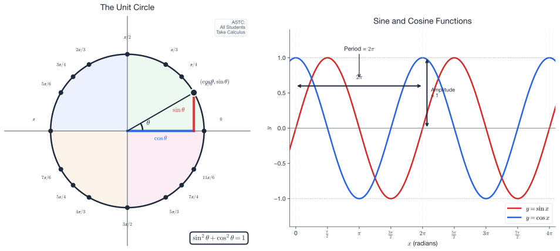
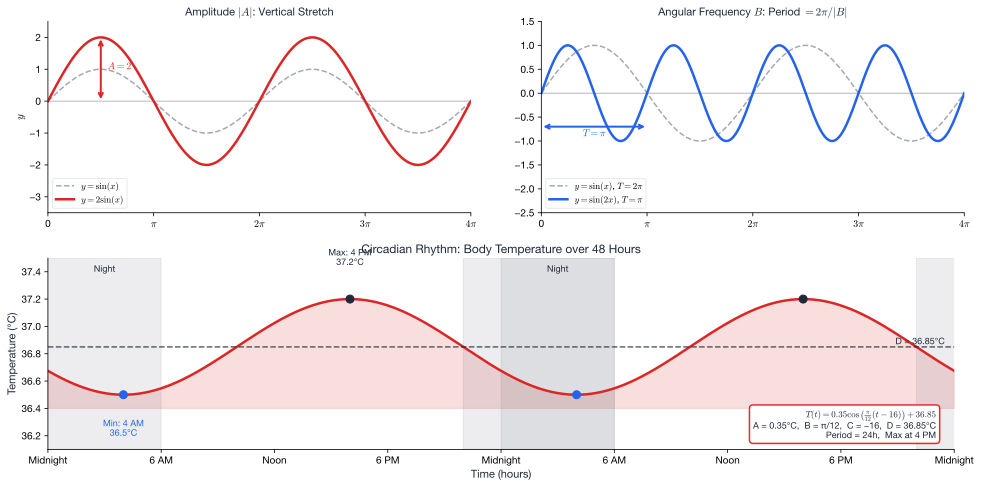

# Week 11: Trigonometric Functions and Periodic Models

**Theme:** "Modeling Cycles and Rhythms"

**Act IV: Making Optimal Decisions**

> *"The cosmos is full of repeating patterns—days, seasons, heartbeats, brain waves. Understanding periodicity is understanding life itself."*

---

**Science Context:** Circadian rhythms, seasonal temperature cycles, biological oscillations, motor-movement timing

**Learning Outcomes:** At the end of this week you should be able to:

1. Convert between degrees and radians and work with the unit circle
2. Define the sine and cosine functions and identify their key properties
3. Determine the amplitude, period, frequency, and phase shift of a trigonometric function
4. Sketch and interpret graphs of functions of the form $y = A\sin(Bx + C) + D$
5. Model periodic real-world phenomena using trigonometric functions
6. Solve simple trigonometric equations over a given interval

**Exam Alignment:** Q31, Q36

---

## Overview

This week marks our entry into **Act IV: Making Optimal Decisions**. Having built statistical tools for testing hypotheses (Week 10), we now turn to modeling the **periodic phenomena** that pervade biological and physical systems.

**Why trigonometry for scientists?**

Cycles are everywhere in nature:
- **Circadian rhythms:** ~24-hour cycles in hormone levels, body temperature, alertness
- **Seasonal patterns:** Annual temperature cycles, breeding seasons, migration timing
- **Physiological oscillations:** Heart rate variability, respiratory cycles, neural oscillations
- **Motor behavior:** Repetitive movements like walking, breathing, or—as in Q36—moving a pencil back and forth

These phenomena share a common mathematical structure: **periodic functions**. The sine and cosine functions provide elegant, parameter-rich models for capturing amplitude, frequency, and timing of cycles.

---

## 1. The Geometry of Circles: Degrees and Radians

### 1.1 Why Two Measurement Systems?

Angles can be measured in **degrees** (familiar from everyday use) or **radians** (natural for calculus and wave analysis).

**Definition:** One **radian** is the angle subtended at the center of a circle by an arc equal in length to the radius.

Since circumference $= 2\pi r$, a full circle contains $2\pi$ radians.

$$\boxed{2\pi \text{ radians} = 360°}$$

### 1.2 Conversion Formulas

$$\theta_{\text{rad}} = \theta_{\text{deg}} \times \frac{\pi}{180}$$

$$\theta_{\text{deg}} = \theta_{\text{rad}} \times \frac{180}{\pi}$$

**Key conversions to memorize:**

| Degrees | Radians | Decimal ≈ |
|---------|---------|-----------|
| 0° | 0 | 0 |
| 30° | $\frac{\pi}{6}$ | 0.524 |
| 45° | $\frac{\pi}{4}$ | 0.785 |
| 60° | $\frac{\pi}{3}$ | 1.047 |
| 90° | $\frac{\pi}{2}$ | 1.571 |
| 180° | $\pi$ | 3.142 |
| 270° | $\frac{3\pi}{2}$ | 4.712 |
| 360° | $2\pi$ | 6.283 |

**Example (Exam Q31 style):** Convert 90° to radians.

$$90° \times \frac{\pi}{180} = \frac{90\pi}{180} = \frac{\pi}{2}$$

---

## 2. The Unit Circle: Defining Trigonometric Functions

### 2.1 Right Triangle Definitions

For a right triangle with angle $\theta$, opposite side $O$, adjacent side $A$, and hypotenuse $H$:

$$\sin\theta = \frac{O}{H}, \quad \cos\theta = \frac{A}{H}, \quad \tan\theta = \frac{O}{A} = \frac{\sin\theta}{\cos\theta}$$

### 2.2 Unit Circle Definition

The **unit circle** is a circle of radius 1 centered at the origin. For any angle $\theta$ measured counterclockwise from the positive x-axis:

- The **x-coordinate** of the point on the circle is $\cos\theta$
- The **y-coordinate** of the point on the circle is $\sin\theta$

This definition extends trigonometry beyond acute angles to all real numbers.

**Fundamental Identity:**

$$\boxed{\sin^2\theta + \cos^2\theta = 1}$$

This follows directly from the Pythagorean theorem on the unit circle: $x^2 + y^2 = 1$.

### 2.3 Exact Values You Must Know

| $\theta$ | $\sin\theta$ | $\cos\theta$ | $\tan\theta$ |
|----------|--------------|--------------|--------------|
| 0 | 0 | 1 | 0 |
| $\frac{\pi}{6}$ (30°) | $\frac{1}{2}$ | $\frac{\sqrt{3}}{2}$ | $\frac{1}{\sqrt{3}}$ |
| $\frac{\pi}{4}$ (45°) | $\frac{\sqrt{2}}{2}$ | $\frac{\sqrt{2}}{2}$ | 1 |
| $\frac{\pi}{3}$ (60°) | $\frac{\sqrt{3}}{2}$ | $\frac{1}{2}$ | $\sqrt{3}$ |
| $\frac{\pi}{2}$ (90°) | 1 | 0 | undefined |
| $\pi$ (180°) | 0 | -1 | 0 |
| $\frac{3\pi}{2}$ (270°) | -1 | 0 | undefined |

**Memory aid:** For sine at 0°, 30°, 45°, 60°, 90°: $\frac{\sqrt{0}}{2}, \frac{\sqrt{1}}{2}, \frac{\sqrt{2}}{2}, \frac{\sqrt{3}}{2}, \frac{\sqrt{4}}{2}$

---

## 3. Signs in Quadrants: The ASTC Rule

The unit circle is divided into four quadrants, and the signs of trigonometric functions vary:

| Quadrant | Angle Range | sin | cos | tan | Memory |
|----------|-------------|-----|-----|-----|--------|
| I | $0 \leq \theta < \frac{\pi}{2}$ | + | + | + | **A**ll |
| II | $\frac{\pi}{2} \leq \theta < \pi$ | + | − | − | **S**in |
| III | $\pi \leq \theta < \frac{3\pi}{2}$ | − | − | + | **T**an |
| IV | $\frac{3\pi}{2} \leq \theta < 2\pi$ | − | + | − | **C**os |

**ASTC = "All Students Take Calculus"** (or "All Stations To Central")

### 3.1 Symmetry Relations

These follow from the unit circle geometry:

$$\sin(\pi - \theta) = \sin\theta, \quad \cos(\pi - \theta) = -\cos\theta$$

$$\sin(-\theta) = -\sin\theta \quad \text{(odd function)}$$

$$\cos(-\theta) = \cos\theta \quad \text{(even function)}$$

---

## 4. Graphs of Trigonometric Functions

### 4.1 The Basic Sine and Cosine Curves

The graphs of $y = \sin x$ and $y = \cos x$ are smooth, wave-like curves with:

- **Amplitude:** 1 (oscillates between -1 and +1)
- **Period:** $2\pi$ (one complete cycle)
- **Key difference:** $\cos x = \sin(x + \frac{\pi}{2})$ — cosine leads sine by $\frac{\pi}{2}$

### 4.2 The General Sinusoidal Function

The **workhorse model** for periodic phenomena is:

$$\boxed{y = A\sin(B(x + C)) + D} \quad \text{or} \quad \boxed{y = A\cos(B(x + C)) + D}$$

Each parameter has a specific physical meaning:

| Parameter | Effect | Formula |
|-----------|--------|---------|
| $A$ | **Amplitude** — half the vertical range | Amplitude $= |A|$ |
| $B$ | **Angular frequency** — controls cycle speed | Period $= \frac{2\pi}{|B|}$ |
| $C$ | **Phase shift** — horizontal translation | Shift $= -C$ (left if $C > 0$) |
| $D$ | **Vertical shift** — midline position | Midline at $y = D$ |

### 4.3 Frequency and Period

**Period** $T$ is the time (or x-distance) for one complete cycle:

$$T = \frac{2\pi}{|B|}$$

**Frequency** $f$ is cycles per unit time:

$$f = \frac{1}{T} = \frac{|B|}{2\pi}$$

**Angular frequency** $\omega = B = 2\pi f$

**Example (Exam Q31 style):** For $x(t) = \frac{7}{2}\cos(\pi t)$:
- Period: $T = \frac{2\pi}{\pi} = 2$ seconds
- Frequency: $f = \frac{1}{2} = 0.5$ Hz

---

## 5. Modeling Periodic Phenomena: Parameter Fitting

### 5.1 The Scientific Context: Circadian Rhythms

**Circadian rhythms** are ~24-hour biological cycles driven by internal clocks and synchronized by light. Body temperature follows a predictable pattern:

- **Minimum** (~36.5°C): Early morning (around 4-5 AM)
- **Maximum** (~37.2°C): Late afternoon (around 4-6 PM)

This temperature variation affects alertness, cognitive performance, and drug metabolism—critical for clinical decision-making.

### 5.2 Step-by-Step Model Fitting

Given periodic data, determine the four parameters systematically:

**Step 1: Amplitude $A$**

$$A = \frac{\text{max} - \text{min}}{2}$$

**Step 2: Vertical Shift $D$ (Midline)**

$$D = \frac{\text{max} + \text{min}}{2} = \text{min} + A$$

**Step 3: Angular Frequency $B$**

From the known period:

$$B = \frac{2\pi}{\text{Period}}$$

For a 24-hour cycle: $B = \frac{2\pi}{24} = \frac{\pi}{12}$ per hour

For a 12-month cycle: $B = \frac{2\pi}{12} = \frac{\pi}{6}$ per month

**Step 4: Phase Shift $C$**

This requires knowing when the maximum or minimum occurs.

For a **cosine model** $y = A\cos(B(x + C)) + D$:
- Cosine has its maximum at argument $= 0$
- If the maximum occurs at $x = x_{\max}$, then $C = -x_{\max}$

For a **sine model** $y = A\sin(B(x + C)) + D$:
- Sine has its maximum at argument $= \frac{\pi}{2}$
- Solve $B(x_{\max} + C) = \frac{\pi}{2}$ for $C$

### 5.3 Worked Example: Pencil Movement (Exam Q36)

**Scenario:** A person moves a pencil periodically between 2 cm and 12 cm, completing a round every 2 seconds. At $t = 0$, the pencil is at $x = 2$ cm.

**Model:** $x(t) = A\cos(B(t + C)) + D$

**Step 1: Amplitude**
$$A = \frac{12 - 2}{2} = 5 \text{ cm}$$

**Step 2: Vertical shift**
$$D = \frac{12 + 2}{2} = 7 \text{ cm}$$

**Step 3: Angular frequency**
$$B = \frac{2\pi}{2} = \pi \text{ rad/s}$$

**Step 4: Phase shift**

At $t = 0$: $x(0) = 2$ cm (the minimum position)

For cosine, the minimum occurs when the argument equals $\pi$:
$$B(0 + C) = \pi$$
$$\pi \cdot C = \pi$$
$$C = 1$$

**Final model:** $x(t) = 5\cos(\pi(t + 1)) + 7$

**Verification:** $x(0) = 5\cos(\pi \cdot 1) + 7 = 5(-1) + 7 = 2$ ✓

---

## 6. Seasonal Temperature Modeling

### 6.1 Why Cosine Works for Temperature

Annual temperature variation is driven by Earth's axial tilt and orbital position. In regions away from the equator, this produces a nearly sinusoidal pattern.

For the **Southern Hemisphere** (e.g., Perth, Wellington):
- Coldest month: July (month 7)
- Hottest month: January (month 1)

For the **Northern Hemisphere** (e.g., London, Edmonton):
- Coldest month: January (month 1)
- Hottest month: July (month 7)

### 6.2 Fitting to Monthly Data

Given monthly temperature data for a city:

**Step 1:** Extract max and min temperatures:
$$A = \frac{T_{\max} - T_{\min}}{2}, \quad D = \frac{T_{\max} + T_{\min}}{2}$$

**Step 2:** Set angular frequency for annual cycle:
$$B = \frac{2\pi}{12} = \frac{\pi}{6} \text{ per month}$$

**Step 3:** Determine phase shift based on coldest month.

For a cosine function, the minimum occurs at argument $= \pi$:
- If coldest month is July (month 7): $B(7 + C) = \pi \Rightarrow C = -1$
- If coldest month is January (month 1): $B(1 + C) = \pi \Rightarrow C = 5$

**Wellington Airport Example:**

Data: Max = 17.9°C (Feb), Min = 9.5°C (Jul)

$$A = \frac{17.9 - 9.5}{2} = 4.2°C$$
$$D = \frac{17.9 + 9.5}{2} = 13.7°C$$
$$B = \frac{\pi}{6}$$

Coldest month is July (month 7):
$$\frac{\pi}{6}(7 + C) = \pi \Rightarrow 7 + C = 6 \Rightarrow C = -1$$

**Model:** $T(m) = 4.2\cos\left(\frac{\pi}{6}(m - 1)\right) + 13.7$

---

## 7. Trigonometric Identities

### 7.1 Fundamental Identities

**Pythagorean identity:**
$$\sin^2\theta + \cos^2\theta = 1$$

**Quotient identity:**
$$\tan\theta = \frac{\sin\theta}{\cos\theta}$$

**Reciprocal identities:**
$$\sec\theta = \frac{1}{\cos\theta}, \quad \csc\theta = \frac{1}{\sin\theta}, \quad \cot\theta = \frac{1}{\tan\theta}$$

### 7.2 Double Angle Formulas (Reference)

$$\sin(2\theta) = 2\sin\theta\cos\theta$$

$$\cos(2\theta) = \cos^2\theta - \sin^2\theta = 2\cos^2\theta - 1 = 1 - 2\sin^2\theta$$

### 7.3 Using Identities: Example

**Problem:** If $\sin\theta = 0.6$ and $\theta$ is in Quadrant I, find $\cos\theta$.

**Solution:** Using $\sin^2\theta + \cos^2\theta = 1$:

$$\cos^2\theta = 1 - \sin^2\theta = 1 - 0.36 = 0.64$$
$$\cos\theta = \pm 0.8$$

Since $\theta$ is in Quadrant I, $\cos\theta > 0$, so $\cos\theta = 0.8$.

---

## 8. Connection to Decision Making

### 8.1 From Cycles to Optimization

Understanding periodic patterns enables **optimal timing decisions**:

| Domain | Periodic Pattern | Decision Application |
|--------|-----------------|---------------------|
| Medicine | Circadian drug metabolism | Optimal medication timing (chronotherapy) |
| Agriculture | Seasonal temperature | Planting and harvest scheduling |
| Ecology | Annual migration cycles | Conservation timing |
| Physiology | Sleep-wake cycles | Shift work scheduling |
| Economics | Seasonal demand | Inventory management |

### 8.2 Preview: Week 12

Next week, we complete Act IV with **Linear Programming**—a method for optimizing decisions subject to constraints. The periodic models from this week inform when certain constraints apply (e.g., seasonal resource availability).

---

## 9. Summary: Key Formulas

| Concept | Formula |
|---------|---------|
| Degree-radian conversion | $\theta_{\text{rad}} = \theta_{\text{deg}} \times \frac{\pi}{180}$ |
| Pythagorean identity | $\sin^2\theta + \cos^2\theta = 1$ |
| Tangent definition | $\tan\theta = \frac{\sin\theta}{\cos\theta}$ |
| General sinusoid | $y = A\sin(B(x+C)) + D$ |
| Amplitude | $|A| = \frac{\max - \min}{2}$ |
| Period | $T = \frac{2\pi}{|B|}$ |
| Frequency | $f = \frac{1}{T} = \frac{|B|}{2\pi}$ |
| Vertical shift | $D = \frac{\max + \min}{2}$ |
| Phase shift | Solve using boundary condition |

---

## 10. Learning Outcomes

By the end of this week, you should be able to:

1. ✅ Convert between degrees and radians (Q31)
2. ✅ Evaluate $\sin\theta$, $\cos\theta$, $\tan\theta$ for key angles
3. ✅ Apply the ASTC rule to determine signs in each quadrant
4. ✅ Identify amplitude, period, phase shift, and vertical shift from a function (Q31)
5. ✅ Calculate frequency from period (Q31)
6. ✅ Apply the Pythagorean identity $\sin^2\theta + \cos^2\theta = 1$
7. ✅ Fit a sinusoidal model to periodic data using boundary conditions (Q36)
8. ✅ Interpret the parameters of periodic models in scientific contexts

---

## Exam Alignment

| Exam Question | Topic | Key Skills |
|---------------|-------|------------|
| Q31 | Trigonometric values and identities | Radian conversion, amplitude, period, frequency |
| Q36 | Cosine model with phase shift | Determine A, B, C, D from motion description |

---

## References

- SCIE1500 Math Lecture: Trigonometry (Week 11)
- NIWA: Modeling Temperature with Trigonometric Functions
- SCIE1500 Sample Final Examination: Q31, Q36
- Refinetti, R. (2016). *Circadian Physiology*. CRC Press.

---

*Next: Week 12 — Simultaneous Equations and Linear Programming: Optimizing with Constraints*
