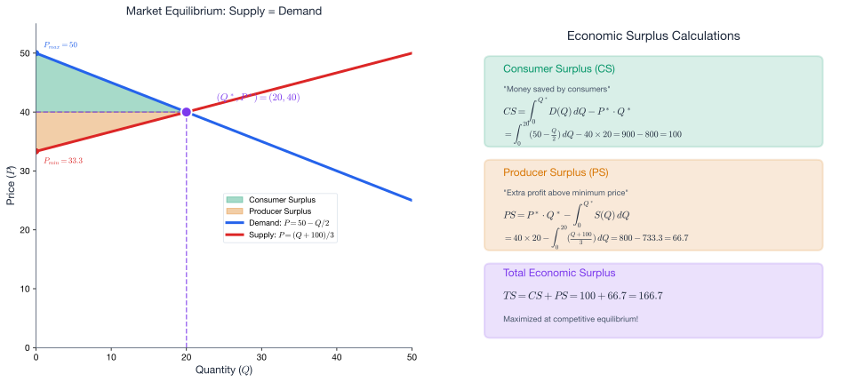
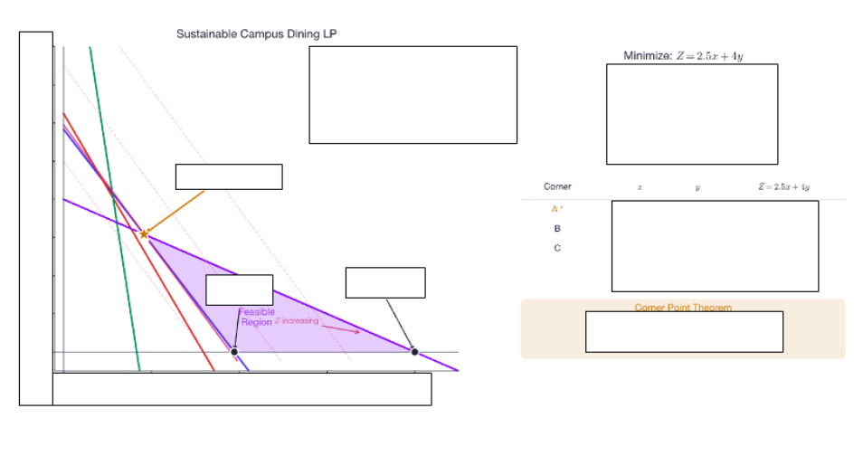

# Week 12: Simultaneous Equations and Linear Programming

**Theme:** "Optimizing with Constraints"

**Act IV: Making Optimal Decisions**

> *"The real world rarely offers unlimited resources. Optimization under constraints is the mathematician's answer to scarcity—and the scientist's tool for making the best possible decisions."*

---

**Science Context:** Dietary planning, land allocation to crops, staff scheduling, resource allocation under budget constraints

**Learning Outcomes:** At the end of this week you should be able to:

1. Solve systems of two or more linear equations by substitution and elimination
2. Find market equilibrium prices and quantities from supply and demand equations
3. Formulate a linear programming problem from a word description
4. Graph the feasible region for a system of linear inequalities
5. Apply the Corner Point Theorem to identify the optimal solution
6. Interpret linear programming solutions in scientific and resource allocation contexts

**Exam Alignment:** Q40

---

## Overview

This final week completes **Act IV: Making Optimal Decisions** by introducing the mathematics of **constrained optimization**. Having modeled periodic phenomena in Week 11, we now tackle problems where decisions must satisfy multiple requirements simultaneously.

**Why this matters for scientists:**

Constrained optimization appears across every scientific discipline:

| Domain | Decision Problem | Constraints |
|--------|-----------------|-------------|
| **Nutrition** | Design a cost-effective diet | Minimum nutrient requirements |
| **Agriculture** | Allocate land to crops | Available land, water, labor |
| **Healthcare** | Assign staff to shifts | Coverage requirements, labor laws |
| **Engineering** | Design a structure | Material strength, weight limits |
| **Ecology** | Allocate conservation funds | Budget, species priorities |
| **Economics** | Maximize profit | Production capacity, demand |
| **Defense** | Deploy resources | Logistics, strategic priorities |

The mathematical framework we develop—**linear programming (LP)**—was pioneered during World War II for military logistics and has since revolutionized operations research, economics, and computational science.

---

## 1. Simultaneous Linear Equations: Finding Equilibrium

### 1.1 Why Simultaneous Equations?

Many scientific problems require finding values that satisfy multiple conditions at once. Mathematically, this means solving a **system of equations**.

**Definition:** A **system of linear equations** is a collection of two or more linear equations involving the same variables.

The **solution** is the set of values that satisfies ALL equations simultaneously.

### 1.2 Two Equations, Two Unknowns

Consider the general system:

$$a_1 x + b_1 y = c_1$$
$$a_2 x + b_2 y = c_2$$

**Geometric interpretation:** Each equation represents a line. The solution is where the lines **intersect**.

Three possibilities exist:
1. **One solution** (lines intersect at a single point) — most common
2. **No solution** (lines are parallel) — inconsistent system
3. **Infinitely many solutions** (lines are identical) — dependent system

### 1.3 Method 1: Substitution

**Procedure:**
1. Solve one equation for one variable
2. Substitute into the other equation
3. Solve for the remaining variable
4. Back-substitute to find the first variable

**Example 12.1:** Solve the system:
$$x + 2y = 7$$
$$3x - y = 11$$

**Solution:**

**Step 1:** Solve the first equation for $x$:
$$x = 7 - 2y$$

**Step 2:** Substitute into the second equation:
$$3(7 - 2y) - y = 11$$
$$21 - 6y - y = 11$$
$$21 - 7y = 11$$
$$-7y = -10$$
$$y = \frac{10}{7}$$

**Step 3:** Back-substitute:
$$x = 7 - 2\left(\frac{10}{7}\right) = 7 - \frac{20}{7} = \frac{49 - 20}{7} = \frac{29}{7}$$

**Solution:** $\left(\frac{29}{7}, \frac{10}{7}\right) \approx (4.14, 1.43)$

### 1.4 Method 2: Elimination

**Procedure:**
1. Multiply equations to make coefficients of one variable equal (in magnitude)
2. Add or subtract equations to eliminate that variable
3. Solve for the remaining variable
4. Back-substitute

**Example 12.2:** Solve the same system using elimination:
$$x + 2y = 7$$
$$3x - y = 11$$

**Solution:**

**Step 1:** Multiply the second equation by 2:
$$x + 2y = 7$$
$$6x - 2y = 22$$

**Step 2:** Add the equations (eliminates $y$):
$$7x = 29$$
$$x = \frac{29}{7}$$

**Step 3:** Substitute back into the first equation:
$$\frac{29}{7} + 2y = 7$$
$$2y = 7 - \frac{29}{7} = \frac{49 - 29}{7} = \frac{20}{7}$$
$$y = \frac{10}{7}$$

**Same solution:** $\left(\frac{29}{7}, \frac{10}{7}\right)$ ✓

---

## 2. Market Equilibrium: Supply and Demand

### 2.1 The Economic Context

In a competitive market:
- **Demand** decreases as price increases (consumers buy less at higher prices)
- **Supply** increases as price increases (producers offer more at higher prices)

**Equilibrium** occurs where supply equals demand—the price at which the quantity consumers want to buy equals the quantity producers want to sell.

### 2.2 Linear Demand and Supply Functions

**Demand function:** $Q_d = a - bP$ (downward sloping, $b > 0$)

**Supply function:** $Q_s = -c + dP$ (upward sloping, $d > 0$)

Here:
- $Q_d$ = quantity demanded
- $Q_s$ = quantity supplied
- $P$ = price per unit
- $a, b, c, d$ are positive constants

### 2.3 Finding Equilibrium (Exam Q39)

At equilibrium: $Q_d = Q_s$

**Example 12.3 (Exam Q39 Style):** Given:
$$Q_d = 100 - 2P$$
$$Q_s = -100 + 3P$$

Find the equilibrium price and quantity.

**Solution:**

Set $Q_d = Q_s$:
$$100 - 2P = -100 + 3P$$
$$100 + 100 = 3P + 2P$$
$$200 = 5P$$
$$P^* = 40$$

Substitute back to find equilibrium quantity:
$$Q^* = 100 - 2(40) = 100 - 80 = 20$$

**Equilibrium:** $(P^*, Q^*) = (40, 20)$

### 2.4 Maximum Willingness to Pay and Minimum Acceptable Price

**Maximum willingness to pay:** The highest price any consumer would pay (where $Q_d = 0$).

From $Q_d = 100 - 2P = 0$:
$$P = 50$$

**Minimum acceptable price:** The lowest price at which producers would supply (where $Q_s = 0$).

From $Q_s = -100 + 3P = 0$:
$$P = \frac{100}{3} \approx 33.33$$

---

## 3. Consumer and Producer Surplus

### 3.1 The Concept of Economic Surplus

**Consumer Surplus (CS):** The benefit consumers receive from paying a price lower than their maximum willingness to pay. It represents "money saved" relative to what consumers would have been willing to pay.

**Producer Surplus (PS):** The benefit producers receive from selling at a price higher than their minimum acceptable price. It represents "extra revenue" above what producers would have accepted.

### 3.2 Geometric Interpretation

On a supply-demand diagram:
- **CS** = Area between the demand curve and the equilibrium price line
- **PS** = Area between the equilibrium price line and the supply curve

These are **triangular** areas when demand and supply are linear.

### 3.3 Calculating Surplus Using Integration

To use integration, we need the **inverse functions** (price as a function of quantity):

**Inverse demand:** $P = D(Q)$ (demand curve in $P$-$Q$ space)
**Inverse supply:** $P = S(Q)$ (supply curve in $P$-$Q$ space)

**Consumer Surplus:**
$$\boxed{CS = \int_0^{Q^*} D(Q)\,dQ - P^* \cdot Q^*}$$

This is the area under the demand curve minus the rectangle (what consumers actually pay).

**Producer Surplus:**
$$\boxed{PS = P^* \cdot Q^* - \int_0^{Q^*} S(Q)\,dQ}$$

This is the revenue rectangle minus the area under the supply curve.

### 3.4 Worked Example (Exam Q39 Complete)

**Given:** $Q_d = 100 - 2P$ and $Q_s = -100 + 3P$

From earlier: $P^* = 40$, $Q^* = 20$

**Step 1: Find inverse functions**

From $Q = 100 - 2P$:
$$2P = 100 - Q$$
$$P = D(Q) = 50 - \frac{Q}{2}$$

From $Q = -100 + 3P$:
$$3P = Q + 100$$
$$P = S(Q) = \frac{Q + 100}{3} = \frac{Q}{3} + \frac{100}{3}$$

**Step 2: Calculate Consumer Surplus**

$$CS = \int_0^{20} \left(50 - \frac{Q}{2}\right)dQ - 40 \times 20$$

$$= \left[50Q - \frac{Q^2}{4}\right]_0^{20} - 800$$

$$= \left(50(20) - \frac{400}{4}\right) - (0) - 800$$

$$= (1000 - 100) - 800 = 900 - 800 = 100$$

$$\boxed{CS = 100}$$

**Step 3: Calculate Producer Surplus**

$$PS = 40 \times 20 - \int_0^{20} \left(\frac{Q}{3} + \frac{100}{3}\right)dQ$$

$$= 800 - \left[\frac{Q^2}{6} + \frac{100Q}{3}\right]_0^{20}$$

$$= 800 - \left(\frac{400}{6} + \frac{2000}{3}\right)$$

$$= 800 - \left(\frac{200}{3} + \frac{2000}{3}\right)$$

$$= 800 - \frac{2200}{3} = 800 - 733.33 = 66.67$$

$$\boxed{PS = \frac{200}{3} \approx 66.67}$$

### 3.5 Shortcut for Linear Functions

For **linear** demand and supply curves, the surplus areas are triangles:

$$CS = \frac{1}{2} \times \text{base} \times \text{height} = \frac{1}{2} \times Q^* \times (P_{\max} - P^*)$$

$$PS = \frac{1}{2} \times Q^* \times (P^* - P_{\min})$$

**Verification:**
$$CS = \frac{1}{2} \times 20 \times (50 - 40) = \frac{1}{2} \times 20 \times 10 = 100 \checkmark$$
$$PS = \frac{1}{2} \times 20 \times \left(40 - \frac{100}{3}\right) = \frac{1}{2} \times 20 \times \frac{20}{3} = \frac{200}{3} \checkmark$$

---

## 4. Linear Programming: The Framework

### 4.1 What is Linear Programming?

**Linear Programming (LP)** is a method for finding the optimal value (maximum or minimum) of a linear objective function subject to linear constraints.

**Historical note:** LP was developed by George Dantzig in 1947 for U.S. Air Force planning. The "programming" refers to planning/scheduling, not computer programming.

### 4.2 LP Problem Structure

Every LP problem has three components:

1. **Decision variables:** The quantities we control (e.g., $x$ = units of Food I, $y$ = units of Food II)

2. **Objective function:** What we want to maximize or minimize (must be linear)
   $$Z = c_1 x + c_2 y$$

3. **Constraints:** Limitations on decisions (linear inequalities or equations)
   $$a_{i1}x + a_{i2}y \leq b_i \quad \text{(or } \geq, =\text{)}$$
   Plus: $x \geq 0$, $y \geq 0$ (non-negativity constraints)

### 4.3 Standard Form

**Maximize (or Minimize):** $Z = c_1 x + c_2 y$

**Subject to:**
$$a_{11}x + a_{12}y \leq b_1$$
$$a_{21}x + a_{22}y \leq b_2$$
$$\vdots$$
$$x \geq 0, \quad y \geq 0$$

---

## 5. Solving LP Graphically: The Diet Problem (Exam Q40)

### 5.1 Problem Setup

**Exam Q40:** Design a minimum-cost diet combining two foods to meet nutritional requirements.

| Nutrient | Food I | Food II | Minimum Requirement |
|----------|--------|---------|---------------------|
| Protein | 4 | 5 | 100 |
| Energy | 10 | 25 | 400 |
| Vitamin A | 0.8 | 0.4 | 10 |
| Calcium | 0 | 1 | 5 |
| **Cost** | $2 | $3 | — |

Let $x$ = units of Food I, $y$ = units of Food II.

### 5.2 Step 1: Formulate the LP

**Objective (minimize cost):**
$$\text{Minimize } Z = 2x + 3y$$

**Subject to (nutrient constraints):**
$$4x + 5y \geq 100 \quad \text{(protein)}$$
$$10x + 25y \geq 400 \quad \text{(energy)}$$
$$0.8x + 0.4y \geq 10 \quad \text{(vitamin A)}$$
$$y \geq 5 \quad \text{(calcium, since Food I has 0)}$$

**Non-negativity:**
$$x \geq 0, \quad y \geq 0$$

### 5.3 Step 2: Graph the Constraints

Convert inequalities to equations to find boundary lines:

**Protein:** $4x + 5y = 100$
- When $x = 0$: $y = 20$
- When $y = 0$: $x = 25$

**Energy:** $10x + 25y = 400$ → Simplify: $2x + 5y = 80$
- When $x = 0$: $y = 16$
- When $y = 0$: $x = 40$

**Vitamin A:** $0.8x + 0.4y = 10$ → Simplify: $2x + y = 25$
- When $x = 0$: $y = 25$
- When $y = 0$: $x = 12.5$

**Calcium:** $y = 5$ (horizontal line)

### 5.4 Step 3: Identify the Feasible Region

The **feasible region** is the set of all points $(x, y)$ satisfying ALL constraints.

For $\geq$ constraints: shade the region **away** from the origin (on the side where the constraint is satisfied).

The feasible region is the **intersection** of all shaded regions—typically a polygon.

### 5.5 Step 4: Find Corner Points (Vertices)

The **Corner Point Theorem** states:

> *If an LP has an optimal solution, it occurs at a corner point (vertex) of the feasible region.*

This is because the objective function is linear, so its maximum/minimum over a convex polygon must occur at a vertex.

**Finding vertices:** Solve pairs of constraint equations simultaneously.

**Vertex A (Vitamin A ∩ Calcium):**
$$2x + y = 25 \quad \text{and} \quad y = 5$$
$$2x + 5 = 25 \Rightarrow x = 10$$
Point A: $(10, 5)$

**Vertex B (Protein ∩ Calcium):**
$$4x + 5y = 100 \quad \text{and} \quad y = 5$$
$$4x + 25 = 100 \Rightarrow x = 18.75$$
Point B: $(18.75, 5)$

**Vertex C (Protein ∩ Energy):**
$$4x + 5y = 100 \quad \text{and} \quad 2x + 5y = 80$$
Subtract: $2x = 20 \Rightarrow x = 10$
Substitute: $20 + 5y = 80 \Rightarrow y = 12$
Point C: $(10, 12)$

**Vertex D (Energy ∩ y-axis, if applicable):**
Check if $(0, 16)$ satisfies all constraints...
- Protein: $4(0) + 5(16) = 80 < 100$ ✗ (not feasible)

**Vertex E (Vitamin A ∩ y-axis):**
$(0, 25)$: Check all constraints...
- Protein: $5(25) = 125 \geq 100$ ✓
- Energy: $25(25) = 625 \geq 400$ ✓
- Calcium: $25 \geq 5$ ✓
Point E: $(0, 25)$

Vertices of feasible region: A$(10, 5)$, B$(18.75, 5)$, C$(10, 12)$, E$(0, 25)$

*Note: Need to verify which vertices actually bound the feasible region by checking constraints.*

### 5.6 Step 5: Evaluate Objective at Each Corner

| Vertex | $x$ | $y$ | $Z = 2x + 3y$ |
|--------|-----|-----|---------------|
| A | 10 | 5 | $2(10) + 3(5) = 35$ |
| B | 18.75 | 5 | $2(18.75) + 3(5) = 52.50$ |
| C | 10 | 12 | $2(10) + 3(12) = 56$ |
| E | 0 | 25 | $2(0) + 3(25) = 75$ |

### 5.7 Step 6: Select Optimal Solution

**Minimum cost:** $Z = 35$ at vertex A$(10, 5)$

**Answer:** Use **10 units of Food I** and **5 units of Food II**.

**Total cost:** $\$35$

### 5.8 Sensitivity Analysis: What if Costs Change?

**Part (d) of Q40:** If Food I costs $5 instead of $2, what changes?

**New objective:** $Z = 5x + 3y$

| Vertex | $x$ | $y$ | $Z = 5x + 3y$ |
|--------|-----|-----|---------------|
| A | 10 | 5 | $5(10) + 3(5) = 65$ |
| B | 18.75 | 5 | $5(18.75) + 3(5) = 108.75$ |
| C | 10 | 12 | $5(10) + 3(12) = 86$ |
| E | 0 | 25 | $5(0) + 3(25) = 75$ |

**New minimum:** $Z = 65$ at A$(10, 5)$—same point but higher cost!

*The optimal diet composition remains unchanged because the constraint geometry hasn't changed, but the cost has increased.*

---

## 6. LP Solution Algorithm Summary

The **graphical method** for 2-variable LP problems:

| Step | Action |
|------|--------|
| 1 | **Define variables** clearly |
| 2 | **Write objective function** (max or min?) |
| 3 | **Write constraints** as linear inequalities |
| 4 | **Graph constraints** and identify feasible region |
| 5 | **Find corner points** by solving simultaneous equations |
| 6 | **Evaluate objective** at each corner |
| 7 | **Select optimal** corner point |

### 6.1 Special Cases

**Unbounded solution:** Feasible region extends infinitely in the direction of optimization—no finite optimum exists.

**Multiple optimal solutions:** Objective function is parallel to a binding constraint—all points on that edge are optimal.

**Infeasible problem:** Constraints are contradictory—no feasible region exists.

---

## 7. Applications Beyond Diet Optimization

### 7.1 Resource Allocation in Agriculture

**Problem:** A farmer has 100 hectares and 400 labor-hours. Wheat yields \$300/ha profit and requires 3 hours/ha. Corn yields \$400/ha profit and requires 5 hours/ha. How should land be allocated?

**Variables:** $x$ = hectares of wheat, $y$ = hectares of corn

**Objective:** Maximize $Z = 300x + 400y$

**Constraints:**
$$x + y \leq 100 \quad \text{(land)}$$
$$3x + 5y \leq 400 \quad \text{(labor)}$$
$$x, y \geq 0$$

### 7.2 Environmental Management

**Problem:** A conservation agency must protect at least 200 km² of habitat using two methods: land acquisition (\$50/km², 80% effective) and easements (\$20/km², 40% effective). Budget is \$6000.

**Variables:** $x$ = km² acquired, $y$ = km² under easement

**Objective:** Maximize protected habitat $Z = 0.8x + 0.4y$

**Constraints:**
$$50x + 20y \leq 6000 \quad \text{(budget)}$$
$$x + y \geq 200 \quad \text{(minimum area)}$$
$$x, y \geq 0$$

### 7.3 Healthcare Staffing

**Problem:** A hospital needs at least 30 nurses on day shift and 20 on night shift. Full-time nurses work 5 days/week (any shift). Part-time nurses work 3 days (day only). Minimize cost given full-time = \$800/week, part-time = \$400/week.

---

## 8. Connection to Previous Weeks

### 8.1 Integration of Course Themes

| Week | Concept | Connection to Week 12 |
|------|---------|----------------------|
| 1 | Linear functions | Constraints and objective are linear |
| 5 | Optimization | LP extends unconstrained optimization |
| 7 | Definite integrals | CS/PS calculated via integration |
| 7 | Simultaneous equations | Finding vertices of feasible region |
| 11 | Periodic models | Seasonal constraints in LP |

### 8.2 From Calculus to Algebra

Interestingly, LP optimization uses **algebra** (solving systems of linear equations) rather than **calculus**. This is because:
- The objective function is linear (constant slope)
- The feasible region is a polygon (corners are critical)
- Derivatives would give constant values, not critical points

For **nonlinear** constrained optimization, calculus methods (Lagrange multipliers) are needed—a topic for more advanced courses.

---

## 9. Summary: Key Formulas

| Concept | Formula |
|---------|---------|
| Simultaneous equations (elimination) | Add/subtract to eliminate variable |
| Market equilibrium | Set $Q_d = Q_s$, solve for $P^*$ |
| Inverse demand | Solve $Q_d = a - bP$ for $P$ |
| Consumer Surplus | $CS = \int_0^{Q^*} D(Q)\,dQ - P^* \cdot Q^*$ |
| Producer Surplus | $PS = P^* \cdot Q^* - \int_0^{Q^*} S(Q)\,dQ$ |
| CS (linear, shortcut) | $CS = \frac{1}{2} Q^* (P_{\max} - P^*)$ |
| PS (linear, shortcut) | $PS = \frac{1}{2} Q^* (P^* - P_{\min})$ |
| LP objective | $Z = c_1 x + c_2 y$ |
| LP constraint | $a_1 x + a_2 y \leq b$ (or $\geq$, $=$) |
| Corner Point Theorem | Optimal at a vertex |

---

## 10. Learning Outcomes

By the end of this week, you should be able to:

1. ✅ Solve systems of linear equations using substitution or elimination
2. ✅ Find market equilibrium price and quantity from supply and demand functions (Q39a-c)
3. ✅ Identify maximum willingness to pay and minimum acceptable price (Q39a-b)
4. ✅ Calculate Consumer Surplus using integration (Q39d)
5. ✅ Calculate Producer Surplus using integration (Q39e)
6. ✅ Formulate an LP problem from a word description (Q40a)
7. ✅ Graph constraints and identify the feasible region (Q40b)
8. ✅ Find corner points of the feasible region
9. ✅ Apply the Corner Point Theorem to find optimal solutions (Q40c)
10. ✅ Perform basic sensitivity analysis (Q40d)

---

## Exam Alignment

| Exam Question | Topic | Key Skills |
|---------------|-------|------------|
| Q39(a) | Maximum willingness to pay | Set $Q_d = 0$, solve for $P$ |
| Q39(b) | Minimum acceptable price | Set $Q_s = 0$, solve for $P$ |
| Q39(c) | Market equilibrium | Set $Q_d = Q_s$, solve system |
| Q39(d) | Consumer Surplus | Integral or triangle formula |
| Q39(e) | Producer Surplus | Integral or triangle formula |
| Q40(a) | LP formulation | Variables, objective, constraints |
| Q40(b) | Feasible region | Graph constraints, shade correctly |
| Q40(c) | Optimal solution | Corner Point Theorem |
| Q40(d) | Sensitivity analysis | Re-evaluate with changed parameters |

---

## Course Completion: The Analytical Scientist

Congratulations! You have completed the mathematical journey of SCIE1500.

**The Four Acts:**
1. **Understanding Systems** (Weeks 1–4): Functions describe phenomena
2. **Measuring Accumulation** (Weeks 5–7): Integration quantifies totals
3. **Predicting Interactions** (Weeks 8–10): Dynamics and probability handle uncertainty
4. **Making Optimal Decisions** (Weeks 11–12): Periodic models and LP guide choices

You now possess the quantitative toolkit of an **Analytical Scientist**—ready to model, analyze, and optimize across every scientific domain.

---

## References

- Dantzig, G.B. (1963). *Linear Programming and Extensions*. Princeton University Press.
- SCIE1500 Math Lecture: Linear Programming
- SCIE1500 Science Lecture: Market Equilibrium and Surplus
- SCIE1500 Sample Final Examination: Q39, Q40
- Stigler, G.J. (1945). The Cost of Subsistence. *Journal of Farm Economics*, 27(2), 303-314.

---

*Course Complete — Best of luck on your examination!*
