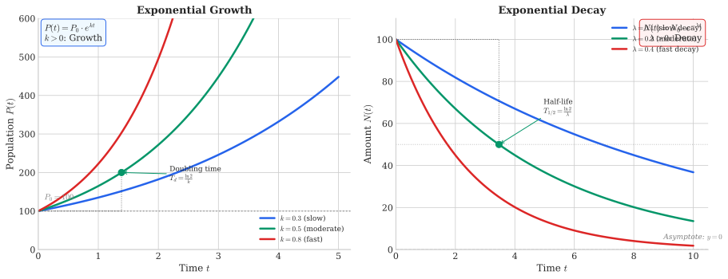

# Week 2: Exponential and Logarithmic Functions

## Theme: "Modeling Unbounded Growth and Decay"

**Science Context:** Plastic production growth, radioactive decay, population growth (unlimited)

**Learning Outcomes:** At the end of this week you should be able to:
1. Understand the definition and properties of exponential functions
2. Recognize the special number $e \approx 2.718$ and why it matters
3. Understand the definition of the logarithm function as the inverse of the exponential
4. Apply logarithm rules to simplify expressions
5. Solve exponential equations using logarithms
6. Connect geometric sequences to exponential functions

**Exam Alignment:** Q8, Q17, Q20, Q23, Q27

---

## 2.1 Introduction: Why Exponential Growth Matters

### The Power of Compounding

There is a fundamental tendency for populations to grow exponentially when unconstrained. Without limits on space, food, or other resources, populations grow geometrically.

**Example: Bacterial Growth**

If a bacterium replicates (doubles) every 20 minutes, after $h$ hours it would become:

$$P(h) = P(0) \cdot 2^{3h} = 1 \times 2^{3h}$$

| Time | Population |
|------|------------|
| 1 hour | 8 bacteria |
| 3 hours | 512 bacteria |
| 10 hours | 1,073,742,000 bacteria (1.07 billion) |

If that same bacterium were to divide every 19 minutes instead, after 10 hours it would become **3.2 billion**!

> **Key Insight:** Compounding effect means small differences in growth rate make huge differences over time.

---

## 2.2 The Exponential Function

### Definition

A function of the form

$$f(x) = a^x, \quad a > 0$$

is an exponential function. The base $a$ determines the rate of growth or decay.

### Key Examples

| Function | Behaviour |
|----------|-----------|
| $f(x) = 2^x$ | Doubling with each unit increase in $x$ |
| $f(x) = 3^x$ | Tripling with each unit increase in $x$ |
| $f(x) = (0.5)^x$ | Halving with each unit increase (decay) |

### The Special Number $e$

When we try to find the derivative of $a^x$ from first principles, something remarkable happens. Consider:

$$f'(x) = \lim_{h \to 0} \frac{a^{x+h} - a^x}{h} = a^x \lim_{h \to 0} \frac{a^h - 1}{h}$$

Computing $\lim_{h \to 0} \frac{a^h - 1}{h}$ for different bases:

| $h$ | $\frac{2^h - 1}{h}$ | $\frac{3^h - 1}{h}$ |
|-----|---------------------|---------------------|
| 0.1 | 0.717735 | 1.161232 |
| 0.01 | 0.695555 | 1.104669 |
| 0.001 | 0.693387 | 1.099216 |
| 0.0001 | 0.693171 | 1.098673 |
| 0.000001 | 0.693147 | 1.098613 |

The limit is **less than 1** for base 2 and **more than 1** for base 3. Therefore, there exists a number between 2 and 3 for which this limit equals exactly 1!

We call this number $e$, **Euler's number**:

$$e \approx 2.718282...$$

For $f(x) = e^x$, we have the remarkable property that $(e^x)' = e^x$. This is the **only function** (up to scaling) that is its own derivative!

We often write $\exp(x)$ to denote $e^x$.

### Graph of $\exp(x)$

- **Domain:** $\{x \in \mathbb{R}\}$ (all real numbers)
- **Range:** $\{y \in \mathbb{R} : y > 0\}$ (positive reals only)
- Always passes through $(0, 1)$ since $e^0 = 1$
- Always increasing
- Horizontal asymptote at $y = 0$ as $x \to -\infty$

### Exponential Laws

All the standard exponential laws hold:

| Law | Expression |
|-----|------------|
| Product | $e^x \cdot e^y = e^{x+y}$ |
| Quotient | $\frac{e^x}{e^y} = e^{x-y}$ |
| Power | $(e^x)^y = e^{xy}$ |
| Negative exponent | $e^{-x} = \frac{1}{e^x}$ |

 and ln(x)")

---

## 2.3 Growth and Decay Models

### General Form

The general exponential model is:

$$P(t) = P_0 \cdot e^{kt}$$

where:
- $P_0$ = initial value (at $t = 0$)
- $k$ = growth/decay rate constant
- If $k > 0$: exponential **growth**
- If $k < 0$: exponential **decay**

### Example 2.1: Bacteria Population Growth

A bacteria population starts with 400 bacteria and grows according to:

$$b(t) = 400e^{1.12567t}$$

where $t$ is in hours.

**Questions:**
1. How many bacteria will there be after 3 hours?
2. At what time will the population double?

**Solution:**

1. $b(3) = 400e^{1.12567 \times 3} = 400e^{3.377} \approx 11,713$ bacteria

2. We need $b(t) = 800$:
   $$400e^{1.12567t} = 800$$
   $$e^{1.12567t} = 2$$
   $$1.12567t = \ln(2)$$
   $$t = \frac{\ln(2)}{1.12567} = \frac{0.693}{1.12567} \approx 0.616 \text{ hours}$$

### Example 2.2: Tree Growth (Devaranavadgi et al., 2013)

The height-age growth of *Acacia catechu* is modelled as:

$$h(t) = 5.966 \exp\left(-\frac{3.0001}{t + 0.3501}\right)$$

where $h(t)$ is height in metres and $t$ is time in years.

**Questions:**
1. What is the maximum height of the tree?
2. What is the initial height?
3. How long does it take to reach half its final height?

**Solution:**

1. Maximum height: As $t \to \infty$, the exponential term approaches $e^0 = 1$, so $h_{\max} = 5.966$ m

2. Initial height: $h(0) = 5.966 \exp\left(-\frac{3.0001}{0.3501}\right) = 5.966 \times e^{-8.57} \approx 0.0004$ m

3. Half final height: Solve $h(t) = 2.983$ m, yielding $t \approx 3.978$ years

---

## 2.4 The Logarithm Function

### The Inverse of the Exponential

Since the exponential function is one-to-one, it has an inverse. We call this inverse the **natural logarithm function**, denoted $\ln(x)$.

$$y = e^x \iff x = \ln(y)$$

### Graph of $\ln(x)$

The graph of $\ln(x)$ is the reflection of $e^x$ across the line $y = x$:

- **Domain:** $\{x \in \mathbb{R} : x > 0\}$ (positive reals only)
- **Range:** $\{y \in \mathbb{R}\}$ (all real numbers)
- Passes through $(1, 0)$ since $\ln(1) = 0$
- Vertical asymptote at $x = 0$

### Fundamental Inverse Relationships

Since $\exp$ and $\ln$ are inverses:

$$e^{\ln(x)} = x \quad \text{and} \quad \ln(e^x) = x$$

Or equivalently:

$$\exp(\ln(x)) = \ln(\exp(x)) = x$$

### Logarithm Laws

| Law | Expression |
|-----|------------|
| Product | $\ln(xy) = \ln(x) + \ln(y)$ |
| Quotient | $\ln\left(\frac{x}{y}\right) = \ln(x) - \ln(y)$ |
| Power | $\ln(x^r) = r \ln(x)$ |
| Special values | $\ln(1) = 0$, $\ln(e) = 1$ |

### Example 2.3: Simplifying Logarithmic Expressions

Simplify the following:

**(a)** $\ln(e^x) + \ln(e^{3x})$

$$= x + 3x = 4x$$

**(b)** $e^{\ln(x^2)}$

$$= x^2$$

**(c)** $e^{\ln(\sqrt{x})}$

$$= \sqrt{x}$$

**(d)** $\exp(\ln(x^2 + x + 2))$

$$= x^2 + x + 2$$

---

## 2.5 Solving Exponential and Logarithmic Equations

The key strategy: use the inverse relationship between $\exp$ and $\ln$.

### Example 2.4: Solve for $x$

**(a)** $e^{2x} = 1$

$$2x = \ln(1) = 0 \implies x = 0$$

**(b)** $e^{x^2} = 4$

$$x^2 = \ln(4) \implies x = \pm\sqrt{\ln(4)} = \pm\sqrt{1.386} \approx \pm 1.177$$

**(c)** $\ln(x^2) = 4$

$$x^2 = e^4 \implies x = \pm e^2 \approx \pm 7.389$$

**(d)** $\ln(x^2) = 8$

$$x^2 = e^8 \implies x = \pm e^4 \approx \pm 54.60$$

---

## 2.6 The "70 over r" Rule

A useful approximation for doubling time:

> **The doubling time of a population growing at rate $r$% per unit time is approximately $\frac{70}{r}$ time units.**

**Derivation:**

We want to find $T$ such that $P_0 e^{rT} = 2P_0$:

$$e^{rT} = 2$$
$$rT = \ln(2) \approx 0.693$$
$$T = \frac{0.693}{r}$$

When $r$ is expressed as a percentage (e.g., $r = 0.03$ for 3%), we have:

$$T = \frac{0.693}{0.03} = 23.1 \text{ years}$$

Which equals $\frac{69.3}{3} \approx \frac{70}{3}$ years.

**Example:** A population growing at 5% per year doubles every $\frac{70}{5} = 14$ years.

### Tripling Time?

Following similar logic: $\frac{\ln(3)}{r} = \frac{1.099}{r} \approx \frac{110}{r\%}$

---

## 2.7 Geometric Sequences as Discrete Exponentials

### Definition

A sequence $\{a_1, a_2, a_3, \ldots\}$ is a **geometric sequence** if:
- $a_1 = a$ (first term)
- $a_k = a \cdot r^{k-1}$ for $k > 1$

where $r \neq 0$ is the **common ratio**.

| Condition | Behaviour |
|-----------|-----------|
| $r > 1$ | Increasing sequence |
| $0 < r < 1$ | Decreasing sequence |
| $r = 1$ | Constant sequence |

### Connection to Exponential Functions

A geometric sequence is essentially a **discrete sampling** of an exponential function:

$$a_n = a \cdot r^{n-1} \longleftrightarrow f(x) = a \cdot r^{x-1}$$

The sequence values lie exactly on the exponential curve at integer points.

### Example 2.5: Compound Interest

Chork Meng invests $100,000 in a fixed deposit with 5% monthly interest.

**(a)** How much after 3 years (36 months)?

$$a_{36} = 100,000 \times (1.05)^{36} = \$579,181.60$$

**(b)** How long to double?

$$100,000 \times (1.05)^k = 200,000$$
$$(1.05)^k = 2$$
$$k \ln(1.05) = \ln(2)$$
$$k = \frac{\ln(2)}{\ln(1.05)} = \frac{0.693}{0.0488} = 14.2 \text{ months}$$

So it takes **15 months** to double.

### Example 2.6: Petroleum Usage

Petroleum oil use increases at 7% annually. In 2022, usage was 3.95 million barrels/day.

**(a)** Daily usage in 2032?

$$P_{11} = 3.95 \times (1.07)^{10} = 7.77 \text{ million b/d}$$

---

## 2.8 Geometric Series (Sum of Geometric Sequence)

### Formula Derivation

Let $S_n = a + ar + ar^2 + \cdots + ar^{n-1}$

Multiply by $r$: $rS_n = ar + ar^2 + \cdots + ar^n$

Subtract:
$$S_n - rS_n = a - ar^n$$
$$S_n(1 - r) = a(1 - r^n)$$
$$S_n = \frac{a(1 - r^n)}{1 - r}, \quad r \neq 1$$

### Sum to Infinity

If $|r| < 1$, the series converges:

$$\lim_{n \to \infty} S_n = \frac{a}{1 - r}$$

---

## 2.9 Connecting Growth Rates

### Population Dynamics Terminology

From population studies (especially Andrewartha, 1970), several growth measures are connected:

| Measure | Symbol | Meaning |
|---------|--------|---------|
| Intrinsic rate of increase | $r_m$ | Per capita instantaneous growth rate |
| Finite rate of increase | $\lambda$ | Multiplicative factor: $\lambda = e^{r_m}$ |
| Net reproductive rate | $R_0$ | Offspring per individual per generation |
| Generation time | $T$ | Mean time between generations |

**Relationships:**

$$\lambda = e^{r_m}$$
$$R_0 = e^{r_m T}$$

**Example: Rice Weevil**

- $r_m = 0.76$ per week
- $T = 6.2$ weeks
- $\lambda = e^{0.76} = 2.14$ (population multiplies by 2.14 each week)
- $R_0 = e^{0.76 \times 6.2} = e^{4.71} = 111$ (each individual produces 111 offspring per generation)

---

## 2.10 Application: Probability and Risk

Exponential and logistic functions appear frequently in probability modelling.

### Example 2.7: Disease Risk

Suppose the probability $p$ of contracting a disease is a function of risk $x$:

$$p = \frac{1}{1 + e^{-3x}}$$

**Properties:**
- When $x = 0$: $p = \frac{1}{1 + 1} = \frac{1}{2}$
- When $x < 0$ (negative risk): $p < \frac{1}{2}$
- When $x > 0$ (positive risk): $p > \frac{1}{2}$
- $p$ is always an increasing function of $x$
- As $x \to -\infty$: $p \to 0$
- As $x \to +\infty$: $p \to 1$

> **Note:** This logistic function will be studied in detail in Week 3.

---

## Summary: Key Formulas for Week 2

| Topic | Key Formula |
|-------|-------------|
| Exponential function | $f(x) = e^x$, where $e \approx 2.718$ |
| General growth/decay | $P(t) = P_0 e^{kt}$ |
| Logarithm definition | $y = \ln(x) \iff e^y = x$ |
| Log of product | $\ln(ab) = \ln(a) + \ln(b)$ |
| Log of quotient | $\ln(a/b) = \ln(a) - \ln(b)$ |
| Log of power | $\ln(a^n) = n\ln(a)$ |
| Geometric sequence | $a_n = a_1 \cdot r^{n-1}$ |
| Geometric series | $S_n = \frac{a(1-r^n)}{1-r}$ |
| Doubling time | $T = \frac{\ln(2)}{r} \approx \frac{70}{r\%}$ |

---

## Looking Ahead: Week 3

In Week 3, we will explore what happens when growth has **limits** — the logistic function:

$$P(t) = \frac{K}{1 + Ae^{-\alpha t}}$$

where $K$ is the carrying capacity. We'll also introduce the Schaefer fish growth model, which connects to optimization problems later in the course.

---

*Materials adapted from SCIE1500 lecture notes (Khan, Hailu) and aligned with SCIE1500 Sample Final Examination.*
