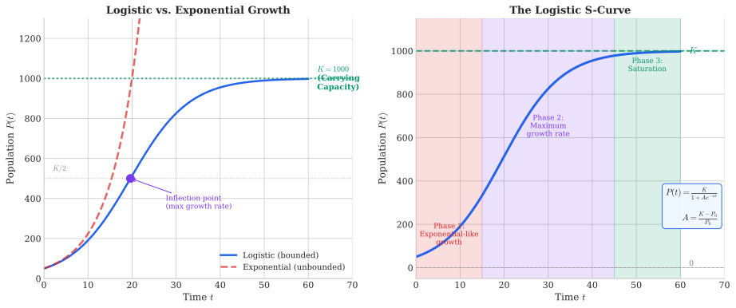
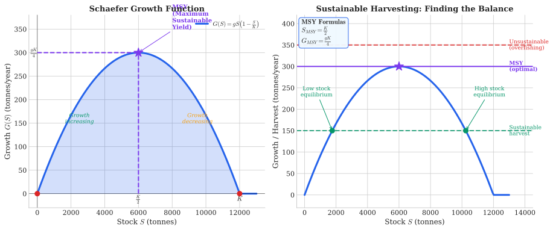

# Week 3: Logistic Functions and Bounded Growth

## Theme: "When Growth Has Limits"

**Science Context:** Fish populations, carrying capacity, sustainable harvesting, the Schaefer model

**Learning Outcomes:** At the end of this week you should be able to:
1. Understand why exponential growth cannot continue indefinitely in real systems
2. Recognize and work with the logistic function as a model of bounded growth
3. Apply the Schaefer model to analyze fish population dynamics
4. Calculate Maximum Sustainable Yield (MSY) for renewable resources
5. Understand arithmetic sequences and their connection to linear functions
6. Compose functions and find inverse functions

**Exam Alignment:** Q8, Q13, Q17

---

## 3.1 Introduction: Why Growth Has Limits

### The Problem with Unbounded Growth

In Week 2, we studied exponential growth: $P(t) = P_0 e^{kt}$. This model captures the early stages of population growth beautifully—bacteria in a petri dish, rabbits on an island, or plastic production in an economy with abundant resources.

But here's the critical question: **Can any population grow exponentially forever?**

The answer is clearly **no**. Consider:

| System | Limiting Factor |
|--------|-----------------|
| Bacteria in petri dish | Nutrients exhausted, waste accumulates |
| Fish in the ocean | Food competition, predation, habitat space |
| Human population | Resources, space, carrying capacity of Earth |
| Market for a product | Market saturation, competing products |

> **Key Insight:** All real growth systems eventually encounter **compensating factors** that slow and eventually halt growth. The exponential model is only valid when the population is small relative to available resources.

### From Stock to Flow: A Renewable Resource Perspective

When analyzing renewable resources like fish, it's essential to think in terms of:

- **Stock ($S$)**: The total biomass at a point in time (e.g., 2 million tonnes of fish)
- **Flow or Growth ($G$)**: The change in stock over time (e.g., 400,000 tonnes of additional fish per year)

The fundamental question becomes: **How does the flow (growth) depend on the level of the stock?**

---

## 3.2 The Logistic Function

### Building Intuition

If fish grew at a constant rate $g$ regardless of population size:

$$G(S) = g \cdot S$$

Then the stock would grow exponentially: $S(t) = S_0 e^{gt}$

But as the stock grows, **competition for resources increases**. The *actual* growth rate must decline as the population approaches the environment's **carrying capacity** $K$.

### The Logistic Growth Model

The logistic function incorporates this constraint elegantly:

$$P(t) = \frac{K}{1 + Ae^{-\alpha t}}$$

where:
- $K$ = **carrying capacity** (maximum sustainable population)
- $\alpha$ = **intrinsic growth rate** (growth rate when population is small)
- $A$ = parameter related to initial conditions: $A = \frac{K - P(0)}{P(0)} = \frac{K}{P(0)} - 1$
- $t$ = time

### Alternative Form

The logistic function is sometimes written with an inflection point parameter:

$$P(t) = \frac{L}{1 + e^{-k(t - t_0)}}$$

where:
- $L$ = carrying capacity
- $k$ = growth rate parameter
- $t_0$ = time at inflection point (where growth rate is maximum)

### Properties of the Logistic Curve (S-Curve)

| Property | Value/Description |
|----------|-------------------|
| Domain | $\{t \in \mathbb{R}\}$ |
| Range | $\{P \in \mathbb{R} : 0 < P < K\}$ |
| Initial value | $P(0) = \frac{K}{1 + A}$ |
| As $t \to \infty$ | $P(t) \to K$ (horizontal asymptote) |
| As $t \to -\infty$ | $P(t) \to 0$ (horizontal asymptote) |
| Inflection point | At $P = K/2$, where growth rate is maximum |
| Shape | S-curve (sigmoid) |

### Example 3.1: Population with Carrying Capacity

A fish population follows the logistic equation:

$$P(t) = \frac{15000}{1 + 120e^{-0.15t}}$$

where $P(t)$ is in tonnes and $t$ is in years.

**Questions:**
1. What is the carrying capacity?
2. What is the initial population?
3. How long until the population reaches 50% of carrying capacity?

**Solution:**

1. Carrying capacity: $K = 15000$ tonnes

2. Initial population: 
   $$P(0) = \frac{15000}{1 + 120e^0} = \frac{15000}{121} \approx 124 \text{ tonnes}$$

3. Time to reach $P = 7500$ tonnes:
   $$7500 = \frac{15000}{1 + 120e^{-0.15t}}$$
   $$1 + 120e^{-0.15t} = 2$$
   $$120e^{-0.15t} = 1$$
   $$e^{-0.15t} = \frac{1}{120}$$
   $$-0.15t = \ln\left(\frac{1}{120}\right) = -\ln(120)$$
   $$t = \frac{\ln(120)}{0.15} = \frac{4.787}{0.15} \approx 32 \text{ years}$$

> **Note:** This matches Q8 in the exam, which asks about time to reach 50% of carrying capacity.

---

## 3.3 The Schaefer Model of Fish Growth

### From Population Trajectory to Growth Rate

The **Schaefer (1957) model** focuses directly on the **growth function** $G(S)$ rather than the population trajectory $P(t)$. This is particularly useful for fisheries management.

### The Schaefer Growth Equation

$$G(S) = g \cdot S \cdot \left(1 - \frac{S}{K}\right)$$

where:
- $G(S)$ = growth (flow) of fish biomass
- $g$ = intrinsic growth rate (potential growth rate when $S$ is small)
- $S$ = current stock level
- $K$ = carrying capacity

### Understanding the Model Components

**The term $\left(1 - \frac{S}{K}\right)$ is the key innovation:**

| Stock Level | Compensating Factor | Effect |
|-------------|---------------------|--------|
| $S \ll K$ | $\left(1 - \frac{S}{K}\right) \approx 1$ | Growth near intrinsic rate |
| $S = K/2$ | $\left(1 - \frac{S}{K}\right) = 0.5$ | Maximum total growth |
| $S = K$ | $\left(1 - \frac{S}{K}\right) = 0$ | Zero growth (at capacity) |
| $S > K$ | $\left(1 - \frac{S}{K}\right) < 0$ | Negative growth (decline) |

### The Actual Growth Rate

The **actual growth rate** (growth per unit stock) is:

$$\frac{G(S)}{S} = g \cdot \left(1 - \frac{S}{K}\right)$$

This declines linearly from $g$ (when $S = 0$) to $0$ (when $S = K$).

### Example 3.2: Analyzing Fish Stock Dynamics

Consider a fishery with $g = 0.1$ per year and $K = 12000$ tonnes.

**Calculate growth at various stock levels:**

| Stock $S$ (tonnes) | $1 - S/K$ | Growth $G(S)$ (tonnes/year) | Growth Rate $G(S)/S$ |
|-------------------|-----------|------------------------------|---------------------|
| 2,000 | 0.833 | $0.1 \times 2000 \times 0.833 = 167$ | 8.33% |
| 4,000 | 0.667 | $0.1 \times 4000 \times 0.667 = 267$ | 6.67% |
| 6,000 | 0.500 | $0.1 \times 6000 \times 0.500 = 300$ | 5.00% |
| 8,000 | 0.333 | $0.1 \times 8000 \times 0.333 = 267$ | 3.33% |
| 10,000 | 0.167 | $0.1 \times 10000 \times 0.167 = 167$ | 1.67% |
| 12,000 | 0.000 | $0.1 \times 12000 \times 0.000 = 0$ | 0.00% |

> **Key Observation:** Growth is maximized at $S = 6000$ tonnes, which is exactly $K/2$.

---

## 3.4 Maximum Sustainable Yield (MSY)

### The Concept

**Maximum Sustainable Yield (MSY)** is the largest harvest that can be taken from a renewable resource indefinitely without depleting the stock.

At MSY:
- Harvest = Growth
- Stock remains constant year after year

### Finding the MSY

The Schaefer model $G(S) = gS(1 - S/K)$ is a **quadratic function** of $S$ (a downward-opening parabola).

To find the maximum, we can either:

1. **Use calculus** (Week 4): Set $\frac{dG}{dS} = 0$
2. **Use the vertex formula**: For $G(S) = -\frac{g}{K}S^2 + gS$, the vertex is at $S = -\frac{b}{2a}$

**Using the vertex formula:**

Rewriting: $G(S) = gS - \frac{g}{K}S^2 = -\frac{g}{K}\left(S^2 - KS\right)$

Standard form: $G(S) = aS^2 + bS$ where $a = -\frac{g}{K}$ and $b = g$

Vertex at:
$$S^* = -\frac{b}{2a} = -\frac{g}{2 \cdot (-g/K)} = \frac{K}{2}$$

**MSY occurs when the stock is at half the carrying capacity:**

$$S_{MSY} = \frac{K}{2}$$

**The MSY harvest is:**

$$G_{MSY} = g \cdot \frac{K}{2} \cdot \left(1 - \frac{K/2}{K}\right) = g \cdot \frac{K}{2} \cdot \frac{1}{2} = \frac{gK}{4}$$

### Example 3.3: MSY Calculation

For $g = 0.1$ and $K = 12000$ tonnes:

$$S_{MSY} = \frac{12000}{2} = 6000 \text{ tonnes}$$

$$G_{MSY} = \frac{0.1 \times 12000}{4} = 300 \text{ tonnes/year}$$

**Interpretation:** By maintaining the fish stock at 6,000 tonnes, we can sustainably harvest 300 tonnes every year—forever.

### Management Implications

| Current Stock | Management Action |
|--------------|-------------------|
| $S < S_{MSY}$ | Reduce harvest to let stock recover |
| $S = S_{MSY}$ | Harvest exactly $G_{MSY}$ to maintain steady state |
| $S > S_{MSY}$ | Can harvest more than $G_{MSY}$ temporarily to reduce stock to optimal level |

---

## 3.5 Connecting Models: Exponential → Logistic

### The Differential Equation View

The Schaefer model can also be written as a differential equation:

$$\frac{dS}{dt} = gS\left(1 - \frac{S}{K}\right)$$

When $S \ll K$, this simplifies to:

$$\frac{dS}{dt} \approx gS$$

which gives exponential growth $S(t) = S_0 e^{gt}$.

The solution to the full logistic differential equation is:

$$S(t) = \frac{K}{1 + Ae^{-gt}}$$

where $A = \frac{K - S_0}{S_0}$.

**The Schaefer growth model and the logistic function describe the same phenomenon—one focuses on growth rate, the other on the population trajectory.**

---

## 3.6 Arithmetic Sequences: The Linear Analogue

### Definition

While geometric sequences connect to exponential functions, **arithmetic sequences** connect to **linear functions**.

A sequence $\{a_1, a_2, a_3, \ldots\}$ is **arithmetic** if consecutive terms differ by a constant:

$$a_n = a_1 + (n-1)d$$

where:
- $a_1$ = first term
- $d$ = **common difference**
- $n$ = term number

### Examples

| Sequence | $a_1$ | $d$ | Formula |
|----------|-------|-----|---------|
| 2, 5, 8, 11, 14, ... | 2 | 3 | $a_n = 2 + 3(n-1) = 3n - 1$ |
| 100, 90, 80, 70, ... | 100 | -10 | $a_n = 100 - 10(n-1) = 110 - 10n$ |
| 3, 3, 3, 3, ... | 3 | 0 | $a_n = 3$ |

### Connection to Linear Functions

An arithmetic sequence is a **discrete sampling** of a linear function:

$$a_n = a_1 + (n-1)d \longleftrightarrow f(x) = d \cdot x + (a_1 - d)$$

Compare with slope-intercept form $y = mx + b$:
- Slope $m = d$ (the common difference)
- The sequence values lie exactly on the line at integer points

### Example 3.4: Fish Stock Under Constant Decline

Suppose fish stock declines linearly due to environmental degradation:

$$S_n = 12000 - 500(n-1)$$

where $S_n$ is stock in year $n$.

**Questions:**
1. What is the initial stock?
2. What is the common difference?
3. When will the stock reach zero?

**Solution:**

1. Initial stock: $S_1 = 12000 - 500(0) = 12000$ tonnes

2. Common difference: $d = -500$ tonnes/year (declining)

3. Stock reaches zero when:
   $$12000 - 500(n-1) = 0$$
   $$n - 1 = 24$$
   $$n = 25 \text{ years}$$

### Arithmetic Series

The sum of the first $n$ terms of an arithmetic sequence:

$$S_n = \frac{n}{2}(a_1 + a_n) = \frac{n}{2}[2a_1 + (n-1)d]$$

---

## 3.7 Function Composition

### Definition

Given two functions $f$ and $g$, the **composition** $f \circ g$ is defined as:

$$(f \circ g)(x) = f(g(x))$$

**Read as:** "f of g of x" — first apply $g$, then apply $f$ to the result.

### Important Notes

1. **Order matters:** Generally, $f \circ g \neq g \circ f$
2. **Domain considerations:** $x$ must be in the domain of $g$, and $g(x)$ must be in the domain of $f$

### Example 3.5: Composing Functions

Let $f(x) = e^x$ and $g(x) = 2x + 1$.

**(a) Find $(f \circ g)(x)$:**

$$(f \circ g)(x) = f(g(x)) = f(2x + 1) = e^{2x+1}$$

**(b) Find $(g \circ f)(x)$:**

$$(g \circ f)(x) = g(f(x)) = g(e^x) = 2e^x + 1$$

**(c) Evaluate $(f \circ g)(0)$:**

$$(f \circ g)(0) = e^{2(0)+1} = e^1 = e$$

### Example 3.6: Composition with Logistic Function

Let $f(x) = \frac{1}{1 + e^{-x}}$ (logistic function) and $g(x) = 3x$.

$$(f \circ g)(x) = f(3x) = \frac{1}{1 + e^{-3x}}$$

This is exactly the disease risk function from Week 2, Example 2.7!

### Application: Building Complex Models

In scientific modeling, composition allows us to build complex models from simpler components:

$$\text{Risk} = f(\text{Exposure})$$
$$\text{Exposure} = g(\text{Distance})$$
$$\text{Risk} = (f \circ g)(\text{Distance})$$

---

## 3.8 Inverse Functions

### Definition

If $f$ is a one-to-one function, its **inverse** $f^{-1}$ satisfies:

$$f^{-1}(f(x)) = x \quad \text{and} \quad f(f^{-1}(x)) = x$$

**Graphically:** The graph of $f^{-1}$ is the reflection of the graph of $f$ across the line $y = x$.

### Finding Inverse Functions

**Step 1:** Write $y = f(x)$  
**Step 2:** Solve for $x$ in terms of $y$  
**Step 3:** Swap $x$ and $y$ to get $y = f^{-1}(x)$

### Example 3.7: Finding Inverses

**(a) Find the inverse of $f(x) = 3 + \frac{1}{4}x$**

Step 1: $y = 3 + \frac{1}{4}x$

Step 2: Solve for $x$:
$$y - 3 = \frac{1}{4}x$$
$$x = 4(y - 3) = 4y - 12$$

Step 3: Swap $x$ and $y$:
$$f^{-1}(x) = 4x - 12 = -12 + 4x$$

**Verification:** 
$$f(f^{-1}(x)) = f(4x - 12) = 3 + \frac{1}{4}(4x - 12) = 3 + x - 3 = x \checkmark$$

**(b) Find the inverse of $f(x) = e^{2x}$**

Step 1: $y = e^{2x}$

Step 2: Take natural log:
$$\ln(y) = 2x$$
$$x = \frac{\ln(y)}{2}$$

Step 3: $f^{-1}(x) = \frac{\ln(x)}{2} = \frac{1}{2}\ln(x)$

### Inverse of the Logistic Function

For the logistic function $P = \frac{K}{1 + Ae^{-\alpha t}}$, we can solve for $t$:

$$P(1 + Ae^{-\alpha t}) = K$$
$$1 + Ae^{-\alpha t} = \frac{K}{P}$$
$$Ae^{-\alpha t} = \frac{K}{P} - 1 = \frac{K - P}{P}$$
$$e^{-\alpha t} = \frac{K - P}{AP}$$
$$-\alpha t = \ln\left(\frac{K - P}{AP}\right)$$
$$t = -\frac{1}{\alpha}\ln\left(\frac{K - P}{AP}\right) = \frac{1}{\alpha}\ln\left(\frac{AP}{K - P}\right)$$

This tells us the **time required to reach a given population level**.

---

## 3.9 Why This Matters: Preparing for Optimization

Understanding bounded growth and the Schaefer model is crucial preparation for:

| Future Topic | Connection |
|--------------|------------|
| **Week 4-5: Derivatives** | Finding MSY using $\frac{dG}{dS} = 0$ |
| **Week 5: Optimization** | Maximizing sustainable yield |
| **Week 8: Predator-Prey** | Lotka-Volterra extends these ideas to interacting populations |
| **Week 12: Linear Programming** | Resource allocation under constraints |

The Schaefer model demonstrates how **quadratic structure** (from the product $S \cdot (1 - S/K)$) leads to **optimization problems** with clear maxima—a theme that will recur throughout the course.

---

## Summary: Key Formulas for Week 3

| Topic | Key Formula |
|-------|-------------|
| Logistic function | $P(t) = \frac{K}{1 + Ae^{-\alpha t}}$ |
| Parameter $A$ | $A = \frac{K}{P(0)} - 1$ |
| Schaefer growth model | $G(S) = gS\left(1 - \frac{S}{K}\right)$ |
| MSY stock level | $S_{MSY} = \frac{K}{2}$ |
| MSY harvest | $G_{MSY} = \frac{gK}{4}$ |
| Arithmetic sequence | $a_n = a_1 + (n-1)d$ |
| Arithmetic series | $S_n = \frac{n}{2}(a_1 + a_n)$ |
| Function composition | $(f \circ g)(x) = f(g(x))$ |
| Inverse relationship | $f^{-1}(f(x)) = x$ |

---

## Looking Ahead: Week 4

In Week 4, we will formalize the concept of **instantaneous rate of change** through the **derivative**. This will allow us to:

- Prove that MSY occurs at $S = K/2$ using calculus
- Find optimal harvest strategies for any growth function
- Understand limits and continuity as foundations for calculus

The optimization of the Schaefer model (Q13 in the exam) will be fully analyzed using derivative techniques.

---

*Materials adapted from SCIE1500 lecture notes (Khan, Hailu) and aligned with SCIE1500 Sample Final Examination.*
