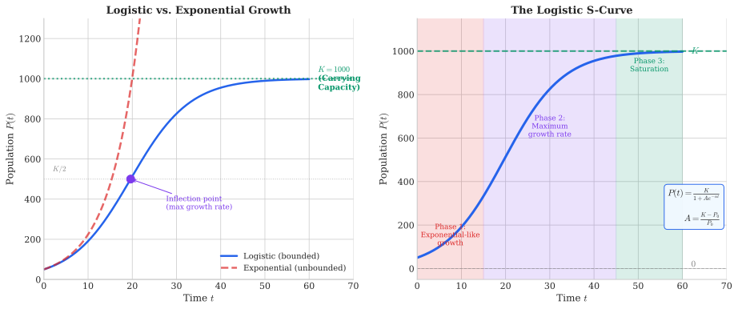
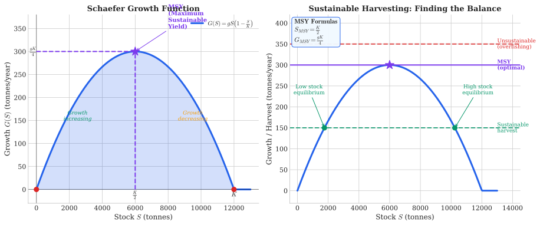

# Week 3: Logistic Functions and Bounded Growth

## Act I: Understanding Systems — Chapter 3

> *"Every system has a ceiling. The logistic curve is nature's way of reminding us that limits are real."*

---

## Theme: "When Growth Has Limits"

**Science Context:** Fish populations, carrying capacity, sustainable harvesting, the Schaefer model

**Learning Outcomes:** At the end of this week you should be able to:
1. Understand why exponential growth cannot continue indefinitely in real systems
2. Understand arithmetic sequences and their connection to linear functions
3. Recognize and work with the logistic function as a model of bounded growth
4. Apply the Schaefer model to analyze fish population dynamics
5. Calculate Maximum Sustainable Yield (MSY) for renewable resources
6. Compose functions and find inverse functions

---

> **📓 About "Try it in Python" boxes:** Throughout this lesson, these boxes reference specific code examples by ID — e.g. **W3-CS03** means *Week 3, Code Snippet 3*. Find the matching code under **Notes → Python Code Snippets** for this week; each entry there is labelled with its ID.

## 3.1 Introduction: Why Growth Has Limits

### The Problem with Unbounded Growth

In Week 2, we studied exponential growth: $P(t) = P_0 e^{kt}$. This model captures the early stages of population growth beautifully: bacteria in a petri dish, rabbits on an island, or plastic production in an economy with abundant resources.

But here's the critical question: **Can any population grow exponentially forever?**

The answer is clearly **no**. Consider:

| System                 | Limiting Factor                              |
| ---------------------- | --------------------------------------------- |
| Bacteria in petri dish | Nutrients exhausted, waste accumulates       |
| Fish in the ocean      | Food competition, predation, habitat space   |
| Human population       | Resources, space, carrying capacity of Earth |
| Market for a product   | Market saturation, competing products        |

> **Key Insight:** All real growth systems eventually encounter **compensating factors** that slow and eventually halt growth. The exponential model is only valid when the population is small relative to available resources.

### From Stock to Flow: A Renewable Resource Perspective

When analyzing renewable resources like fish, it's essential to think in terms of:

- **Stock ($S$)**: The total biomass at a point in time
- **Flow or Growth ($G$)**: The change in stock per unit time

The fundamental question becomes: **How does the flow (growth) depend on the level of the stock?**

---

## 3.2 Completing Last Week's Pair: Arithmetic Sequences

### Last Week → This Week

Last week you met the **geometric sequence** — the discrete cousin of exponential growth, where each term is found by *multiplying* by a constant ratio. There's a natural partner: the **arithmetic sequence**, the discrete cousin of linear, straight-line change, where each term is found by *adding* a constant amount.

### Definition

A sequence $\{a_1, a_2, a_3, \ldots\}$ is **arithmetic** if consecutive terms differ by a constant:

$$a_n = a_1 + (n-1)d$$

where:
- $a_1$ = first term
- $d$ = **common difference**
- $n$ = term number

### Examples

| Sequence             | $a_1$ | $d$ | Formula                           |
| -------------------- | ----- | --- | --------------------------------- |
| 2, 5, 8, 11, 14, ... | 2     | 3   | $a_n = 2 + 3(n-1) = 3n - 1$       |
| 100, 90, 80, 70, ... | 100   | -10 | $a_n = 100 - 10(n-1) = 110 - 10n$ |
| 3, 3, 3, 3, ...      | 3     | 0   | $a_n = 3$                         |

### Connection to Linear Functions

An arithmetic sequence is a **discrete sampling** of a linear function:

$$a_n = a_1 + (n-1)d \longleftrightarrow f(x) = d \cdot x + (a_1 - d)$$

Compare with slope-intercept form $y = mx + b$:
- Slope $m = d$
- Sequence values lie exactly on the line at integer points

### Example 3.1: Fish Stock Under Constant Decline

Suppose fish stock declines linearly due to environmental degradation:

$$S_n = 12000 - 500(n-1)$$

where $S_n$ is stock in year $n$.

1. Initial stock: $12000$ tonnes
2. Common difference: $d = -500$ tonnes/year
3. Stock reaches zero when $12000 - 500(n-1) = 0$, giving $n = 25$

### Arithmetic Series

The sum of the first $n$ terms is:

$$S_n = \frac{n}{2}(a_1 + a_n) = \frac{n}{2}[2a_1 + (n-1)d]$$

### So Why Bring This Up Here?

Linear change is the **simplest** possible model of a changing stock, and sometimes — over a limited range — it's genuinely all you need, as the example above shows. But most bounded biological growth doesn't behave that simply: it starts fast, like exponential growth, and then *bends* as it nears a limit. Describing that bend — not a straight line, but a curve that flattens — is exactly the job of the logistic function, which we build next.

> **📓 Try it in Python**
>
> - **W3-CS07** — *Arithmetic Sequence Visualization*: Plot a sequence as discrete points alongside its underlying linear function.
>
> Find these under **Notes → Python Code Snippets** for this week.

---

## 3.3 The Logistic Function

### Building Intuition

If fish grew at a constant rate $g$ regardless of population size:

$$G(S) = g \cdot S$$

Then the stock would grow exponentially: $S(t) = S_0 e^{gt}$.

But as the stock grows, **competition for resources increases**. The actual growth rate must decline as the population approaches the environment's **carrying capacity** $K$.

### The Logistic Growth Model

The logistic function incorporates this constraint elegantly:

$$P(t) = \frac{K}{1 + Ae^{-\alpha t}}$$

where:
- $K$ = **carrying capacity**
- $\alpha$ = **intrinsic growth rate**
- $A$ = parameter related to initial conditions: $A = \frac{K - P(0)}{P(0)} = \frac{K}{P(0)} - 1$
- $t$ = time

### Alternative Form

The logistic function is sometimes written with an inflection point parameter:

$$P(t) = \frac{L}{1 + e^{-k(t - t_0)}}$$

where:
- $L$ = carrying capacity
- $k$ = growth rate parameter
- $t_0$ = time at inflection point

### Properties of the Logistic Curve (S-Curve)

| Property           | Value/Description                          |
| ------------------ | ------------------------------------------- |
| Domain             | $\{t \in \mathbb{R}\}$                     |
| Range              | $\{P \in \mathbb{R} : 0 < P < K\}$         |
| Initial value      | $P(0) = \frac{K}{1 + A}$                   |
| As $t \to \infty$  | $P(t) \to K$ (horizontal asymptote)        |
| As $t \to -\infty$ | $P(t) \to 0$ (horizontal asymptote)        |
| Inflection point   | At $P = K/2$, where growth rate is maximum |
| Shape              | S-curve (sigmoid)                          |

### Example 3.2: Population with Carrying Capacity

A fish population follows the logistic equation:

$$P(t) = \frac{15000}{1 + 120e^{-0.15t}}$$

where $P(t)$ is in tonnes and $t$ is in years.

**Questions:**
1. What is the carrying capacity?
2. What is the initial population?
3. How long until the population reaches 50% of carrying capacity?

**Solution:**

1. Carrying capacity: $K = 15000$ tonnes

2. Initial population:
   $$P(0) = \frac{15000}{1 + 120e^0} = \frac{15000}{121} \approx 124 \text{ tonnes}$$

3. Time to reach $P = 7500$ tonnes:
   $$7500 = \frac{15000}{1 + 120e^{-0.15t}}$$
   $$1 + 120e^{-0.15t} = 2$$
   $$120e^{-0.15t} = 1$$
   $$e^{-0.15t} = \frac{1}{120}$$
   $$-0.15t = \ln\left(\frac{1}{120}\right) = -\ln(120)$$
   $$t = \frac{\ln(120)}{0.15} \approx 32 \text{ years}$$

That time is exactly the inflection point — the moment the population stops speeding up and begins to slow.

> **📓 Try it in Python**
>
> - **W3-CS01** — *Logistic Growth Curve*: Plot the S-curve and mark the inflection point at $K/2$.
> - **W3-CS05** — *Fitting a Logistic Curve to Real Data*: Estimate $K$, $A$, and $\alpha$ from observed populations.
>
> Find these under **Notes → Python Code Snippets** for this week.

## 3.4 The Schaefer Model of Fish Growth

### From Population Trajectory to Growth Rate

The **Schaefer (1957) model** focuses directly on the **growth function** $G(S)$ rather than the population trajectory $P(t)$. This is particularly useful for fisheries management.

### The Schaefer Growth Equation

$$G(S) = g \cdot S \cdot \left(1 - \frac{S}{K}\right)$$

where:
- $G(S)$ = growth (flow) of fish biomass
- $g$ = intrinsic growth rate
- $S$ = current stock level
- $K$ = carrying capacity

### Understanding the Model Components

**The term $\left(1 - \frac{S}{K}\right)$ is the key innovation:**

| Stock Level | Compensating Factor                      | Effect                     |
| ----------- | ----------------------------------------- | --------------------------- |
| $S \ll K$   | $\left(1 - \frac{S}{K}\right) \approx 1$ | Growth near intrinsic rate |
| $S = K/2$   | $\left(1 - \frac{S}{K}\right) = 0.5$     | Maximum total growth       |
| $S = K$     | $\left(1 - \frac{S}{K}\right) = 0$       | Zero growth (at capacity)  |
| $S > K$     | $\left(1 - \frac{S}{K}\right) < 0$       | Negative growth (decline)  |

### The Actual Growth Rate

The **actual growth rate** is:

$$\frac{G(S)}{S} = g \cdot \left(1 - \frac{S}{K}\right)$$

This declines linearly from $g$ to $0$ as stock moves from $0$ to $K$. The *total* flow $G(S)$, however, rises then falls — a parabola, as the next example shows.

### Example 3.3: Analyzing Fish Stock Dynamics

Consider a fishery with $g = 0.1$ per year and $K = 12000$ tonnes.

| Stock $S$ (tonnes) | $1 - S/K$ | Growth $G(S)$ (tonnes/year)           | Growth Rate $G(S)/S$ |
| ------------------- | --------- | -------------------------------------- | --------------------- |
| 2,000              | 0.833     | $0.1 \times 2000 \times 0.833 = 167$  | 8.33%                 |
| 4,000              | 0.667     | $0.1 \times 4000 \times 0.667 = 267$  | 6.67%                 |
| 6,000              | 0.500     | $0.1 \times 6000 \times 0.500 = 300$  | 5.00%                 |
| 8,000              | 0.333     | $0.1 \times 8000 \times 0.333 = 267$  | 3.33%                 |
| 10,000             | 0.167     | $0.1 \times 10000 \times 0.167 = 167$ | 1.67%                 |
| 12,000             | 0.000     | $0.1 \times 12000 \times 0.000 = 0$   | 0.00%                 |

> **Key Observation:** Growth is maximized at $S = 6000$ tonnes, which is exactly $K/2$. Beyond $K/2$, the compensating factor $(1-S/K)$ dominates and total growth falls even though the stock is larger.

> **📓 Try it in Python**
>
> - **W3-CS02** — *Schaefer Fish Growth Model*: Plot $G(S) = gS(1 - S/K)$, locate MSY, and see the actual growth rate decline linearly with stock.
>
> Find these under **Notes → Python Code Snippets** for this week.

---

## 3.5 Maximum Sustainable Yield (MSY): It's Just the Vertex

### The Concept

**Maximum Sustainable Yield (MSY)** is the largest harvest that can be taken from a renewable resource indefinitely without depleting the stock.

At MSY:
- Harvest = Growth
- Stock remains constant year after year

### Finding the MSY: The Vertex of a Quadratic

The Schaefer model $G(S) = gS(1 - S/K)$ is a **quadratic function** of $S$. Multiply it out:

$$G(S) = gS - \frac{g}{K}S^2$$

Match this to the general quadratic form $aS^2 + bS + c$:

$$a = -\frac{g}{K}, \qquad b = g, \qquad c = 0$$

Since $a < 0$, the parabola **opens downward**, so it has a single highest point — a vertex. You already know how to find the vertex of any parabola:

$$S^* = -\frac{b}{2a} = \frac{-g}{2(-g/K)} = \frac{K}{2}$$

So the stock that gives maximum growth is exactly half the carrying capacity — not because fisheries obey some special rule, but simply because that's where this downward parabola peaks. This is the ordinary quadratic vertex formula you already know, applied to the growth curve — not a new formula to memorise.

$$S_{MSY} = \frac{K}{2}$$

The sustainable harvest there — the height of the peak — is found by substituting $S = K/2$ back into the growth function:

$$G_{MSY} = g \cdot \frac{K}{2} \cdot \frac{1}{2} = \frac{gK}{4}$$

### Example 3.4: MSY Calculation

For $g = 0.1$ and $K = 12000$ tonnes:

$$S_{MSY} = 6000 \text{ tonnes}$$

$$G_{MSY} = 300 \text{ tonnes/year}$$

**Interpretation:** By maintaining stock at 6,000 tonnes, we can sustainably harvest 300 tonnes every year.

### Management Implications

| Current Stock | Management Action                                  |
| -------------- | ---------------------------------------------------- |
| $S < S_{MSY}$ | Reduce harvest to let stock recover                |
| $S = S_{MSY}$ | Harvest exactly $G_{MSY}$ to maintain steady state |
| $S > S_{MSY}$ | Can temporarily harvest more to move toward MSY    |

> **A caveat worth flagging:** sitting slightly *above* $K/2$ is often wiser than sitting exactly on it. A given harvest can be taken sustainably at two different stock levels — one below $K/2$, one above — but the one above is the safer place to be. Larger stocks are cheaper to catch, and a stock on the high side has more room to absorb a shock (a bad season, a disease outbreak) without collapsing, whereas a stock on the low side risks being pushed into a downward spiral. MSY tells you the *biggest* sustainable catch — it doesn't always tell you the *safest* place to sit.

> **📓 Try it in Python**
>
> - **W3-CS04** — *Sustainable Yield Analysis Table*: Generate a table of growth and sustainable yield across stock levels.
> - **W3-CS06** — *Interactive MSY Exploration*: Vary $g$ and $K$ and see how MSY shifts.
>
> Find these under **Notes → Python Code Snippets** for this week.

---

## 3.6 Connecting Models: Two Lenses on the Same Phenomenon

### The Differential Equation View

The Schaefer model can also be written as a differential equation:

$$\frac{dS}{dt} = gS\left(1 - \frac{S}{K}\right)$$

When $S \ll K$, this simplifies to:

$$\frac{dS}{dt} \approx gS$$

which gives exponential growth $S(t) = S_0 e^{gt}$ — exponential growth re-emerging, exactly as we'd expect early on.

The solution to the full logistic differential equation is:

$$S(t) = \frac{K}{1 + Ae^{-gt}}$$

where $A = \frac{K - S_0}{S_0}$.

**The Schaefer growth model and the logistic function describe the same S-shaped phenomenon, viewed two ways: Schaefer is the *flow* view — the natural language of fisheries *management*, since it speaks in terms of what's safe to harvest. The logistic curve is the *trajectory* view — the natural language of *forecasting*, since it tells you where the population will be at a given time.**

> **📓 Try it in Python**
>
> - **W3-CS03** — *Exponential vs Logistic Growth Comparison*: Plot both curves on the same axes to see why bounded models matter for real populations.
>
> Find these under **Notes → Python Code Snippets** for this week.

---

## 3.7 Function Composition

### Definition

Given two functions $f$ and $g$, the **composition** $f \circ g$ is defined as:

$$(f \circ g)(x) = f(g(x))$$

**Read as:** first apply $g$, then apply $f$.

### Important Notes

1. Order matters: generally, $f \circ g \neq g \circ f$
2. Domain matters: $g(x)$ must lie in the domain of $f$

### Example 3.5: Composing Functions

Let $f(x) = e^x$ and $g(x) = 2x + 1$.

**(a)** $$(f \circ g)(x) = e^{2x+1}$$

**(b)** $$(g \circ f)(x) = 2e^x + 1$$

**(c)** $$(f \circ g)(0) = e$$

### Example 3.6: Building a Risk Model

Exposure to a hazard depends on distance: $\text{Exposure} = g(\text{Distance})$. Risk depends on exposure: $\text{Risk} = f(\text{Exposure})$. Chaining them together:

$$\text{Risk} = (f \circ g)(\text{Distance})$$

Complex scientific models are built from simple, understandable parts this way. For instance, if $f(x) = \frac{1}{1+e^{-x}}$ (a logistic/sigmoid response) and $g(x) = 3x$ (a linear exposure model), then $(f\circ g)(x) = \frac{1}{1+e^{-3x}}$ — the disease-risk function from Week 2, Example 2.7, built by composing exactly this way.

### Application: Building Complex Models

In scientific modelling, composition lets us build complex models from simpler parts.

---

## 3.8 Inverse Functions

### Definition

If $f$ is one-to-one, its **inverse** $f^{-1}$ satisfies:

$$f^{-1}(f(x)) = x \quad \text{and} \quad f(f^{-1}(x)) = x$$

### Finding Inverse Functions

1. Write $y = f(x)$
2. Solve for $x$ in terms of $y$
3. Swap $x$ and $y$

Geometrically: $f^{-1}$ is the reflection of $f$ across the line $y = x$.

### Example 3.7: Finding Inverses

**(a)** For $f(x) = 3 + \frac{1}{4}x$:

$$f^{-1}(x) = 4x - 12$$

**(b)** For $f(x) = e^{2x}$:

$$f^{-1}(x) = \frac{1}{2}\ln(x)$$

### Inverse of the Logistic Function

For the logistic function $P = \frac{K}{1 + Ae^{-\alpha t}}$, solving for $t$ gives:

$$t = \frac{1}{\alpha}\ln\left(\frac{AP}{K - P}\right)$$

This tells us the **time required to reach a given population level** — the inverse turns a forecasting formula into a timing formula.

> **📓 Try it in Python**
>
> - **W3-CS08** — *Function Composition and Inverse Visualization*: See $f \circ g$ and $f^{-1}$ plotted alongside $f$, with the $y = x$ reflection line.
>
> Find these under **Notes → Python Code Snippets** for this week.

---

## 3.9 Why This Matters: Preparing for Optimization

Understanding bounded growth and the Schaefer model is crucial preparation for:

| Future Topic                    | Connection                                                    |
| --------------------------------- | ----------------------------------------------------------------- |
| **Week 4-5: Derivatives**       | Finding MSY using $\frac{dG}{dS} = 0$                         |
| **Week 5: Optimization**        | Maximizing sustainable yield                                  |
| **Week 8: Predator-Prey**       | Lotka-Volterra extends these ideas to interacting populations |
| **Week 12: Linear Programming** | Resource allocation under constraints                         |

The Schaefer model demonstrates how quadratic structure leads to optimization problems with clear maxima.

---

## Summary: Key Formulas for Week 3

| Topic                 | Key Formula                             |
| ------------------------ | ------------------------------------------ |
| Arithmetic sequence   | $a_n = a_1 + (n-1)d$                    |
| Arithmetic series     | $S_n = \frac{n}{2}(a_1 + a_n)$          |
| Logistic function     | $P(t) = \frac{K}{1 + Ae^{-\alpha t}}$   |
| Parameter $A$         | $A = \frac{K}{P(0)} - 1$                |
| Schaefer growth model | $G(S) = gS\left(1 - \frac{S}{K}\right)$ |
| MSY stock level       | $S_{MSY} = \frac{K}{2}$                 |
| MSY harvest           | $G_{MSY} = \frac{gK}{4}$                |
| Function composition  | $(f \circ g)(x) = f(g(x))$              |
| Inverse relationship  | $f^{-1}(f(x)) = x$                      |

---

## Looking Ahead: Week 4

In Week 4, we will formalise **instantaneous rate of change** through the derivative. This will let us prove MSY results and optimise more general growth functions — setting $\frac{dG}{dS} = 0$ directly, with no vertex shortcut needed.
