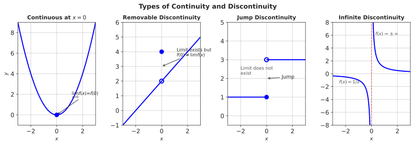
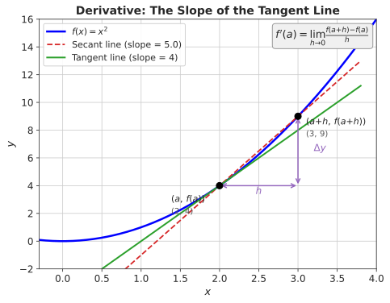

# Week 4: Limits, Continuity, and Introduction to Derivatives

## Act I: Understanding Systems — Chapter 4

> *"The analytical scientist doesn't just ask 'how much?' but 'how fast is it changing?' Derivatives give us that answer."*

---

## Theme: "From Total Change to Instantaneous Change"

**Science Context:** Bacterial growth rates, plastic production acceleration, radioactive decay rates

**Learning Outcomes:** At the end of this week you should be able to:

1. Evaluate limits algebraically (factoring, limits at infinity, one-sided)
2. Identify and classify the three types of discontinuity
3. Derive the derivative from first principles using the limit definition
4. Apply the power rule and basic differentiation rules (sum, constant, constant-multiple)
5. Interpret derivatives as instantaneous rates of change in scientific contexts
6. Write the equation of a tangent line at a given point
7. Differentiate the Schaefer model to locate Maximum Sustainable Yield

**Exam Alignment:** Q13, Q21, Q25, Q27, Q28

---

## 1. The Challenge: From Total Change to Instantaneous Change

### Why Instantaneous Rates Matter

In Weeks 1–3, you learned to describe systems using functions—linear models for constant change, exponential models for unbounded growth, and logistic models for bounded growth. But these functions tell us about *cumulative* behavior. As analytical scientists, we often need to answer a more precise question: **How fast is something changing right now?**

Consider these scientific questions:

| Domain | Question | What We Need |
|--------|----------|--------------|
| Environmental Science | How fast is plastic production accelerating *this year*? | Instantaneous rate of change |
| Microbiology | At what rate is a bacterial colony growing *at this moment*? | Instantaneous growth rate |
| Nuclear Physics | How quickly is a radioactive sample decaying *right now*? | Instantaneous decay rate |
| Fisheries | At what stock level does fish growth reach its maximum? | Where rate of change equals zero |

These questions cannot be answered by calculating average rates between two points. We need **derivatives**—the mathematical tool for measuring instantaneous change.

### From Average to Instantaneous: The Conceptual Leap

Suppose a bacterial colony grows according to $N(t) = 1000 e^{0.0347t}$, where $N$ is the number of cells and $t$ is time in minutes.

**Average growth rate** from $t = 0$ to $t = 60$:

$$\text{Average rate} = \frac{N(60) - N(0)}{60 - 0} = \frac{8017 - 1000}{60} = 116.95 \text{ cells/min}$$

But this average hides crucial information. Is the colony growing faster at $t = 60$ than at $t = 0$? To answer this, we need the **instantaneous rate**—and that requires the concept of a **limit**.

---

## 2. Limits: The Foundation of Calculus

### 2.1 Intuitive Definition

The **limit** of $f(x)$ as $x$ approaches $a$ is the value that $f(x)$ gets arbitrarily close to as $x$ gets arbitrarily close to $a$.

$$\lim_{x \to a} f(x) = L$$

means: as $x$ approaches $a$, $f(x)$ approaches $L$.

 approaches L")

### 2.2 The Easy Case: Direct Substitution

Most limits are straightforward — **just plug in the number**:

| Limit | Substitution | Value |
|-------|-------------|-------|
| $\lim_{x \to 3}(2x+1)$ | $2(3)+1$ | $\mathbf{7}$ |
| $\lim_{x \to 4}\sqrt{x}$ | $\sqrt{4}$ | $\mathbf{2}$ |
| $\lim_{x \to 1}(x^2-3x+5)$ | $1-3+5$ | $\mathbf{3}$ |

This works whenever the function is **continuous** at the target point — meaning the limit equals the function value:

$$\lim_{x \to a} f(x) = f(a)$$

If the graph has no holes, jumps, or blow-ups at the point, direct substitution works. We formalise continuity in Section 3, but for now the practical rule is:

> **Try plugging in first.** If you get a number, you're done. If you get $\frac{0}{0}$, then factor and cancel — that's Section 2.4.

### 2.3 Why Limits Matter — The $\frac{0}{0}$ Case

Consider the expression $\frac{x^2 - 4}{x - 2}$. If we try to evaluate this at $x = 2$:

$$\frac{2^2 - 4}{2 - 2} = \frac{0}{0}$$

This is **indeterminate**—we cannot divide by zero. But what happens as $x$ *approaches* 2?

| $x$ | $\frac{x^2 - 4}{x - 2}$ |
|-----|-------------------------|
| 2.1 | 4.1 |
| 2.01 | 4.01 |
| 2.001 | 4.001 |
| 1.9 | 3.9 |
| 1.99 | 3.99 |
| 1.999 | 3.999 |

The values approach **4** from both sides. This is the limit.

### 2.4 Evaluating Limits Algebraically

When direct substitution gives $\frac{0}{0}$, algebraic manipulation reveals the limit.

**Strategy 1: Factoring** (for $\frac{0}{0}$ forms)

$$\lim_{x \to 2} \frac{x^2 - 4}{x - 2} = \lim_{x \to 2} \frac{(x+2)(x-2)}{x-2} = \lim_{x \to 2} (x + 2) = 4$$

**Example 4.1:** Evaluate $\lim_{x \to 3} \frac{x^2 - 9}{x - 3}$

*Solution:*
$$\lim_{x \to 3} \frac{x^2 - 9}{x - 3} = \lim_{x \to 3} \frac{(x+3)(x-3)}{x-3} = \lim_{x \to 3} (x + 3) = 6$$

**Example 4.2:** Evaluate $\lim_{x \to -1} \frac{x^2 + 3x + 2}{x + 1}$

*Solution:*
$$\lim_{x \to -1} \frac{x^2 + 3x + 2}{x + 1} = \lim_{x \to -1} \frac{(x+1)(x+2)}{x+1} = \lim_{x \to -1} (x + 2) = 1$$

### 2.5 Limits at Infinity

What happens to a function as $x$ becomes arbitrarily large?

**Strategy 2: Divide by highest power** (for limits at infinity)

$$\lim_{x \to \infty} \frac{2x^2 + 3x - 1}{4x^2 + 5}$$

Divide every term by $x^2$:

$$= \lim_{x \to \infty} \frac{2 + \frac{3}{x} - \frac{1}{x^2}}{4 + \frac{5}{x^2}}$$

As $x \to \infty$, the terms $\frac{3}{x}$, $\frac{1}{x^2}$, and $\frac{5}{x^2}$ all approach 0:

$$= \frac{2 + 0 - 0}{4 + 0} = \frac{2}{4} = \frac{1}{2}$$

**Key Principle:** $\lim_{x \to \infty} \frac{1}{x^n} = 0$ for any $n > 0$.

**Example 4.3:** Evaluate $\lim_{x \to \infty} \frac{3x^3 + x - 1}{2x^3 + 4}$

*Solution:* Divide by $x^3$:
$$= \lim_{x \to \infty} \frac{3 + \frac{1}{x^2} - \frac{1}{x^3}}{2 + \frac{4}{x^3}} = \frac{3}{2}$$

### 2.6 One-Sided Limits

Sometimes we need to distinguish between approaching from the left ($x \to a^-$) and from the right ($x \to a^+$).

For $f(x) = \frac{|x|}{x}$:

- $\lim_{x \to 0^+} \frac{|x|}{x} = \lim_{x \to 0^+} \frac{x}{x} = 1$
- $\lim_{x \to 0^-} \frac{|x|}{x} = \lim_{x \to 0^-} \frac{-x}{x} = -1$

Since the one-sided limits differ, $\lim_{x \to 0} \frac{|x|}{x}$ **does not exist**.

### 2.7 Limit Problems in Nature

The $\frac{0}{0}$ pattern is ubiquitous in science. Here are two real examples where limits capture a quantity that a raw formula cannot evaluate directly.

**Enzyme kinetics (Michaelis–Menten)**

The rate of an enzyme-catalysed reaction is

$$v = \frac{V_{\max}[S]}{K_m + [S]}$$

The **catalytic efficiency** — how effective the enzyme is at low substrate concentrations — equals the initial slope of the saturation curve:

$$\lim_{[S] \to 0} \frac{v}{[S]} = \frac{V_{\max}}{K_m}$$

Direct substitution gives $\frac{0}{0}$, but the limit resolves to $V_{\max}/K_m$. If you take biochemistry or pharmacology, this ratio will follow you for years.

**Per-capita population growth**

The growth rate per individual over a short interval is

$$\frac{N(t+h) - N(t)}{h\,N(t)}$$

As $h \to 0$, this limit *is* the intrinsic rate of increase $r$:

$$\lim_{h \to 0} \frac{N(t+h) - N(t)}{h\,N(t)} = \frac{1}{N}\frac{dN}{dt} = r$$

This is the foundation of logistic growth models and the Schaefer model you will use on the exam.

---

## 3. Continuity: When Functions Behave Well

### 3.1 Definition

A function $f$ is **continuous at $x = a$** if three conditions hold:

1. $f(a)$ is defined
2. $\lim_{x \to a} f(x)$ exists
3. $\lim_{x \to a} f(x) = f(a)$

Intuitively: you can draw the graph without lifting your pen.

### 3.2 Types of Discontinuity

| Type | Description | Example |
|------|-------------|---------|
| **Removable** | Limit exists but $f(a)$ is missing or different | $f(x) = \frac{x^2-4}{x-2}$ at $x = 2$ |
| **Jump** | One-sided limits exist but differ | Step functions |
| **Infinite** | Function approaches $\pm\infty$ | $f(x) = \frac{1}{x}$ at $x = 0$ |



### 3.3 Why Continuity Matters for Scientists

**Threshold Effects:** Many biological systems exhibit discontinuous behavior at critical thresholds. The Schaefer model $G(S) = gS(1 - S/K)$ is continuous for $S \geq 0$, meaning fish growth changes smoothly with stock level—no sudden jumps.

**Model Validity:** If your model predicts a discontinuity where nature shows smooth behavior, your model needs refinement.

---

## 4. The Derivative: Measuring Instantaneous Change

### 4.1 From Secant to Tangent

The **average rate of change** of $f(x)$ between $x$ and $x + h$ is the slope of the **secant line**:

$$\frac{f(x + h) - f(x)}{h}$$

As $h \to 0$, this secant line approaches the **tangent line** at $x$. The slope of this tangent is the **instantaneous rate of change**, or the **derivative**.

### 4.2 Definition of the Derivative

$$f'(x) = \lim_{h \to 0} \frac{f(x + h) - f(x)}{h}$$

**Notation:** We use $f'(x)$, $\frac{df}{dx}$, $\frac{dy}{dx}$, or $y'$ interchangeably.



### 4.3 Computing a Derivative from First Principles

**Example 4.4:** Find the derivative of $f(x) = x^2$.

*Solution:*
$$f'(x) = \lim_{h \to 0} \frac{(x+h)^2 - x^2}{h}$$

Expand:
$$= \lim_{h \to 0} \frac{x^2 + 2xh + h^2 - x^2}{h} = \lim_{h \to 0} \frac{2xh + h^2}{h}$$

Factor out $h$:
$$= \lim_{h \to 0} \frac{h(2x + h)}{h} = \lim_{h \to 0} (2x + h) = 2x$$

Therefore: $\frac{d}{dx}[x^2] = 2x$

**Interpretation:** For $f(x) = x^2$, the instantaneous rate of change at any point $x$ is $2x$. At $x = 3$, the slope of the tangent is $2(3) = 6$.

---

## 5. Basic Differentiation Rules

Computing derivatives from first principles is tedious. Fortunately, patterns emerge that give us efficient rules.

### 5.1 The Power Rule

$$\frac{d}{dx}[x^n] = nx^{n-1}$$

This works for **any real** $n$—positive, negative, or fractional.

| Function | Derivative | Explanation |
|----------|------------|-------------|
| $x^3$ | $3x^2$ | Power comes down, exponent decreases by 1 |
| $x^5$ | $5x^4$ | |
| $x^{1/2} = \sqrt{x}$ | $\frac{1}{2}x^{-1/2} = \frac{1}{2\sqrt{x}}$ | Works for fractional powers |
| $x^{-1} = \frac{1}{x}$ | $-x^{-2} = -\frac{1}{x^2}$ | Works for negative powers |
| $x^{-2} = \frac{1}{x^2}$ | $-2x^{-3} = -\frac{2}{x^3}$ | |

**Example 4.5:** Differentiate $f(x) = x^7$.

*Solution:* $f'(x) = 7x^6$

**Example 4.6:** Differentiate $g(x) = \frac{1}{x^3} = x^{-3}$.

*Solution:* $g'(x) = -3x^{-4} = -\frac{3}{x^4}$

### 5.2 The Constant Rule

$$\frac{d}{dx}[c] = 0$$

The derivative of any constant is zero—constants don't change!

**Example:** $\frac{d}{dx}[7] = 0$

### 5.3 The Constant Multiple Rule

$$\frac{d}{dx}[cf(x)] = c \cdot f'(x)$$

You can "pull out" constant multipliers.

**Example 4.7:** Differentiate $f(x) = 5x^4$.

*Solution:* $f'(x) = 5 \cdot 4x^3 = 20x^3$

### 5.4 The Sum/Difference Rule

$$\frac{d}{dx}[f(x) \pm g(x)] = f'(x) \pm g'(x)$$

Differentiate term by term.

**Example 4.8:** Differentiate $y = 3x^4 - 2x^3 + 5x - 7$.

*Solution:*
$$y' = 3(4x^3) - 2(3x^2) + 5(1) - 0 = 12x^3 - 6x^2 + 5$$

**Example 4.9:** Differentiate $f(x) = 4x^3 - \frac{3}{x} + 2\sqrt{x} - 7$.

*Solution:* Rewrite: $f(x) = 4x^3 - 3x^{-1} + 2x^{1/2} - 7$

$$f'(x) = 12x^2 - 3(-1)x^{-2} + 2 \cdot \frac{1}{2}x^{-1/2} - 0$$
$$= 12x^2 + \frac{3}{x^2} + \frac{1}{\sqrt{x}}$$

---

## 6. Geometric Interpretation: Tangent Lines

### 6.1 Equation of the Tangent Line

At point $(a, f(a))$, the tangent line has:
- Slope: $m = f'(a)$
- Equation: $y - f(a) = f'(a)(x - a)$

Or equivalently: $y = f(a) + f'(a)(x - a)$

**Example 4.10:** Find the equation of the tangent to $y = x^2 - 3x + 1$ at $x = 2$.

*Solution:*
1. Find the point: $y(2) = 4 - 6 + 1 = -1$, so the point is $(2, -1)$
2. Find the derivative: $y' = 2x - 3$
3. Find the slope at $x = 2$: $y'(2) = 2(2) - 3 = 1$
4. Write the tangent: $y - (-1) = 1(x - 2)$, so $y = x - 3$

---

## 7. Application: Instantaneous Rates in Science

### 7.1 Bacterial Growth Rate

A bacterial population follows $N(t) = 1000 e^{0.0347t}$, where $t$ is in minutes.

**Question:** What is the instantaneous growth rate at $t = 60$ minutes?

**Analysis (preview):** While we cannot yet differentiate $e^{kt}$ using our basic rules (that's Week 5), we can approximate the instantaneous rate numerically by computing average rates over smaller and smaller intervals:

| Interval | Average Rate (cells/min) |
|----------|-------------------------|
| $[60, 120]$ | 210.3 |
| $[60, 70]$ | 160.8 |
| $[60, 61]$ | 139.4 |
| $[60, 60.1]$ | 137.1 |
| $[60, 60.01]$ | 136.9 |

The limit appears to be approximately **137 cells/minute**—this is $N'(60)$.

### 7.2 Radioactive Decay Rate

Iodine-131 decays according to $A(t) = A_0 e^{-0.0866t}$ (half-life ≈ 8 days).

**Physical Meaning:** The derivative $A'(t)$ tells us the **rate of decay** (negative because the amount is decreasing). Doctors use this to plan radiation therapy timing.

### 7.3 The Schaefer Model: Setting Up for Optimization

Recall the Schaefer growth model from Week 3:

$$G(S) = gS\left(1 - \frac{S}{K}\right) = gS - \frac{g}{K}S^2$$

This is a polynomial in $S$! We can now differentiate:

$$G'(S) = g - \frac{2g}{K}S$$

**Critical Question:** At what stock level $S^*$ is growth maximized?

Setting $G'(S^*) = 0$:
$$g - \frac{2g}{K}S^* = 0$$
$$S^* = \frac{K}{2}$$

**This confirms algebraically what we found graphically in Week 3: Maximum Sustainable Yield occurs when stock is at half the carrying capacity.**

This result appears directly on your exam (Q13)—being able to differentiate the Schaefer model and find its maximum is essential.

---

## 8. When Derivatives Don't Exist

A function may fail to be differentiable at a point where:

1. **The function is not continuous** (e.g., jump discontinuity)
2. **There's a corner or cusp** (e.g., $f(x) = |x|$ at $x = 0$)
3. **There's a vertical tangent** (e.g., $f(x) = x^{1/3}$ at $x = 0$)

**Example:** $f(x) = |x|$ has no derivative at $x = 0$:
- From the left: slope is $-1$
- From the right: slope is $+1$
- No single tangent line exists

**Important:** Differentiability implies continuity, but continuity does NOT imply differentiability.

---

## 9. Python: Numerical Differentiation and Visualization

### 9.1 Computing Derivatives Numerically

While we've derived derivatives symbolically, scientists often work with data where the underlying function is unknown. The **cubic spline** method allows numerical differentiation:

```python
import numpy as np
import matplotlib.pyplot as plt
from scipy.interpolate import CubicSpline

# Create data from a known function for verification
x = np.linspace(-3, 3, 50)
y = x**2  # f(x) = x²

# Fit cubic spline
cs = CubicSpline(x, y)

# Get derivative function
cs_derivative = cs.derivative(1)

# Evaluate derivative at a point
x0 = 1.5
print(f"Numerical derivative at x = {x0}: {cs_derivative(x0):.4f}")
print(f"Exact derivative (2x) at x = {x0}: {2*x0:.4f}")
```

### 9.2 Visualizing Secant-to-Tangent Convergence

```python
# Demonstrate how secant approaches tangent
def f(x):
    return x**2

x0 = 2  # Point of tangency
h_values = [1.5, 1.0, 0.5, 0.2, 0.1, 0.01]

x_plot = np.linspace(0, 4, 100)

fig, axes = plt.subplots(2, 3, figsize=(12, 8))
for ax, h in zip(axes.flatten(), h_values):
    # Plot function
    ax.plot(x_plot, f(x_plot), 'b-', label='$f(x) = x^2$')
    
    # Secant line
    x1, x2 = x0, x0 + h
    y1, y2 = f(x1), f(x2)
    slope = (y2 - y1) / h
    
    ax.plot([x1, x2], [y1, y2], 'ro', markersize=6)
    secant_x = np.linspace(x0 - 0.5, x0 + h + 0.5, 20)
    secant_y = y1 + slope * (secant_x - x0)
    ax.plot(secant_x, secant_y, 'r--', label=f'Secant (h={h})')
    
    ax.set_title(f'h = {h}, slope = {slope:.2f}')
    ax.set_xlim(0, 4)
    ax.set_ylim(0, 12)
    ax.grid(True)
    ax.legend(fontsize=8)

plt.suptitle('Secant Lines Approaching Tangent as h → 0', fontsize=14)
plt.tight_layout()
plt.show()
```

---

## 10. Looking Ahead: Week 5

With the basic differentiation rules mastered, Week 5 will introduce:

- **Product rule:** $(fg)' = f'g + fg'$
- **Quotient rule:** $\left(\frac{f}{g}\right)' = \frac{f'g - fg'}{g^2}$
- **Chain rule:** $\frac{d}{dx}[f(g(x))] = f'(g(x)) \cdot g'(x)$
- **Derivatives of exponential and logarithmic functions:**
  - $\frac{d}{dx}[e^x] = e^x$
  - $\frac{d}{dx}[\ln x] = \frac{1}{x}$
- **Optimization problems:** Finding maxima and minima using $f'(x) = 0$

These tools will allow you to analyze real-world optimization problems like the profit maximization question (Q38) on your exam.

---

## Summary: Key Formulas for Week 4

| Concept | Formula |
|---------|---------|
| Limit definition | $\lim_{x \to a} f(x) = L$ means $f(x) \to L$ as $x \to a$ |
| Continuity | $f$ continuous at $a$ iff $\lim_{x \to a} f(x) = f(a)$ |
| Derivative definition | $f'(x) = \lim_{h \to 0} \frac{f(x+h) - f(x)}{h}$ |
| Power rule | $\frac{d}{dx}[x^n] = nx^{n-1}$ |
| Constant rule | $\frac{d}{dx}[c] = 0$ |
| Constant multiple | $\frac{d}{dx}[cf] = cf'$ |
| Sum/Difference | $\frac{d}{dx}[f \pm g] = f' \pm g'$ |
| Tangent line | $y = f(a) + f'(a)(x - a)$ |

---

## Exam Alignment

| Question | Topic | Week 4 Skill Required |
|----------|-------|----------------------|
| Q13 | Schaefer model optimization | Setting $G'(S) = 0$ to find MSY stock level |
| Q21 | Tangent to $y = e^{x-2} + 3$ at $x = 2$ | Tangent line equation (slope given by derivative) |
| Q25 | Properties of $(x+2)(x-3)$ | Finding slope via derivative |
| Q27 | Limits of a probability function | Evaluating limits algebraically |
| Q28 | Differentiation | Power rule, sum rule |

---

## References

- Schaefer, M.B. (1957). Some considerations of population dynamics and economics in relation to the management of the commercial marine fisheries. *Journal of the Fisheries Research Board of Canada*, 14(5), 669-681.
- Andrewartha, H.G. (1970). *Introduction to the Study of Animal Populations*. University of Chicago Press.

---

*Next: Week 5 — Differentiation Techniques and Optimization: Finding the Best Outcome*
