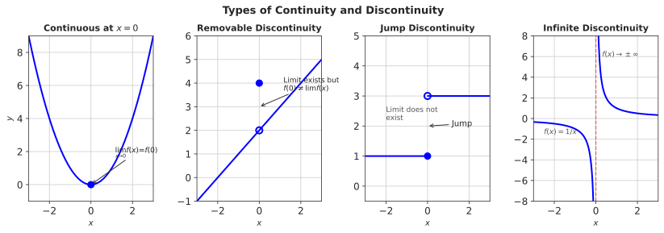
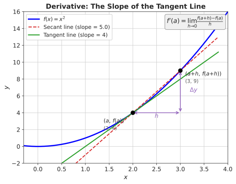

# Week 4: Limits, Continuity, and Introduction to Derivatives

## Act I: Understanding Systems — Chapter 4

> *"The analytical scientist doesn't just ask 'how much?' but 'how fast is it changing?' Derivatives give us that answer."*

---

## Theme: "From Total Change to Instantaneous Change"

**Science Context:** Bacterial growth rates, plastic production acceleration, radioactive decay rates

**Learning Outcomes:** At the end of this week you should be able to:

1. Evaluate limits algebraically (factoring, limits at infinity, one-sided)
2. Identify and classify the three types of discontinuity
3. Derive the derivative from first principles using the limit definition
4. Apply the power rule and basic differentiation rules (sum, constant, constant-multiple)
5. Interpret derivatives as instantaneous rates of change in scientific contexts
6. Write the equation of a tangent line at a given point
7. Differentiate the Schaefer model to locate Maximum Sustainable Yield

---

> **📓 About "Try it in Python" boxes:** Throughout this lesson, these boxes reference specific code examples by ID — e.g. **W4-CS03** means *Week 4, Code Snippet 3*. Find the matching code under **Notes → Python Code Snippets** for this week; each entry there is labelled with its ID.


## 1. The Challenge: From Total Change to Instantaneous Change

### Why Instantaneous Rates Matter

In Weeks 1–3, you used functions to describe how systems behave over time. This week shifts the question: not just *how much* has changed, but **how fast is it changing right now?**

Consider these scientific questions:

| Domain                | Question                                                     | What We Need                 |
| --------------------- | ------------------------------------------------------------ | ---------------------------- |
| Environmental Science | How fast is plastic production accelerating *this year*?     | Instantaneous rate of change |
| Microbiology          | At what rate is a bacterial colony growing *at this moment*? | Instantaneous growth rate    |
| Nuclear Physics       | How quickly is a radioactive sample decaying *right now*?    | Instantaneous decay rate     |
| Fisheries             | At what stock level does fish growth reach its maximum?      | Where rate of change equals zero |

Average rates are not enough here. We need **derivatives** to measure instantaneous change.

### From Average to Instantaneous: The Conceptual Leap

Suppose a bacterial colony grows according to $N(t) = 1000 e^{0.0347t}$, where $N$ is the number of cells and $t$ is time in minutes.

**Average growth rate** from $t = 0$ to $t = 60$:

$$\text{Average rate} = \frac{N(60) - N(0)}{60 - 0} = \frac{8017 - 1000}{60} = 116.95 \text{ cells/min}$$

But this average hides what is happening *at* $t = 60$. To answer that, we need the **instantaneous rate**, and that leads directly to **limits**.

---

## 2. Limits: The Foundation of Calculus

### 2.1 Intuitive Definition

The **limit** of $f(x)$ as $x$ approaches $a$ is the value that $f(x)$ gets arbitrarily close to as $x$ gets arbitrarily close to $a$.

$$\lim_{x \to a} f(x) = L$$

means: as $x$ approaches $a$, $f(x)$ approaches $L$.

 approaches L")

### 2.2 The Easy Case: Direct Substitution

Most limits are straightforward — **just plug in the number**:

| Limit                      | Substitution | Value        |
| -------------------------- | ------------ | ------------ |
| $\lim_{x \to 3}(2x+1)$     | $2(3)+1$     | $\mathbf{7}$ |
| $\lim_{x \to 4}\sqrt{x}$   | $\sqrt{4}$   | $\mathbf{2}$ |
| $\lim_{x \to 1}(x^2-3x+5)$ | $1-3+5$      | $\mathbf{3}$ |

This works whenever the function is **continuous** at the target point:

$$\lim_{x \to a} f(x) = f(a)$$

If the graph has no hole, jump, or blow-up at the point, direct substitution usually works. The practical rule is:

> **Try plugging in first.** If you get a number, you're done. If you get $\frac{0}{0}$, then factor and cancel — that's Section 2.4.

### 2.3 Why Limits Matter — The $\frac{0}{0}$ Case

Consider the expression $\frac{x^2 - 4}{x - 2}$. If we try to evaluate this at $x = 2$:

$$\frac{2^2 - 4}{2 - 2} = \frac{0}{0}$$

This is **indeterminate**—we cannot divide by zero. But what happens as $x$ *approaches* 2?

| $x$   | $\frac{x^2 - 4}{x - 2}$ |
| ----- | ----------------------- |
| 2.1   | 4.1                     |
| 2.01  | 4.01                    |
| 2.001 | 4.001                   |
| 1.9   | 3.9                     |
| 1.99  | 3.99                    |
| 1.999 | 3.999                   |

The values approach **4** from both sides. This is the limit.

### 2.4 Evaluating Limits Algebraically

When direct substitution gives $\frac{0}{0}$, algebraic manipulation reveals the limit.

**Strategy 1: Factoring** (for $\frac{0}{0}$ forms)

$$\lim_{x \to 2} \frac{x^2 - 4}{x - 2} = \lim_{x \to 2} \frac{(x+2)(x-2)}{x-2} = \lim_{x \to 2} (x + 2) = 4$$

**Example 4.1:** Evaluate $\lim_{x \to 3} \frac{x^2 - 9}{x - 3}$

*Solution:*
$$\lim_{x \to 3} \frac{x^2 - 9}{x - 3} = \lim_{x \to 3} \frac{(x+3)(x-3)}{x-3} = \lim_{x \to 3} (x + 3) = 6$$

**Example 4.2:** Evaluate $\lim_{x \to -1} \frac{x^2 + 3x + 2}{x + 1}$

*Solution:*
$$\lim_{x \to -1} \frac{x^2 + 3x + 2}{x + 1} = \lim_{x \to -1} \frac{(x+1)(x+2)}{x+1} = \lim_{x \to -1} (x + 2) = 1$$

**Further technique: Polynomial long division**

When a cubic numerator doesn't factor by inspection, polynomial long division reveals the factor. This arises naturally when computing instantaneous rates from first principles.

**Worked example:** Bacterial count follows $N(t) = t^3 - t$. Find the instantaneous rate of change at $t = 2$ from first principles:

$$\lim_{t \to 2} \frac{N(t) - N(2)}{t - 2} = \lim_{t \to 2} \frac{(t^3 - t) - 6}{t - 2} = \lim_{t \to 2} \frac{t^3 - t - 6}{t - 2}$$

Direct substitution gives $\frac{0}{0}$. Dividing $t^3 - t - 6$ by $(t - 2)$ gives:
$$t^3 - t - 6 = (t - 2)(t^2 + 2t + 3)$$

Cancel and substitute:
$$\lim_{t \to 2} (t^2 + 2t + 3) = 4 + 4 + 3 = 11 \text{ cells per minute}$$

### 2.5 Limits at Infinity

What happens to a function as $x$ becomes arbitrarily large?

**Strategy 2: Divide by highest power** (for limits at infinity)

$$\lim_{x \to \infty} \frac{2x^2 + 3x - 1}{4x^2 + 5}$$

Divide every term by $x^2$:

$$= \lim_{x \to \infty} \frac{2 + \frac{3}{x} - \frac{1}{x^2}}{4 + \frac{5}{x^2}}$$

As $x \to \infty$, the terms $\frac{3}{x}$, $\frac{1}{x^2}$, and $\frac{5}{x^2}$ all approach 0:

$$= \frac{2 + 0 - 0}{4 + 0} = \frac{2}{4} = \frac{1}{2}$$

**Key Principle:** $\lim_{x \to \infty} \frac{1}{x^n} = 0$ for any $n > 0$.

**Example 4.3:** Evaluate $\lim_{x \to \infty} \frac{3x^3 + x - 1}{2x^3 + 4}$

*Solution:* Divide by $x^3$:
$$= \lim_{x \to \infty} \frac{3 + \frac{1}{x^2} - \frac{1}{x^3}}{2 + \frac{4}{x^3}} = \frac{3}{2}$$

### 2.6 One-Sided Limits

Sometimes we need to distinguish between approaching from the left ($x \to a^-$) and from the right ($x \to a^+$).

For $f(x) = \frac{|x|}{x}$:

- $\lim_{x \to 0^+} \frac{|x|}{x} = \lim_{x \to 0^+} \frac{x}{x} = 1$
- $\lim_{x \to 0^-} \frac{|x|}{x} = \lim_{x \to 0^-} \frac{-x}{x} = -1$

Since the one-sided limits differ, $\lim_{x \to 0} \frac{|x|}{x}$ **does not exist**.

### 2.7 Limit Problems in Nature

The $\frac{0}{0}$ pattern appears constantly in science. Here are two examples where the limit carries the real meaning.

**Enzyme kinetics (Michaelis–Menten)**

The rate of an enzyme-catalysed reaction is

$$v = \frac{V_{\max}[S]}{K_m + [S]}$$

The **catalytic efficiency** equals the initial slope of the saturation curve:

$$\lim_{[S] \to 0} \frac{v}{[S]} = \frac{V_{\max}}{K_m}$$

Direct substitution gives $\frac{0}{0}$, but the limit resolves to $V_{\max}/K_m$.

**Per-capita population growth**

The growth rate per individual over a short interval is

$$\frac{N(t+h) - N(t)}{h\,N(t)}$$

As $h \to 0$, this limit *is* the intrinsic rate of increase $r$:

$$\lim_{h \to 0} \frac{N(t+h) - N(t)}{h\,N(t)} = \frac{1}{N}\frac{dN}{dt} = r$$

This is the foundation of logistic growth models, including the Schaefer model.

> **📓 Try it in Python**
>
> - **W4-CS01** — *Standard Imports for Week 4*: Run this first.
> - **W4-CS02** — *Visualizing Limits: Secant Lines Approaching Tangent*: Watch slopes converge as $h \to 0$.
> - **W4-CS03** — *Computing Limits Numerically*: Tabulate $f(x)$ for $x \to a$ from both sides.
>
> Find these under **Notes → Python Code Snippets** for this week.


## 3. Continuity: When Functions Behave Well

### 3.1 Definition

A function $f$ is **continuous at $x = a$** if three conditions hold:

1. $f(a)$ is defined
2. $\lim_{x \to a} f(x)$ exists
3. $\lim_{x \to a} f(x) = f(a)$

Intuitively: you can draw the graph without lifting your pen.

### 3.2 Types of Discontinuity

| Type          | Description                                     | Example                               |
| ------------- | ----------------------------------------------- | ------------------------------------- |
| **Removable** | Limit exists but $f(a)$ is missing or different | $f(x) = \frac{x^2-4}{x-2}$ at $x = 2$ |
| **Jump**      | One-sided limits exist but differ               | Step functions                        |
| **Infinite**  | Function approaches $\pm\infty$                 | $f(x) = \frac{1}{x}$ at $x = 0$       |



### 3.3 Why Continuity Matters for Scientists

Many scientific quantities change smoothly, so continuity is often the default modelling assumption.

For example, the Schaefer model $G(S) = gS(1 - S/K)$ is continuous for $S \geq 0$, so fish growth changes smoothly with stock level. If your model predicts a jump where the real system is smooth, the model needs revision.

> **📓 Try it in Python**
>
> - **W4-CS10** — *Continuity Check with Piecewise Functions*: Detect jumps and removable discontinuities.
>
> Find these under **Notes → Python Code Snippets** for this week.


## 4. The Derivative: Measuring Instantaneous Change

### 4.1 From Secant to Tangent

The **average rate of change** of $f(x)$ between $x$ and $x + h$ is the slope of the **secant line**:

$$\frac{f(x + h) - f(x)}{h}$$

As $h \to 0$, the secant approaches the **tangent line**. Its slope becomes the **derivative**.

### 4.2 Definition of the Derivative

$$f'(x) = \lim_{h \to 0} \frac{f(x + h) - f(x)}{h}$$

**Notation:** We use $f'(x)$, $\frac{df}{dx}$, $\frac{dy}{dx}$, or $y'$ interchangeably.



### 4.3 Computing a Derivative from First Principles

**Example 4.4:** Find the derivative of $f(x) = x^2$.

*Solution:*
$$f'(x) = \lim_{h \to 0} \frac{(x+h)^2 - x^2}{h}$$

Expand:
$$= \lim_{h \to 0} \frac{x^2 + 2xh + h^2 - x^2}{h} = \lim_{h \to 0} \frac{2xh + h^2}{h}$$

Factor out $h$:
$$= \lim_{h \to 0} \frac{h(2x + h)}{h} = \lim_{h \to 0} (2x + h) = 2x$$

Therefore: $\frac{d}{dx}[x^2] = 2x$

**Interpretation:** For $f(x) = x^2$, the instantaneous rate of change at any point $x$ is $2x$. At $x = 3$, the slope of the tangent is $2(3) = 6$.

> **📓 Try it in Python**
>
> - **W4-CS04** — *Numerical Differentiation with Cubic Splines*: A practical way to estimate derivatives from data.
> - **W4-CS12** — *Finite Difference Methods Comparison*: Forward, backward, and central differences side-by-side.
>
> Find these under **Notes → Python Code Snippets** for this week.

---

## 5. Basic Differentiation Rules

Computing derivatives from first principles is slow. In practice, we use rules.

### 5.1 The Power Rule

$$\frac{d}{dx}[x^n] = nx^{n-1}$$

This works for **any real** $n$—positive, negative, or fractional.

| Function                 | Derivative                                  | Explanation                               |
| ------------------------ | ------------------------------------------- | ----------------------------------------- |
| $x^3$                    | $3x^2$                                      | Power comes down, exponent decreases by 1 |
| $x^5$                    | $5x^4$                                      |                                           |
| $x^{1/2} = \sqrt{x}$     | $\frac{1}{2}x^{-1/2} = \frac{1}{2\sqrt{x}}$ | Works for fractional powers               |
| $x^{-1} = \frac{1}{x}$   | $-x^{-2} = -\frac{1}{x^2}$                  | Works for negative powers                 |
| $x^{-2} = \frac{1}{x^2}$ | $-2x^{-3} = -\frac{2}{x^3}$                 |                                           |

**Example 4.5:** Differentiate $f(x) = x^7$.

*Solution:* $f'(x) = 7x^6$

**Example 4.6:** Differentiate $g(x) = \frac{1}{x^3} = x^{-3}$.

*Solution:* $g'(x) = -3x^{-4} = -\frac{3}{x^4}$

### 5.2 The Constant Rule

$$\frac{d}{dx}[c] = 0$$

The derivative of any constant is zero—constants don't change.

**Example:** $\frac{d}{dx}[7] = 0$

### 5.3 The Constant Multiple Rule

$$\frac{d}{dx}[cf(x)] = c \cdot f'(x)$$

You can "pull out" constant multipliers.

**Example 4.7:** Differentiate $f(x) = 5x^4$.

*Solution:* $f'(x) = 5 \cdot 4x^3 = 20x^3$

### 5.4 The Sum/Difference Rule

$$\frac{d}{dx}[f(x) \pm g(x)] = f'(x) \pm g'(x)$$

Differentiate term by term.

**Example 4.8:** Differentiate $y = 3x^4 - 2x^3 + 5x - 7$.

*Solution:*
$$y' = 3(4x^3) - 2(3x^2) + 5(1) - 0 = 12x^3 - 6x^2 + 5$$

**Example 4.9:** Differentiate $f(x) = 4x^3 - \frac{3}{x} + 2\sqrt{x} - 7$.

*Solution:* Rewrite: $f(x) = 4x^3 - 3x^{-1} + 2x^{1/2} - 7$

$$f'(x) = 12x^2 - 3(-1)x^{-2} + 2 \cdot \frac{1}{2}x^{-1/2} - 0$$
$$= 12x^2 + \frac{3}{x^2} + \frac{1}{\sqrt{x}}$$

> **📓 Try it in Python**
>
> - **W4-CS08** — *Power Rule Verification*: Numerically check $\tfrac{d}{dx}x^n = n x^{n-1}$.
> - **W4-CS09** — *Derivative of Exponential Functions*: Verify $\tfrac{d}{dx}e^x = e^x$ and $\tfrac{d}{dx}b^x = b^x \ln b$.
>
> Find these under **Notes → Python Code Snippets** for this week.

---

## 6. Geometric Interpretation: Tangent Lines

### 6.1 Equation of the Tangent Line

At point $(a, f(a))$, the tangent line has:
- Slope: $m = f'(a)$
- Equation: $y - f(a) = f'(a)(x - a)$

Or equivalently: $y = f(a) + f'(a)(x - a)$

**Example 4.10:** Find the equation of the tangent to $y = x^2 - 3x + 1$ at $x = 2$.

*Solution:*
1. Find the point: $y(2) = 4 - 6 + 1 = -1$, so the point is $(2, -1)$
2. Find the derivative: $y' = 2x - 3$
3. Find the slope at $x = 2$: $y'(2) = 2(2) - 3 = 1$
4. Write the tangent: $y - (-1) = 1(x - 2)$, so $y = x - 3$

> **📓 Try it in Python**
>
> - **W4-CS05** — *Tangent Line Visualization*: Plot $f(x)$ with its tangent at a chosen point.
> - **W4-CS11** — *Tangent Line for Lab Exercise: $y = 3x^2 - 4x + 5$*: Used directly in this week's lab.
>
> Find these under **Notes → Python Code Snippets** for this week.


## 7. Application: Instantaneous Rates in Science

### 7.1 Bacterial Growth Rate

A bacterial population follows $N(t) = 1000 e^{0.0347t}$, where $t$ is in minutes.

**Question:** What is the instantaneous growth rate at $t = 60$ minutes?

We cannot yet differentiate $e^{kt}$ with this week's rule set, but we can estimate the rate numerically by shrinking the interval.

| Interval      | Average Rate (cells/min) |
| ------------- | ------------------------ |
| $[60, 120]$   | 210.3                    |
| $[60, 70]$    | 160.8                    |
| $[60, 61]$    | 139.4                    |
| $[60, 60.1]$  | 137.1                    |
| $[60, 60.01]$ | 136.9                    |

The rate approaches about **137 cells/minute**, so $N'(60) \approx 137$.

### 7.2 Radioactive Decay Rate

Iodine-131 decays according to $A(t) = A_0 e^{-0.0866t}$ (half-life ≈ 8 days).

Here $A'(t)$ is the **rate of decay**. It is negative because the amount is decreasing.

### 7.3 The Schaefer Model: Setting Up for Optimization

Recall the Schaefer growth model from Week 3:

$$G(S) = gS\left(1 - \frac{S}{K}\right) = gS - \frac{g}{K}S^2$$

This is a polynomial in $S$, so we can differentiate it directly:

$$G'(S) = g - \frac{2g}{K}S$$

**Critical Question:** At what stock level $S^*$ is growth maximized?

Setting $G'(S^*) = 0$:
$$g - \frac{2g}{K}S^* = 0$$
$$S^* = \frac{K}{2}$$

This confirms the Week 3 graphical result: Maximum Sustainable Yield occurs at half the carrying capacity — now derived directly with calculus instead of the vertex-formula shortcut.

> **📓 Try it in Python**
>
> - **W4-CS06** — *Bacterial Growth Rate Approximation*: Estimate $dN/dt$ from population data.
> - **W4-CS07** — *Schaefer Model Derivative Verification*: Differentiate the fishery model used in lecture.
>
> Find these under **Notes → Python Code Snippets** for this week.

---

## 8. When Derivatives Don't Exist

A function may fail to be differentiable at a point where:

1. **The function is not continuous** (e.g., jump discontinuity)
2. **There's a corner or cusp** (e.g., $f(x) = |x|$ at $x = 0$)
3. **There's a vertical tangent** (e.g., $f(x) = x^{1/3}$ at $x = 0$)

**Example:** $f(x) = |x|$ has no derivative at $x = 0$:
- From the left: slope is $-1$
- From the right: slope is $+1$
- No single tangent line exists

**Important:** differentiability implies continuity, but not the reverse.

---

## 9. Python: Numerical Differentiation and Visualization

### 9.1 Computing Derivatives Numerically

Scientists often work from data rather than formulas. Cubic splines let you estimate derivatives numerically:

```python
import numpy as np
import matplotlib.pyplot as plt
from scipy.interpolate import CubicSpline

# Create data from a known function for verification
x = np.linspace(-3, 3, 50)
y = x**2  # f(x) = x²

# Fit cubic spline
cs = CubicSpline(x, y)

# Get derivative function
cs_derivative = cs.derivative(1)

# Evaluate derivative at a point
x0 = 1.5
print(f"Numerical derivative at x = {x0}: {cs_derivative(x0):.4f}")
print(f"Exact derivative (2x) at x = {x0}: {2*x0:.4f}")
```

### 9.2 Visualizing Secant-to-Tangent Convergence

```python
# Demonstrate how secant approaches tangent
def f(x):
    return x**2

x0 = 2  # Point of tangency
h_values = [1.5, 1.0, 0.5, 0.2, 0.1, 0.01]

x_plot = np.linspace(0, 4, 100)

fig, axes = plt.subplots(2, 3, figsize=(12, 8))
for ax, h in zip(axes.flatten(), h_values):
    # Plot function
    ax.plot(x_plot, f(x_plot), 'b-', label='$f(x) = x^2$')
    
    # Secant line
    x1, x2 = x0, x0 + h
    y1, y2 = f(x1), f(x2)
    slope = (y2 - y1) / h
    
    ax.plot([x1, x2], [y1, y2], 'ro', markersize=6)
    secant_x = np.linspace(x0 - 0.5, x0 + h + 0.5, 20)
    secant_y = y1 + slope * (secant_x - x0)
    ax.plot(secant_x, secant_y, 'r--', label=f'Secant (h={h})')
    
    ax.set_title(f'h = {h}, slope = {slope:.2f}')
    ax.set_xlim(0, 4)
    ax.set_ylim(0, 12)
    ax.grid(True)
    ax.legend(fontsize=8)

plt.suptitle('Secant Lines Approaching Tangent as h → 0', fontsize=14)
plt.tight_layout()
plt.show()
```

---

## 10. Looking Ahead: Week 5

Week 5 adds the main differentiation tools you still need:

- **Product rule:** $(fg)' = f'g + fg'$
- **Quotient rule:** $\left(\frac{f}{g}\right)' = \frac{f'g - fg'}{g^2}$
- **Chain rule:** $\frac{d}{dx}[f(g(x))] = f'(g(x)) \cdot g'(x)$
- **Derivatives of exponential and logarithmic functions:**
  - $\frac{d}{dx}[e^x] = e^x$
  - $\frac{d}{dx}[\ln x] = \frac{1}{x}$
- **Optimization problems:** Finding maxima and minima using $f'(x) = 0$

These are the tools you need for more realistic optimisation problems.

---

## Summary: Key Formulas for Week 4

| Concept               | Formula                                                   |
| --------------------- | --------------------------------------------------------- |
| Limit definition      | $\lim_{x \to a} f(x) = L$ means $f(x) \to L$ as $x \to a$ |
| Continuity            | $f$ continuous at $a$ iff $\lim_{x \to a} f(x) = f(a)$    |
| Derivative definition | $f'(x) = \lim_{h \to 0} \frac{f(x+h) - f(x)}{h}$          |
| Power rule            | $\frac{d}{dx}[x^n] = nx^{n-1}$                            |
| Constant rule         | $\frac{d}{dx}[c] = 0$                                     |
| Constant multiple     | $\frac{d}{dx}[cf] = cf'$                                  |
| Sum/Difference        | $\frac{d}{dx}[f \pm g] = f' \pm g'$                       |
| Tangent line          | $y = f(a) + f'(a)(x - a)$                                 |

---

## References

- Schaefer, M.B. (1957). Some considerations of population dynamics and economics in relation to the management of the commercial marine fisheries. *Journal of the Fisheries Research Board of Canada*, 14(5), 669-681.
- Andrewartha, H.G. (1970). *Introduction to the Study of Animal Populations*. University of Chicago Press.

---

*Next: Week 5 — Differentiation Techniques and Optimization: Finding the Best Outcome*
