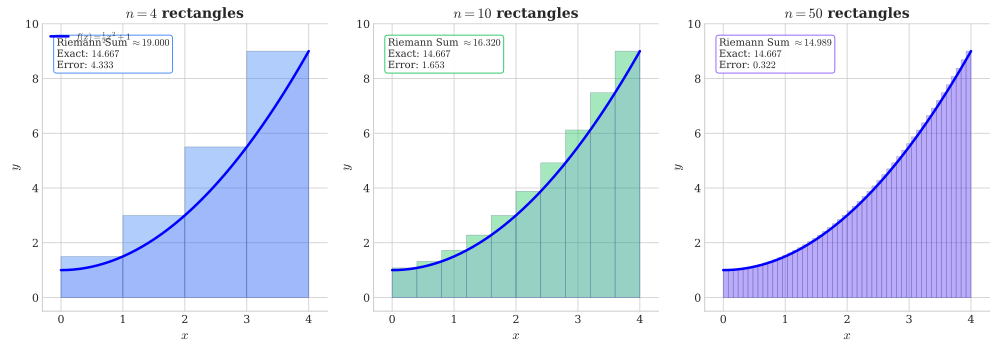
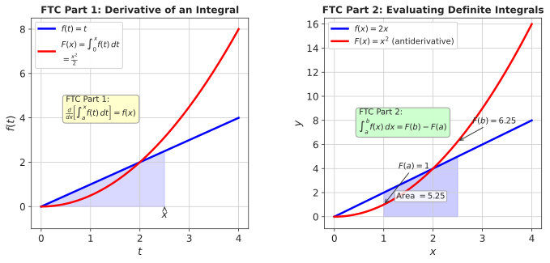

# Week 6: Introduction to Integration

## Act II: Measuring Accumulation — Chapter 1

> *"Differentiation tells us how fast things change; integration tells us how much has accumulated. Together, they complete the calculus story."*

---

## Theme: "Measuring Accumulation"

**Science Context:** Carbon sequestration rates, lymphocyte accumulation in medicine, water flow volumes, marginal costs

**Learning Outcomes:** At the end of this week you should be able to:

1. Understand the antiderivative as the reverse operation of differentiation
2. Apply standard integration rules (power rule, exponential, 1/x)
3. Use the constant of integration and apply initial conditions to find particular solutions
4. Evaluate indefinite integrals of polynomial, exponential, and logarithmic functions
5. Apply integration to find total accumulated quantities from a given rate function

**Exam Alignment:** Q14, Q37

---

## 1. The Challenge: From Rates to Totals

### Why Integration Matters

In Weeks 4–5, you learned to compute derivatives—the instantaneous rate of change. But scientists often face the **reverse problem**: given a rate of change, what is the total accumulated quantity?

| Domain | Given Rate | Need Total |
|--------|------------|------------|
| Carbon Science | CO₂ absorption rate (tonnes/year) | Total carbon sequestered |
| Medicine | White blood cell change rate (cells/hr) | Total lymphocyte count |
| Economics | Marginal cost ($/unit) | Total cost |
| Hydrology | Flow rate (m³/s) | Total water volume |
| Agriculture | Yield response rate (t/ha per kg fertilizer) | Total crop yield |

**Integration is the mathematical tool for answering these questions.**

### The Fundamental Insight

If differentiation answers "how fast?", integration answers "how much?". They are **inverse operations**:

$$\text{Differentiation: } F(x) \xrightarrow{\frac{d}{dx}} f(x)$$

$$\text{Integration: } f(x) \xrightarrow{\int} F(x) + C$$

---

## 2. Antiderivatives: Reversing Differentiation

### 2.1 Definition

An **antiderivative** of $f(x)$ is any function $F(x)$ such that:

$$F'(x) = f(x)$$

**Example 6.1:** What function, when differentiated, gives $2x$?

We know $\frac{d}{dx}[x^2] = 2x$, so $F(x) = x^2$ is an antiderivative of $f(x) = 2x$.

But wait—there's more! All of these also work:
- $\frac{d}{dx}[x^2 + 5] = 2x$
- $\frac{d}{dx}[x^2 - 17] = 2x$
- $\frac{d}{dx}[x^2 + \pi] = 2x$

### 2.2 The Constant of Integration

**Key Insight:** If $F(x)$ is an antiderivative of $f(x)$, then so is $F(x) + C$ for any constant $C$.

This is because $\frac{d}{dx}[C] = 0$.

We write:

$$\int f(x)\,dx = F(x) + C$$

where $C$ is the **constant of integration** and $\int f(x)\,dx$ is the **indefinite integral** of $f(x)$.

**Important:** Any two antiderivatives of the same function differ only by a constant:
$$F_1(x) - F_2(x) = C$$

---

## 3. Basic Integration Rules

### 3.1 Power Rule for Integration

The **reverse** of the power rule for derivatives:

$$\int x^n\,dx = \frac{x^{n+1}}{n+1} + C, \quad n \neq -1$$

**Derivation:** Check by differentiating: $\frac{d}{dx}\left[\frac{x^{n+1}}{n+1}\right] = \frac{(n+1)x^n}{n+1} = x^n$ ✓

**Example 6.2:** Find the antiderivatives:

| $f(x)$ | $\int f(x)\,dx$ | Verification |
|--------|-----------------|--------------|
| $x^2$ | $\frac{x^3}{3} + C$ | $\frac{d}{dx}\left[\frac{x^3}{3}\right] = x^2$ ✓ |
| $x^3$ | $\frac{x^4}{4} + C$ | $\frac{d}{dx}\left[\frac{x^4}{4}\right] = x^3$ ✓ |
| $x^{-2}$ | $\frac{x^{-1}}{-1} + C = -\frac{1}{x} + C$ | $\frac{d}{dx}\left[-x^{-1}\right] = x^{-2}$ ✓ |
| $\sqrt{x} = x^{1/2}$ | $\frac{x^{3/2}}{3/2} + C = \frac{2}{3}x^{3/2} + C$ | $\frac{d}{dx}\left[\frac{2x^{3/2}}{3}\right] = x^{1/2}$ ✓ |

### 3.2 Constant Rule

$$\int k\,dx = kx + C$$

**Example 6.3:** $\int 5\,dx = 5x + C$

### 3.3 Sum and Constant Multiple Rules

$$\int [f(x) + g(x)]\,dx = \int f(x)\,dx + \int g(x)\,dx$$

$$\int k \cdot f(x)\,dx = k \int f(x)\,dx$$

**Example 6.4:** Find $\int (3x^2 - 7x + 4)\,dx$

*Solution:*
$$\int (3x^2 - 7x + 4)\,dx = 3 \cdot \frac{x^3}{3} - 7 \cdot \frac{x^2}{2} + 4x + C = x^3 - \frac{7x^2}{2} + 4x + C$$

### 3.4 Special Integrals: Exponential and Logarithmic

$$\int e^x\,dx = e^x + C$$

$$\int e^{kx}\,dx = \frac{1}{k}e^{kx} + C$$

$$\int \frac{1}{x}\,dx = \ln|x| + C \quad (x \neq 0)$$

**Example 6.5:** Find $\int (e^{2x} + \frac{3}{x})\,dx$

*Solution:*
$$\int (e^{2x} + \frac{3}{x})\,dx = \frac{1}{2}e^{2x} + 3\ln|x| + C$$

---

## 4. Rules That Do NOT Hold for Integration

⚠️ **Warning:** Unlike differentiation, integration does NOT distribute over products, quotients, or powers:

| **INCORRECT** | **Why It Fails** |
|---------------|------------------|
| $\int f(x) \cdot g(x)\,dx \neq \left(\int f(x)\,dx\right) \cdot \left(\int g(x)\,dx\right)$ | Integration doesn't distribute over products |
| $\int \frac{f(x)}{g(x)}\,dx \neq \frac{\int f(x)\,dx}{\int g(x)\,dx}$ | Integration doesn't distribute over quotients |
| $\int [f(x)]^n\,dx \neq \left[\int f(x)\,dx\right]^n$ | Integration doesn't distribute over powers |

**Example 6.6:** Show that $\int x \cdot x\,dx \neq \left(\int x\,dx\right) \cdot \left(\int x\,dx\right)$

*Left side:* $\int x^2\,dx = \frac{x^3}{3} + C$

*Right side:* $\left(\frac{x^2}{2}\right) \cdot \left(\frac{x^2}{2}\right) = \frac{x^4}{4}$ — completely different!

---

## 5. Finding Specific Antiderivatives: Initial Conditions

The constant $C$ can be determined when we know the value of the function at a specific point—an **initial condition**.

### 5.1 The General Process

1. Find the indefinite integral: $F(x) + C$
2. Use the initial condition $F(x_0) = y_0$ to solve for $C$
3. Write the specific antiderivative

**Example 6.7 (Soap Bubble):** The rate of change of a soap bubble's radius is:
$$r'(t) = -3t^2 + 6t \quad \text{(cm/s)}$$
Initially, the bubble has radius 2 cm. Find $r(t)$.

*Solution:*

Step 1: Integrate to find general antiderivative:
$$r(t) = \int (-3t^2 + 6t)\,dt = -t^3 + 3t^2 + C$$

Step 2: Apply initial condition $r(0) = 2$:
$$2 = -(0)^3 + 3(0)^2 + C \implies C = 2$$

Step 3: Write specific solution:
$$r(t) = -t^3 + 3t^2 + 2$$

*Follow-up questions:*
- Maximum radius occurs when $r'(t) = 0$: $-3t^2 + 6t = 0 \implies t(t-2) = 0 \implies t = 0$ or $t = 2$
- At $t = 2$: $r(2) = -8 + 12 + 2 = 6$ cm (maximum)
- Bubble collapses when $r(t) = 0$: solve $-t^3 + 3t^2 + 2 = 0$

---

## 6. Science Context: Land Degradation and Rehabilitation

### 6.1 The Scale of Land Degradation

According to the IPBES 2018 report:
- Over **75% of Earth's land area** is substantially degraded
- Possible increase to **95% by 2050**
- **1.5 billion people** directly affected worldwide
- Annual cost equivalent to **10% of global GDP** (~$8.58 trillion)

Major drivers of land degradation: urbanization, contamination, agriculture (salinization, nutrient depletion, erosion), and mining.

### 6.2 Mathematical Models in Rehabilitation

**Exponential Decay for Element Leaching:**

When rehabilitating mining sites, contaminant concentrations often follow exponential decay:

$$y(t) = A e^{-kt}$$

where:
- $y(t)$ = concentration at time $t$
- $A$ = initial concentration
- $k$ = decay rate constant

**Example 6.8:** Heavy metal concentration in rehabilitated soil decays according to:
$$C'(t) = -0.15 C(t)$$

If initial concentration is 50 mg/kg, find $C(t)$.

*Solution:* The solution to this differential equation is:
$$C(t) = C_0 e^{-0.15t} = 50e^{-0.15t}$$

*Verification by differentiation:* $C'(t) = 50 \cdot (-0.15) e^{-0.15t} = -0.15 \cdot 50e^{-0.15t} = -0.15 C(t)$ ✓

### 6.3 Agricultural Application: Nitrogen Fertilizer Response

The rate of change in crop yield ($y$) as nitrogen fertilizer ($x$) is applied:
$$y'(x) = 0.015 - 0.0001x \quad \text{(tonnes/ha per kg/ha)}$$

If yield is 1.2 t/ha with zero nitrogen, find:
1. The yield function $y(x)$
2. The optimal nitrogen rate for maximum yield

*Solution:*

Step 1: Integrate:
$$y(x) = \int (0.015 - 0.0001x)\,dx = 0.015x - 0.00005x^2 + C$$

Step 2: Apply $y(0) = 1.2$:
$$1.2 = 0 - 0 + C \implies C = 1.2$$

$$y(x) = 1.2 + 0.015x - 0.00005x^2$$

Step 3: Maximum yield occurs when $y'(x) = 0$:
$$0.015 - 0.0001x = 0 \implies x = 150 \text{ kg/ha}$$

Maximum yield: $y(150) = 1.2 + 0.015(150) - 0.00005(150)^2 = 1.2 + 2.25 - 1.125 = 2.325$ t/ha

---

## 7. Preview: The Definite Integral and Area

### 7.1 Motivation: Distance from Velocity

If an object travels at constant speed $v$, the distance is $s = vt$—the area of a rectangle under the velocity-time graph.

But what if velocity varies? The distance is still the "area under the curve," but we need integration to compute it.

### 7.2 Notation Preview

The **definite integral** from $a$ to $b$:

$$\int_a^b f(x)\,dx$$

represents the signed area between $f(x)$ and the $x$-axis from $x = a$ to $x = b$.

The **Fundamental Theorem of Calculus** connects this to antiderivatives:

$$\int_a^b f(x)\,dx = F(b) - F(a)$$

where $F'(x) = f(x)$. We will explore this fully in Week 7.

---

## 8. Exam Alignment: Q14 and Q37

### Q14 Style: Basic Antiderivatives

**Question Type:** Find $\int f(x)\,dx$

**Key skills:** Power rule, exponential/log integrals, sum rule

**Example:** $\int (4x^3 + \frac{1}{\sqrt{x}} - \frac{2}{x^2})\,dx$

*Rewrite:* $\int (4x^3 + x^{-1/2} - 2x^{-2})\,dx$

*Solution:* $x^4 + 2x^{1/2} + 2x^{-1} + C = x^4 + 2\sqrt{x} + \frac{2}{x} + C$

### Q37 Style: Initial Value Problems (Lymphocyte Count)

**Question Type:** Given rate of change and initial condition, find specific function

**Example:** White blood cell count changes at rate $L'(t) = 200e^{-0.1t}$ cells/hour. If initial count is 5000 cells, find $L(t)$.

*Solution:*
$$L(t) = \int 200e^{-0.1t}\,dt = \frac{200}{-0.1}e^{-0.1t} + C = -2000e^{-0.1t} + C$$

Apply $L(0) = 5000$:
$$5000 = -2000e^0 + C = -2000 + C \implies C = 7000$$

$$L(t) = 7000 - 2000e^{-0.1t}$$

---

## Summary: Key Integration Rules

| Function $f(x)$ | Antiderivative $\int f(x)\,dx$ |
|-----------------|-------------------------------|
| $k$ (constant) | $kx + C$ |
| $x^n$ $(n \neq -1)$ | $\frac{x^{n+1}}{n+1} + C$ |
| $\frac{1}{x}$ | $\ln|x| + C$ |
| $e^x$ | $e^x + C$ |
| $e^{kx}$ | $\frac{1}{k}e^{kx} + C$ |
| $f(x) + g(x)$ | $\int f(x)\,dx + \int g(x)\,dx$ |
| $k \cdot f(x)$ | $k \int f(x)\,dx$ |

---

## Learning Outcomes

By the end of this week, you should be able to:

1. ✅ Understand the antiderivative as the reverse operation of differentiation
2. ✅ Apply standard integration rules (power rule, exponential, 1/x, sum and constant multiple rules)
3. ✅ Use the constant of integration and apply initial conditions to find particular solutions
4. ✅ Evaluate indefinite integrals of polynomial, exponential, and logarithmic functions
5. ✅ Apply integration to find total accumulated quantities from a given rate function (land degradation, agriculture)

---

*Next week: Definite integrals, the Fundamental Theorem of Calculus, and computing areas under curves.*
