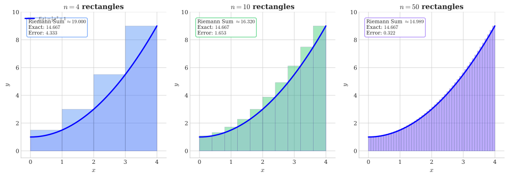
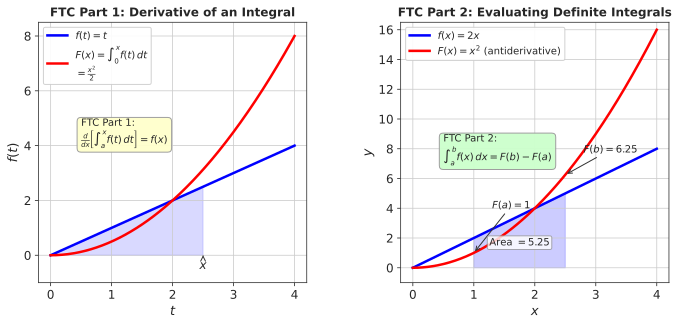

# Week 6: Introduction to Integration

## Act II: Measuring Accumulation — Chapter 1

> *"Differentiation tells us how fast things change; integration tells us how much has accumulated. Together, they complete the calculus story."*

---

## Theme: "Measuring Accumulation"

**Science Context:** Carbon sequestration rates, lymphocyte accumulation in medicine, water flow volumes, marginal costs

**Learning Outcomes:** At the end of this week you should be able to:

1. Understand the antiderivative as the reverse operation of differentiation
2. Apply standard integration rules (power rule, exponential, 1/x)
3. Use the constant of integration and apply initial conditions to find particular solutions
4. Evaluate indefinite integrals of polynomial, exponential, and logarithmic functions
5. Apply integration to find total accumulated quantities from a given rate function

---

> **📓 About "Try it in Python" boxes:** Throughout this lesson, these boxes reference specific code examples by ID — e.g. **W6-CS03** means *Week 6, Code Snippet 3*. Find the matching code under **Notes → Python Code Snippets** for this week; each entry there is labelled with its ID.

## 1. The Challenge: From Rates to Totals

### Why Integration Matters

In Weeks 4–5, you learned to compute derivatives—the instantaneous rate of change. But scientists often face the **reverse problem**: given a rate of change, what is the total accumulated quantity?

| Domain         | Given Rate                                   | Need Total               |
| -------------- | -------------------------------------------- | ------------------------ |
| Carbon Science | CO₂ absorption rate (tonnes/year)            | Total carbon sequestered |
| Medicine       | White blood cell change rate (cells/hr)      | Total lymphocyte count   |
| Economics      | Marginal cost ($/unit)                       | Total cost               |
| Hydrology      | Flow rate (m³/s)                             | Total water volume       |
| Agriculture    | Yield response rate (t/ha per kg fertilizer) | Total crop yield         |

**Integration is the mathematical tool for answering these questions.**

### The Fundamental Insight

If differentiation answers "how fast?", integration answers "how much?". They are **inverse operations**:

$$\text{Differentiation: } F(x) \xrightarrow{\frac{d}{dx}} f(x)$$

$$\text{Integration: } f(x) \xrightarrow{\int} F(x) + C$$

---

## 2. Antiderivatives: Reversing Differentiation

### 2.1 Definition

An **antiderivative** of $f(x)$ is any function $F(x)$ such that:

$$F'(x) = f(x)$$

**Example 6.1:** What function, when differentiated, gives $2x$?

We know $\frac{d}{dx}[x^2] = 2x$, so $F(x) = x^2$ is an antiderivative of $f(x) = 2x$.

But wait—there's more! All of these also work:
- $\frac{d}{dx}[x^2 + 5] = 2x$
- $\frac{d}{dx}[x^2 - 17] = 2x$
- $\frac{d}{dx}[x^2 + \pi] = 2x$

### 2.2 The Constant of Integration

**Key Insight:** If $F(x)$ is an antiderivative of $f(x)$, then so is $F(x) + C$ for any constant $C$.

This is because $\frac{d}{dx}[C] = 0$.

We write:

$$\int f(x)\,dx = F(x) + C$$

where $C$ is the **constant of integration** and $\int f(x)\,dx$ is the **indefinite integral** of $f(x)$.

**Important:** Any two antiderivatives of the same function differ only by a constant:
$$F_1(x) - F_2(x) = C$$

---

## 3. Basic Integration Rules

### 3.1 Power Rule for Integration

The **reverse** of the power rule for derivatives:

$$\int x^n\,dx = \frac{x^{n+1}}{n+1} + C, \quad n \neq -1$$

**Derivation:** Check by differentiating: $\frac{d}{dx}\left[\frac{x^{n+1}}{n+1}\right] = \frac{(n+1)x^n}{n+1} = x^n$ ✓

**Example 6.2:** Find the antiderivatives:

| $f(x)$               | $\int f(x)\,dx$                                    | Verification                                              |
| -------------------- | -------------------------------------------------- | --------------------------------------------------------- |
| $x^2$                | $\frac{x^3}{3} + C$                                | $\frac{d}{dx}\left[\frac{x^3}{3}\right] = x^2$ ✓          |
| $x^3$                | $\frac{x^4}{4} + C$                                | $\frac{d}{dx}\left[\frac{x^4}{4}\right] = x^3$ ✓          |
| $x^{-2}$             | $\frac{x^{-1}}{-1} + C = -\frac{1}{x} + C$         | $\frac{d}{dx}\left[-x^{-1}\right] = x^{-2}$ ✓             |
| $\sqrt{x} = x^{1/2}$ | $\frac{x^{3/2}}{3/2} + C = \frac{2}{3}x^{3/2} + C$ | $\frac{d}{dx}\left[\frac{2x^{3/2}}{3}\right] = x^{1/2}$ ✓ |

### 3.2 Constant Rule

$$\int k\,dx = kx + C$$

**Example 6.3:** $\int 5\,dx = 5x + C$

### 3.3 Sum and Constant Multiple Rules

$$\int [f(x) + g(x)]\,dx = \int f(x)\,dx + \int g(x)\,dx$$

$$\int k \cdot f(x)\,dx = k \int f(x)\,dx$$

**Example 6.4:** Find $\int (3x^2 - 7x + 4)\,dx$

*Solution:*
$$\int (3x^2 - 7x + 4)\,dx = 3 \cdot \frac{x^3}{3} - 7 \cdot \frac{x^2}{2} + 4x + C = x^3 - \frac{7x^2}{2} + 4x + C$$

### 3.4 Special Integrals: Exponential and Logarithmic

$$\int e^x\,dx = e^x + C$$

$$\int e^{kx}\,dx = \frac{1}{k}e^{kx} + C$$

$$\int \frac{1}{x}\,dx = \ln|x| + C \quad (x \neq 0)$$

**Example 6.5:** Find $\int (e^{2x} + \frac{3}{x})\,dx$

*Solution:*
$$\int (e^{2x} + \frac{3}{x})\,dx = \frac{1}{2}e^{2x} + 3\ln|x| + C$$

> **📓 Try it in Python**
>
> - **W6-CS01** — *Setup and Imports*: Run this first.
> - **W6-CS02** — *Basic Indefinite Integration*: SymPy `integrate()` for polynomials.
> - **W6-CS03** — *Exponential and Logarithmic Integration*: $\int e^x\,dx$, $\int 1/x\,dx$.
>
> Find these under **Notes → Python Code Snippets** for this week.

---

## 4. Rules That Do NOT Hold for Integration

⚠️ **Warning:** Unlike differentiation, integration does NOT distribute over products, quotients, or powers:

| **INCORRECT**                                                                               | **Why It Fails**                              |
| ------------------------------------------------------------------------------------------- | --------------------------------------------- |
| $\int f(x) \cdot g(x)\,dx \neq \left(\int f(x)\,dx\right) \cdot \left(\int g(x)\,dx\right)$ | Integration doesn't distribute over products  |
| $\int \frac{f(x)}{g(x)}\,dx \neq \frac{\int f(x)\,dx}{\int g(x)\,dx}$                       | Integration doesn't distribute over quotients |
| $\int [f(x)]^n\,dx \neq \left[\int f(x)\,dx\right]^n$                                       | Integration doesn't distribute over powers    |

**Example 6.6:** Show that $\int x \cdot x\,dx \neq \left(\int x\,dx\right) \cdot \left(\int x\,dx\right)$

*Left side:* $\int x^2\,dx = \frac{x^3}{3} + C$

*Right side:* $\left(\frac{x^2}{2}\right) \cdot \left(\frac{x^2}{2}\right) = \frac{x^4}{4}$ — completely different!

---

## 5. Finding Specific Antiderivatives: Initial Conditions

The constant $C$ can be determined when we know the value of the function at a specific point—an **initial condition**.

### 5.1 The General Process

1. Find the indefinite integral: $F(x) + C$
2. Use the initial condition $F(x_0) = y_0$ to solve for $C$
3. Write the specific antiderivative

**Example 6.7 (Soap Bubble):** The rate of change of a soap bubble's radius is:
$$r'(t) = -3t^2 + 6t \quad \text{(cm/s)}$$
Initially, the bubble has radius 2 cm. Find $r(t)$.

*Solution:*

Step 1: Integrate to find general antiderivative:
$$r(t) = \int (-3t^2 + 6t)\,dt = -t^3 + 3t^2 + C$$

Step 2: Apply initial condition $r(0) = 2$:
$$2 = -(0)^3 + 3(0)^2 + C \implies C = 2$$

Step 3: Write specific solution:
$$r(t) = -t^3 + 3t^2 + 2$$

*Follow-up questions:*
- Maximum radius occurs when $r'(t) = 0$: $-3t^2 + 6t = 0 \implies t(t-2) = 0 \implies t = 0$ or $t = 2$
- At $t = 2$: $r(2) = -8 + 12 + 2 = 6$ cm (maximum)
- Bubble collapses when $r(t) = 0$: solve $-t^3 + 3t^2 + 2 = 0$

---

## 6. Limiting Values: Where Systems End Up

A powerful feature of exponential-decay IVPs is that the solution always approaches a **finite limiting value** as $t \to \infty$. Recognising this pattern saves time and gives physical meaning to the constant of integration.

### 6.1 The General Pattern

If the rate function is $F'(t) = a e^{-kt}$ with $k > 0$ and initial condition $F(0) = F_0$, then:

$$F(t) = \underbrace{\left(F_0 + \frac{a}{k}\right)}_{L} - \frac{a}{k}\,e^{-kt}$$

As $t \to \infty$, $e^{-kt} \to 0$, so:
$$\lim_{t \to \infty} F(t) = L = F_0 + \frac{a}{k}$$

The system **starts at $F_0$**, changes rapidly at first, then **settles to the limiting value $L$**.

**Why this matters:** You can read the long-run behaviour directly from the formula — the limiting value is just the constant term once $e^{-kt}$ has vanished.

---

**Example 6.9 (Carbon Sequestration):** A reforestation project absorbs CO₂ at a declining rate:
$$C'(t) = 50e^{-0.02t} \quad \text{(tonnes/year)}, \quad C(0) = 0$$

Find $C(t)$ and the total carbon eventually sequestered.

*Solution:*

**Step 1 — Integrate:**
$$C(t) = \frac{50}{-0.02}\,e^{-0.02t} + K = -2500e^{-0.02t} + K$$

**Step 2 — Apply $C(0) = 0$:**
$$0 = -2500(1) + K \implies K = 2500$$
$$\boxed{C(t) = 2500\left(1 - e^{-0.02t}\right)}$$

**Step 3 — Limiting value:**
$$\lim_{t \to \infty} C(t) = 2500(1 - 0) = \mathbf{2500 \text{ tonnes}}$$

*Interpretation:* The forest absorbs CO₂ rapidly in early years, then the absorption rate slows. The total carbon eventually sequestered is capped at 2500 tonnes.

---

**Example 6.10 (Lymphocyte Recovery):** After chemotherapy, white blood cell count changes at:
$$L'(t) = 200e^{-0.1t} \quad \text{(cells/day)}, \quad L(0) = 5000$$

Find $L(t)$ and the limiting count as recovery progresses.

*Solution:*

**Step 1 — Integrate:**
$$L(t) = \frac{200}{-0.1}\,e^{-0.1t} + C = -2000e^{-0.1t} + C$$

**Step 2 — Apply $L(0) = 5000$:**
$$5000 = -2000(1) + C \implies C = 7000$$
$$\boxed{L(t) = 7000 - 2000e^{-0.1t}}$$

**Step 3 — Limiting value:**
$$\lim_{t \to \infty} L(t) = 7000 - 0 = \mathbf{7000 \text{ cells}}$$

*Clinical interpretation:* The WBC count recovers from 5000 toward 7000. The recovery is fast initially, then slows. A clinician can use this to predict when a patient's immune system has substantially recovered.

### 6.2 Pattern Recognition

|                | **Carbon (Ex 6.9)**    | **Lymphocyte (Ex 6.10)** |
| -------------- | ---------------------- | ------------------------ |
| Rate           | $50e^{-0.02t}$         | $200e^{-0.1t}$           |
| Initial value  | $C(0) = 0$             | $L(0) = 5000$            |
| Solution       | $2500(1 - e^{-0.02t})$ | $7000 - 2000e^{-0.1t}$   |
| Limiting value | 2500 tonnes            | 7000 cells               |
| Structure      | $L - B\,e^{-kt}$       | $L - B\,e^{-kt}$         |

Every exponential-decay IVP has this shape: the limiting value $L$ is the constant term; the exponential term $B\,e^{-kt}$ is "how far the system still has to go."

> **📓 Try it in Python**
>
> - **W6-CS05** — *Initial Value Problems*: Solve for the constant of integration $C$ from a known point.
> - **W6-CS06** — *Finding Maximum After Integration*: Combine integration with optimization.
> - **W6-CS11** — *Exponential Decay Integration*: $\int e^{-kx}\,dx$ in environmental contexts.
>
> Find these under **Notes → Python Code Snippets** for this week.

---

## 7. Science Context: Land Degradation and Rehabilitation

### 6.1 The Scale of Land Degradation

According to the IPBES 2018 report:
- Over **75% of Earth's land area** is substantially degraded
- Possible increase to **95% by 2050**
- **1.5 billion people** directly affected worldwide
- Annual cost equivalent to **10% of global GDP** (~$8.58 trillion)

Major drivers of land degradation: urbanization, contamination, agriculture (salinization, nutrient depletion, erosion), and mining.

### 6.2 Mathematical Models in Rehabilitation

**Exponential Decay for Element Leaching:**

When rehabilitating mining sites, contaminant concentrations often follow exponential decay:

$$y(t) = A e^{-kt}$$

where:
- $y(t)$ = concentration at time $t$
- $A$ = initial concentration
- $k$ = decay rate constant

**Example 6.8:** Heavy metal concentration in rehabilitated soil decays according to:
$$C'(t) = -0.15 C(t)$$

If initial concentration is 50 mg/kg, find $C(t)$.

*Solution:* The solution to this differential equation is:
$$C(t) = C_0 e^{-0.15t} = 50e^{-0.15t}$$

*Verification by differentiation:* $C'(t) = 50 \cdot (-0.15) e^{-0.15t} = -0.15 \cdot 50e^{-0.15t} = -0.15 C(t)$ ✓

### 6.3 Agricultural Application: Nitrogen Fertilizer Response

The rate of change in crop yield ($y$) as nitrogen fertilizer ($x$) is applied:
$$y'(x) = 0.015 - 0.0001x \quad \text{(tonnes/ha per kg/ha)}$$

If yield is 1.2 t/ha with zero nitrogen, find:
1. The yield function $y(x)$
2. The optimal nitrogen rate for maximum yield

*Solution:*

Step 1: Integrate:
$$y(x) = \int (0.015 - 0.0001x)\,dx = 0.015x - 0.00005x^2 + C$$

Step 2: Apply $y(0) = 1.2$:
$$1.2 = 0 - 0 + C \implies C = 1.2$$

$$y(x) = 1.2 + 0.015x - 0.00005x^2$$

Step 3: Maximum yield occurs when $y'(x) = 0$:
$$0.015 - 0.0001x = 0 \implies x = 150 \text{ kg/ha}$$

Maximum yield: $y(150) = 1.2 + 0.015(150) - 0.00005(150)^2 = 1.2 + 2.25 - 1.125 = 2.325$ t/ha

> **📓 Try it in Python**
>
> - **W6-CS09** — *Area Between Two Curves*: Compute $\int (f - g)\,dx$ over an interval.
> - **W6-CS10** — *Nitrogen Fertilizer Response*: An applied case used in lecture.
> - **W6-CS12** — *SymPy Plotting of Trajectories*: Visualise solutions to integration problems.
>
> Find these under **Notes → Python Code Snippets** for this week.

---

## 8. Preview: The Definite Integral and Area

### 7.1 Motivation: Distance from Velocity

If an object travels at constant speed $v$, the distance is $s = vt$—the area of a rectangle under the velocity-time graph.

But what if velocity varies? The distance is still the "area under the curve," but we need integration to compute it.



### 7.2 Notation Preview

The **definite integral** from $a$ to $b$:

$$\int_a^b f(x)\,dx$$

represents the signed area between $f(x)$ and the $x$-axis from $x = a$ to $x = b$.



The **Fundamental Theorem of Calculus** connects this to antiderivatives:

$$\int_a^b f(x)\,dx = F(b) - F(a)$$

where $F'(x) = f(x)$. We will explore this fully in Week 7.

> **📓 Try it in Python**
>
> - **W6-CS04** — *Definite Integrals*: Evaluate $\int_a^b f(x)\,dx$ exactly with SymPy.
> - **W6-CS07** — *Plotting Areas Under Curves*: Shade $\int_a^b f(x)\,dx$ on a graph.
> - **W6-CS08** — *Plotting Curved Areas*: Visualise non-rectangular regions.
>
> Find these under **Notes → Python Code Snippets** for this week.

---

## 10. Python: SymPy for Symbolic Integration

SymPy is Python's symbolic mathematics library. It can compute antiderivatives exactly — the same results you'd get by hand — and is useful for checking your work.

### 10.1 Computing Antiderivatives

```python
import sympy as sp
x = sp.Symbol('x')

# Power rule
print(sp.integrate(x**3, x))           # x**4/4

# Exponential
print(sp.integrate(sp.exp(2*x), x))    # exp(2*x)/2

# 1/x
print(sp.integrate(1/x, x))            # log(x)
```

> **Important:** SymPy omits $+C$. You must add the constant of integration yourself when writing the general antiderivative. SymPy also writes `log(x)` for $\ln|x|$ — always translate back to maths notation in your solutions.

### 10.2 Verifying Your Answers

The golden rule of integration: **differentiate your answer and check you get the original function back.** SymPy makes this instant:

```python
f = 3*x**2 - 7*x + 4
F = sp.integrate(f, x)
print("Antiderivative:", F)               # x**3 - 7*x**2/2 + 4*x
print("Check:", sp.diff(F, x))           # 3*x**2 - 7*x + 4
print("Match:", sp.simplify(sp.diff(F, x) - f) == 0)  # True
```

This verification works by hand *and* in SymPy. Use it on every question.

### 10.3 Solving Initial Value Problems with SymPy

```python
t = sp.Symbol('t')
C1 = sp.Symbol('C')

# Vegetation recovery: V'(t) = 8*exp(-0.2t), V(0) = 5
rate = 8 * sp.exp(-0.2 * t)
V_general = sp.integrate(rate, t) + C1
print("General:", V_general)           # -40*exp(-0.2*t) + C

# Solve for C using V(0) = 5
C_val = sp.solve(V_general.subs(t, 0) - 5, C1)[0]
V_specific = V_general.subs(C1, C_val)
print("V(t) =", V_specific)            # 45 - 40*exp(-0.2*t)

# Limiting value
print("Limit:", sp.limit(V_specific, t, sp.oo))  # 45
```

**Takeaway:** SymPy handles the algebra — you set up the model and interpret the answer.

---

## Summary: Key Integration Rules

| Function $f(x)$     | Antiderivative $\int f(x)\,dx$  |
| ------------------- | ------------------------------- |
| $k$ (constant)      | $kx + C$                        |
| $x^n$ $(n \neq -1)$ | $\frac{x^{n+1}}{n+1} + C$       |
| $\frac{1}{x}$       | $\ln                            | x | + C$ |
| $e^x$               | $e^x + C$                       |
| $e^{kx}$            | $\frac{1}{k}e^{kx} + C$         |
| $f(x) + g(x)$       | $\int f(x)\,dx + \int g(x)\,dx$ |
| $k \cdot f(x)$      | $k \int f(x)\,dx$               |

---
