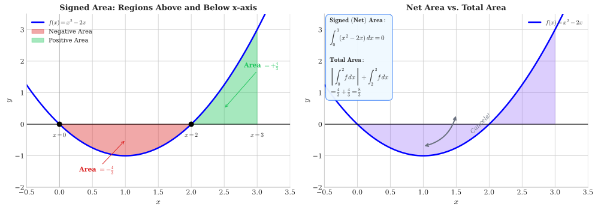
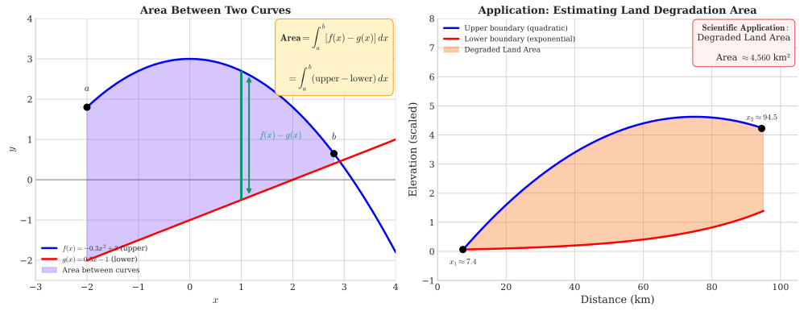

# Week 7: Definite Integrals and Applications

## Act II: Measuring Accumulation — Chapter 2

> *"The definite integral answers the question: what is the total? From pollution to population, from profit to land area, integration transforms rates into accumulated totals."*

---

## Theme: "Definite Integrals and Applications"

**Science Context:** Ocean plastic accumulation, consumer and producer surplus, water reservoir volumes

**Learning Outcomes:** At the end of this week you should be able to:

1. State and apply the Fundamental Theorem of Calculus
2. Evaluate definite integrals using antiderivatives
3. Interpret a definite integral as the area under a curve between two bounds
4. Calculate areas between curves and interpret them in applied contexts
5. Compute consumer surplus and producer surplus from supply and demand functions
6. Apply definite integration to accumulation problems in ecology and economics

**Exam Alignment:** Q14, Q39

---

## 1. From Indefinite to Definite: The Completion of Calculus

### Building on Week 6

In Week 6, we learned to find **antiderivatives** (indefinite integrals):

$$\int f(x)\,dx = F(x) + C$$

This week, we answer a more concrete question: **What is the total accumulated quantity between two points?**

### The Definite Integral

The **definite integral** of $f(x)$ from $a$ to $b$ is written:

$$\int_a^b f(x)\,dx$$

where:
- $a$ = lower limit of integration
- $b$ = upper limit of integration
- $f(x)$ = the integrand
- $dx$ = indicates integration with respect to $x$

**Key Distinction:**
| Indefinite Integral | Definite Integral |
|---------------------|-------------------|
| $\int f(x)\,dx = F(x) + C$ | $\int_a^b f(x)\,dx = \text{a number}$ |
| A family of functions | A specific numerical value |
| Includes $+ C$ | No constant of integration |

---

## 2. The Fundamental Theorem of Calculus

The Fundamental Theorem of Calculus (FTC) is arguably the most important result in all of calculusconnecting differentiation and integration as inverse processes.

### Part 1: Differentiation of an Integral

If $f$ is continuous on $[a, b]$, then the function:

$$F(x) = \int_a^x f(t)\,dt$$

is differentiable, and:

$$\frac{d}{dx}\left[\int_a^x f(t)\,dt\right] = f(x)$$

**Interpretation:** The derivative of the "area so far" function equals the original function.

### Part 2: Evaluation of Definite Integrals

If $F'(x) = f(x)$ (i.e., $F$ is any antiderivative of $f$), then:

$$\boxed{\int_a^b f(x)\,dx = F(b) - F(a)}$$

This is often written using the notation:

$$\int_a^b f(x)\,dx = \left[F(x)\right]_a^b = F(b) - F(a)$$

**The FTC tells us:** To compute a definite integral, find any antiderivative $F(x)$, then evaluate at the limits and subtract.

---

## 3. Computing Definite Integrals

### Example 7.1: Basic Polynomial

Evaluate $\int_1^3 x^2\,dx$

**Solution:**

Step 1: Find antiderivative: $F(x) = \frac{x^3}{3}$

Step 2: Apply FTC Part 2:
$$\int_1^3 x^2\,dx = \left[\frac{x^3}{3}\right]_1^3 = \frac{3^3}{3} - \frac{1^3}{3} = \frac{27}{3} - \frac{1}{3} = \frac{26}{3} \approx 8.67$$

### Example 7.2: Exponential Function

Evaluate $\int_0^2 e^x\,dx$

**Solution:**
$$\int_0^2 e^x\,dx = \left[e^x\right]_0^2 = e^2 - e^0 = e^2 - 1 \approx 6.39$$

### Example 7.3: Logarithmic Integration

Evaluate $\int_1^4 \frac{1}{x}\,dx$

**Solution:**
$$\int_1^4 \frac{1}{x}\,dx = \left[\ln|x|\right]_1^4 = \ln(4) - \ln(1) = \ln(4) - 0 = \ln(4) \approx 1.386$$

### Example 7.4: Mixed Function

Evaluate $\int_0^1 (3x^2 + 2x - 1)\,dx$

**Solution:**
$$\int_0^1 (3x^2 + 2x - 1)\,dx = \left[x^3 + x^2 - x\right]_0^1$$
$$= (1^3 + 1^2 - 1) - (0 + 0 - 0) = 1 + 1 - 1 = 1$$

---

## 4. Properties of Definite Integrals

### 4.1 Additivity Over Intervals

$$\int_a^c f(x)\,dx = \int_a^b f(x)\,dx + \int_b^c f(x)\,dx$$

### 4.2 Reversing Limits

$$\int_a^b f(x)\,dx = -\int_b^a f(x)\,dx$$

### 4.3 Zero-Width Interval

$$\int_a^a f(x)\,dx = 0$$

### 4.4 Constant Multiple

$$\int_a^b k \cdot f(x)\,dx = k \int_a^b f(x)\,dx$$

### 4.5 Sum/Difference Rule

$$\int_a^b [f(x) \pm g(x)]\,dx = \int_a^b f(x)\,dx \pm \int_a^b g(x)\,dx$$

---

## 5. Geometric Interpretation: Area Under a Curve

### 5.1 Positive Functions

When $f(x) \geq 0$ on $[a, b]$, the definite integral equals the **area** between the curve and the $x$-axis:

$$\text{Area} = \int_a^b f(x)\,dx$$

### 5.2 Signed Area

When $f(x)$ takes both positive and negative values, the definite integral gives **signed area**:
- Regions above the $x$-axis contribute **positive** area
- Regions below the $x$-axis contribute **negative** area

**Example 7.5:** Consider $f(x) = x^2 - 2x$ on $[0, 3]$

First, find where $f(x) = 0$: $x(x-2) = 0 \Rightarrow x = 0$ or $x = 2$

The function is negative on $(0, 2)$ and positive on $(2, 3)$.

**Signed area (net area):**
$$\int_0^3 (x^2 - 2x)\,dx = \left[\frac{x^3}{3} - x^2\right]_0^3 = \left(\frac{27}{3} - 9\right) - 0 = 9 - 9 = 0$$

**Total (unsigned) area:**
$$\text{Total Area} = \left|\int_0^2 (x^2 - 2x)\,dx\right| + \int_2^3 (x^2 - 2x)\,dx$$

$$= \left|\frac{8}{3} - 4\right| + \left(9 - 9 - \frac{8}{3} + 4\right) = \frac{4}{3} + \frac{4}{3} = \frac{8}{3}$$

---

## 6. Area Between Two Curves

### General Formula

If $f(x) \geq g(x)$ on $[a, b]$, the area between the curves is:

$$\text{Area} = \int_a^b [f(x) - g(x)]\,dx = \int_a^b (\text{upper} - \text{lower})\,dx$$

### Finding Intersection Points

Before integrating, solve $f(x) = g(x)$ to find where curves intersect.

### Example 7.6: Degraded Land Area Calculation

A degraded land patch has boundaries described by:
- Lower boundary: $y = e^{0.0471x}$
- Upper boundary: $y = -19.96 + 2.999x - 0.02x^2$

The boundaries intersect approximately at $x = 7.4$ and $x = 94.5$ (kilometers).

**Area Calculation:**
$$\text{Area} = \int_{7.4}^{94.5} \left[(-19.96 + 2.999x - 0.02x^2) - e^{0.0471x}\right]\,dx$$

This integral can be evaluated using SymPy (see code snippets):

$$\text{Area} \approx 4,560 \text{ km}^2$$

**Scientific Context:** Such calculations are essential for:
- Estimating rehabilitation costs
- Planning vegetation coverage
- Assessing soil loss extent

---

## 7. Average Value of a Function

### Definition

The **average value** of $f(x)$ over $[a, b]$ is:

$$\bar{f} = \frac{1}{b-a}\int_a^b f(x)\,dx$$

**Interpretation:** This is the height of a rectangle with width $(b-a)$ that has the same area as the region under $f(x)$.

### Example 7.7: Average Pollution Level

Pollution concentration follows $C(t) = 50e^{-0.1t}$ (ppm) over the first 10 hours.

$$\bar{C} = \frac{1}{10-0}\int_0^{10} 50e^{-0.1t}\,dt = \frac{1}{10}\left[\frac{50}{-0.1}e^{-0.1t}\right]_0^{10}$$

$$= \frac{1}{10}\left[-500e^{-1} + 500e^0\right] = \frac{1}{10}\left[500 - 500(0.3679)\right]$$

$$= \frac{1}{10}(500 - 183.9) = 31.6 \text{ ppm}$$

---

## 8. Series: The Discrete Analogue of Integration

Just as integration sums infinitely many infinitesimally small pieces, **series** sum discrete terms. Understanding series helps appreciate how integration works and connects to important applications.

### 8.1 Arithmetic Sequences and Series

**Arithmetic Sequence:** Each term differs from the previous by a constant **common difference** $d$:

$$a_n = a_1 + (n-1)d$$

where:
- $a_1$ = first term
- $d$ = common difference
- $a_n$ = $n$th term

**Examples:**
- $2, 5, 8, 11, 14, \ldots$ (first term $a_1 = 2$, common difference $d = 3$)
- $100, 95, 90, 85, \ldots$ (first term $a_1 = 100$, common difference $d = -5$)

**Arithmetic Series (Sum):**

$$S_n = \sum_{i=1}^{n} a_i = \frac{n}{2}(a_1 + a_n) = \frac{n}{2}[2a_1 + (n-1)d]$$

**Derivation:**
Write the sum forwards and backwards:
$$S_n = a_1 + (a_1+d) + (a_1+2d) + \cdots + a_n$$
$$S_n = a_n + (a_n-d) + (a_n-2d) + \cdots + a_1$$

Adding: $2S_n = n(a_1 + a_n)$, so $S_n = \frac{n}{2}(a_1 + a_n)$

### Example 7.8: Food Production Growth

A country's food production capacity (in millions of people fed) starts at 100 and increases by 5 million per year (arithmetic growth).

$$a_n = 100 + 5(n-1) = 95 + 5n$$

After 20 years: $a_{20} = 95 + 5(20) = 195$ million

Total food produced in first 20 years:
$$S_{20} = \frac{20}{2}(100 + 195) = 10 \times 295 = 2950 \text{ million-years}$$

### Example 7.9: Counting Terms in a Range (Exam Q29 Style)

Consider the sequence $a_i = 3 + 5(i-1)$ for $i = 1, 2, 3, \ldots$

How many terms are **greater than or equal to 10** and **less than or equal to 150**?

**Solution:**

Step 1: Simplify the formula: $a_i = 3 + 5i - 5 = 5i - 2$

Step 2: Find smallest $i$ where $a_i \geq 10$:
$$5i - 2 \geq 10 \Rightarrow 5i \geq 12 \Rightarrow i \geq 2.4$$
So $i_{\min} = 3$ (smallest integer $\geq 2.4$)

Step 3: Find largest $i$ where $a_i \leq 150$:
$$5i - 2 \leq 150 \Rightarrow 5i \leq 152 \Rightarrow i \leq 30.4$$
So $i_{\max} = 30$

Step 4: Count: $30 - 3 + 1 = \boxed{28}$ terms

### 8.2 Geometric Sequences and Series

**Geometric Sequence:** Each term is multiplied by a constant **common ratio** $r$:

$$a_n = a_1 \cdot r^{n-1}$$

**Definition (Exam Q30 Style):** A geometric sequence is a sequence of numbers with a **common ratio between two consecutive numbers**.

**Examples:**
- $2, 6, 18, 54, \ldots$ (first term $a_1 = 2$, common ratio $r = 3$)
- $100, 50, 25, 12.5, \ldots$ (first term $a_1 = 100$, common ratio $r = 0.5$)

**Geometric Series (Sum):**

$$S_n = a_1 \cdot \frac{1 - r^n}{1 - r}, \quad r \neq 1$$

**Derivation:**
$$S_n = a_1 + a_1 r + a_1 r^2 + \cdots + a_1 r^{n-1}$$
$$rS_n = a_1 r + a_1 r^2 + \cdots + a_1 r^n$$
Subtracting: $S_n - rS_n = a_1 - a_1 r^n$, giving $S_n = a_1 \frac{1-r^n}{1-r}$

**Sum to Infinity (when $|r| < 1$):**

$$S_\infty = \lim_{n \to \infty} S_n = \frac{a_1}{1-r}$$

### Example 7.10: Population Growth

A country's population starts at 100 million and grows at 3% per year (geometric growth):

$$P_n = 100 \times 1.03^{n-1}$$

After 20 years: $P_{20} = 100 \times 1.03^{19} \approx 175.4$ million

---

## 9. The Malthusian Trap: Arithmetic vs. Geometric Growth

### 9.1 Malthus's Key Insight

Thomas Robert Malthus (1798) observed:
- **Food production** grows **arithmetically** (linearly): $F_n = F_1 + (n-1)d$
- **Population** grows **geometrically** (exponentially): $P_n = P_1 \cdot r^{n-1}$

Since geometric growth eventually outpaces arithmetic growth, population will inevitably exceed food supply—the **Malthusian Crisis**.

### 9.2 Numerical Example

| Year | Food Capacity (million) | Population (million) |
|------|-------------------------|----------------------|
| 1 | 100 | 100 |
| 10 | 145 | 130.5 |
| 20 | 195 | 175.4 |
| 50 | 345 | 381.6 |
| 71 | 450 | 810.0 |

At year 71, population exceeds food capacity → **Malthusian Crisis**

### 9.3 Modern Perspective

Malthus didn't foresee:
- Agricultural technology and the Green Revolution
- Demographic transition (declining birth rates with development)
- Hence, many parts of the world escaped the "trap"

However, the mathematical relationship between arithmetic and geometric growth remains fundamentally important for understanding sustainability limits.

---

## 10. Preview: Consumer and Producer Surplus (Q39)

Integration has important applications in economics. Here's a preview of concepts that will be fully developed in Week 12.

### 10.1 Market Equilibrium

Given demand $Q_d = 100 - 2P$ and supply $Q_s = -100 + 3P$:

At equilibrium, $Q_d = Q_s$:
$$100 - 2P = -100 + 3P \Rightarrow 200 = 5P \Rightarrow P^* = 40$$
$$Q^* = 100 - 2(40) = 20$$

### 10.2 Consumer Surplus (CS)

CS measures the benefit consumers receive from paying less than their maximum willingness to pay:

$$\text{CS} = \int_0^{Q^*} D(Q)\,dQ - P^* \cdot Q^*$$

where $D(Q)$ is the inverse demand function (price as a function of quantity).

### 10.3 Producer Surplus (PS)

PS measures the benefit producers receive from selling at a price higher than their minimum acceptable price:

$$\text{PS} = P^* \cdot Q^* - \int_0^{Q^*} S(Q)\,dQ$$

where $S(Q)$ is the inverse supply function.

We will compute these explicitly in Week 12.

---

## 11. Riemann Sums: Connecting Series to Integrals

### 11.1 The Big Picture

The definite integral is defined as the limit of **Riemann sums**—discrete approximations using rectangles.

### 11.2 Left Riemann Sum

Divide $[a, b]$ into $n$ equal subintervals of width $\Delta x = \frac{b-a}{n}$.

$$L_n = \sum_{i=0}^{n-1} f(x_i) \cdot \Delta x$$

where $x_i = a + i \cdot \Delta x$

### 11.3 As $n \to \infty$

$$\int_a^b f(x)\,dx = \lim_{n \to \infty} \sum_{i=0}^{n-1} f(x_i) \cdot \Delta x$$

**Key Insight:** Series (discrete sums) → Integrals (continuous sums) as the number of terms approaches infinity and term size approaches zero.

---

## 12. Summary: Key Formulas

| Concept | Formula |
|---------|---------|
| Definite Integral (FTC) | $\int_a^b f(x)\,dx = F(b) - F(a)$ where $F'(x) = f(x)$ |
| Area under curve | $\text{Area} = \int_a^b f(x)\,dx$ when $f(x) \geq 0$ |
| Area between curves | $\text{Area} = \int_a^b [f(x) - g(x)]\,dx$ |
| Average value | $\bar{f} = \frac{1}{b-a}\int_a^b f(x)\,dx$ |
| Arithmetic sequence | $a_n = a_1 + (n-1)d$ |
| Arithmetic series | $S_n = \frac{n}{2}(a_1 + a_n)$ |
| Geometric sequence | $a_n = a_1 \cdot r^{n-1}$ |
| Geometric series | $S_n = a_1 \frac{1-r^n}{1-r}$ |
| Infinite geometric series | $S_\infty = \frac{a_1}{1-r}$ for $|r| < 1$ |

---

## Learning Outcomes

By the end of this week, you should be able to:

1. ✅ Evaluate definite integrals using the Fundamental Theorem of Calculus
2. ✅ Interpret definite integrals as signed area under a curve
3. ✅ Calculate the area between two curves
4. ✅ Compute the average value of a function over an interval
5. ✅ Identify arithmetic and geometric sequences and find their nth terms
6. ✅ Calculate sums of arithmetic and geometric series
7. ✅ Understand the connection between series and integrals (Riemann sums)
8. ✅ Apply these concepts to scientific problems (land degradation, population dynamics)

---

## Exam Alignment

| Exam Question | Topic | Key Skills |
|---------------|-------|------------|
| Q14 | Definite integrals | FTC evaluation, antiderivatives |
| Q29 | Arithmetic sequences | Finding terms in a range |
| Q30 | Geometric sequences | Definition and properties |
| Q39 | Consumer/Producer Surplus | Integration application (Week 12) |

---

*Next week: Predator-Prey Dynamics and the Lotka-Volterra model—systems of interacting populations.*
