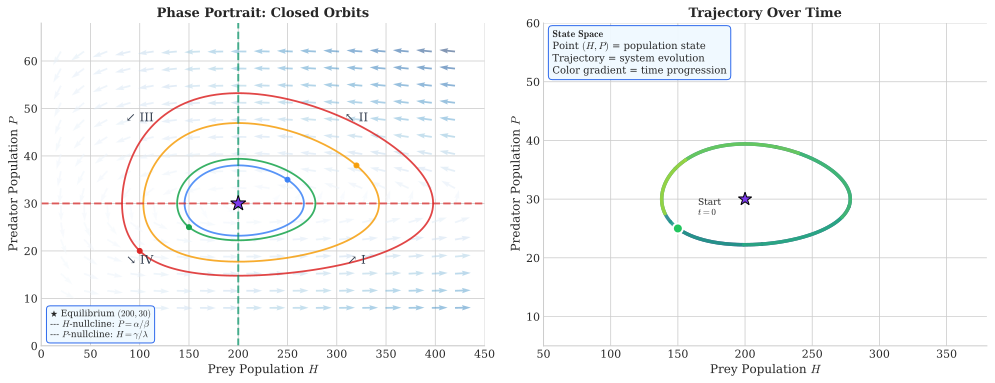
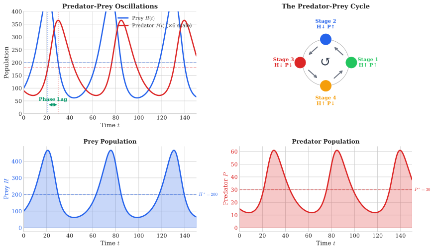

# Week 8: Predator-Prey Dynamics and Systems

## Act III: Predicting Interactions — Chapter 1

> *"In nature, no species exists in isolation. The lynx pursues the hare, populations rise and fall in perpetual dance. Mathematics reveals the hidden choreography."*

---

## Theme: "Predator-Prey Dynamics and Systems of ODEs"

**Science Context:** Lynx-snowshoe hare cycles, feral cat and numbat interactions, dingo and kangaroo dynamics

**Learning Outcomes:** At the end of this week you should be able to:

1. Describe interacting species systems using coupled first-order ordinary differential equations
2. Identify equilibrium points of a two-species system and qualitatively analyse their stability
3. Construct and interpret phase portraits and trajectory diagrams in state space
4. Apply the Lotka-Volterra predator-prey model to real ecological systems
5. Draw and interpret nullclines for a two-species system
6. Discuss the biological implications of cyclic predator-prey population dynamics

**Exam Alignment:** Q34

---

## 1. From Single Populations to Interacting Systems

### The Story So Far

In previous weeks, we modeled single populations:

| Model | Equation | Behavior |
|-------|----------|----------|
| Exponential | $\frac{dN}{dt} = rN$ | Unlimited growth/decay |
| Logistic | $\frac{dN}{dt} = rN\left(1 - \frac{N}{K}\right)$ | Bounded growth to carrying capacity |
| Schaefer | $G(S) = gS\left(1 - \frac{S}{K}\right)$ | Sustainable yield framework |

**The limitation:** These models treat populations as isolated. In reality, species interact—predators depend on prey, and prey are consumed by predators.

### This Week's Challenge

How do we model systems where **two populations influence each other**?

**Examples of predator-prey systems:**
- Canadian lynx and snowshoe hare
- Wolves and deer
- Sharks and fish
- Herbivorous and piscivorous fish
- Even humans exploiting fish stocks (fishery models)

---

## 2. State Space: The Geometry of Behavior

Before diving into the Lotka-Volterra equations, we need to understand how to visualize systems with **two changing quantities**.

### 2.1 One-Dimensional State Space

For a single population $N(t)$, the **state** at any time is just a point on a number line:

$$\text{State space: } \mathbb{R}^+ = [0, \infty)$$

A **trajectory** shows how the population moves along this line over time.

### 2.2 Two-Dimensional State Space

For two interacting populations (prey $H$ and predator $P$), the state is a point in the plane:

$$\text{State: } S = (H, P) \in \mathbb{R}^+ \times \mathbb{R}^+$$

Each point represents a specific combination of prey and predator numbers. As time passes, the system traces out a **trajectory** through this 2D space.

### 2.3 The Dog's Emotional State (An Analogy)

Consider the Lorenz-Zeeman model of a dog's emotional state, characterized by:
- **Rage** (fang exposure)
- **Fear** (ear attitude)

A dog walking calmly starts at state $(r_0, f_0) = (1, 1)$. When a child startles it, fear increases to $(1, 3)$. Cornered, rage increases to $(3, 3)$. As the child flees, the dog's state evolves.

**Key insight:** The trajectory in state space tells the story of how the system evolves!

---

## 3. The Lotka-Volterra Model

### 3.1 Model Setup

The **Lotka-Volterra model** (circa 1920s) describes predator-prey dynamics using two coupled ordinary differential equations (ODEs).

Let:
- $H$ = prey (Herbivore) population
- $P$ = predator population

$$\boxed{\frac{dH}{dt} = \alpha H - \beta HP}$$

$$\boxed{\frac{dP}{dt} = \lambda HP - \gamma P}$$

### 3.2 Parameter Interpretation

| Parameter | Symbol | Meaning | Units |
|-----------|--------|---------|-------|
| Prey birth rate | $\alpha$ | Natural reproduction rate of prey (without predation) | per time |
| Predation rate | $\beta$ | Rate at which encounters lead to prey death | per predator per time |
| Predator efficiency | $\lambda$ | Rate at which prey consumption leads to predator births | per prey per time |
| Predator death rate | $\gamma$ | Natural death rate of predator (without food) | per time |

### 3.3 Understanding Each Term

**Prey equation:** $\frac{dH}{dt} = \underbrace{\alpha H}_{\text{births}} - \underbrace{\beta HP}_{\text{deaths from predation}}$

- Without predators ($P = 0$): prey grows exponentially at rate $\alpha$
- The term $\beta HP$ represents a "mass action" effect—more encounters when both populations are large

**Predator equation:** $\frac{dP}{dt} = \underbrace{\lambda HP}_{\text{births from feeding}} - \underbrace{\gamma P}_{\text{natural deaths}}$

- Without prey ($H = 0$): predator decays exponentially at rate $\gamma$
- Predator births depend on successful hunting ($\lambda HP$)

### 3.4 Predator Efficiency

The **efficiency of predation** measures how effectively the predator converts consumed prey into new predators:

$$\boxed{\epsilon = \frac{\lambda}{\beta}}$$

**Interpretation:**
- $\beta HP$ = number of prey killed per unit time
- $\lambda HP$ = number of predators born per unit time
- $\epsilon = \frac{\lambda HP}{\beta HP} = \frac{\lambda}{\beta}$ = predators born per prey killed

**Example:** If $\lambda = 0.0005$ and $\beta = 0.005$, then:
$$\epsilon = \frac{0.0005}{0.005} = 0.1 = 10\%$$

This means for every 10 prey consumed, 1 new predator is born.

---

## 4. Finding Equilibrium (Fixed) Points

### 4.1 What is an Equilibrium?

An **equilibrium** or **fixed point** is a state where both populations remain constant over time:

$$\frac{dH}{dt} = 0 \quad \text{AND} \quad \frac{dP}{dt} = 0$$

### 4.2 Solving for Equilibria

**From the prey equation:**
$$\frac{dH}{dt} = \alpha H - \beta HP = H(\alpha - \beta P) = 0$$

This gives: $H = 0$ **or** $P = \frac{\alpha}{\beta}$

**From the predator equation:**
$$\frac{dP}{dt} = \lambda HP - \gamma P = P(\lambda H - \gamma) = 0$$

This gives: $P = 0$ **or** $H = \frac{\gamma}{\lambda}$

### 4.3 The Two Equilibrium Points

Combining these conditions yields exactly **two equilibrium points**:

$$\boxed{(H^*, P^*) = (0, 0) \quad \text{(Extinction)}}$$

$$\boxed{(H^*, P^*) = \left(\frac{\gamma}{\lambda}, \frac{\alpha}{\beta}\right) \quad \text{(Coexistence)}}$$

### 4.4 Example Calculation

**Given parameters:** $\alpha = 0.15$, $\beta = 0.005$, $\lambda = 0.0005$, $\gamma = 0.10$

**Extinction equilibrium:** $(H, P) = (0, 0)$

**Coexistence equilibrium:**
$$H^* = \frac{\gamma}{\lambda} = \frac{0.10}{0.0005} = 200$$

$$P^* = \frac{\alpha}{\beta} = \frac{0.15}{0.005} = 30$$

So $(H^*, P^*) = (200, 30)$ is the interior equilibrium.

**Verification:** Substitute back:
- $\frac{dH}{dt} = 0.15(200) - 0.005(200)(30) = 30 - 30 = 0$ ✓
- $\frac{dP}{dt} = 0.0005(200)(30) - 0.10(30) = 3 - 3 = 0$ ✓

---

## 5. Phase Portraits and Direction Fields

### 5.1 The Phase Portrait

A **phase portrait** shows how the system evolves from any initial state. It consists of:
1. **Fixed points** (equilibria)
2. **Trajectories** (paths the system follows from different starting points)
3. **Direction field** (arrows showing instantaneous direction of motion)

### 5.2 Constructing a Direction Field

At any point $(H, P)$, we can compute:
- $\frac{dH}{dt}$ = rate of change in prey
- $\frac{dP}{dt}$ = rate of change in predator

The **direction** of motion is the vector $\left(\frac{dH}{dt}, \frac{dP}{dt}\right)$.

The **slope** of the trajectory at that point is:
$$\frac{dP}{dH} = \frac{dP/dt}{dH/dt} = \frac{\lambda HP - \gamma P}{\alpha H - \beta HP} = \frac{P(\lambda H - \gamma)}{H(\alpha - \beta P)}$$

### 5.3 Determining Direction of Flow

To place arrows correctly on a phase diagram, determine the **signs** of $\frac{dH}{dt}$ and $\frac{dP}{dt}$:

**For prey ($H$):**
$$\frac{dH}{dt} = H(\alpha - \beta P) \begin{cases} > 0 & \text{if } P < \frac{\alpha}{\beta} \text{ (H increasing)} \\ = 0 & \text{if } P = \frac{\alpha}{\beta} \text{ (H constant)} \\ < 0 & \text{if } P > \frac{\alpha}{\beta} \text{ (H decreasing)} \end{cases}$$

**For predator ($P$):**
$$\frac{dP}{dt} = P(\lambda H - \gamma) \begin{cases} > 0 & \text{if } H > \frac{\gamma}{\lambda} \text{ (P increasing)} \\ = 0 & \text{if } H = \frac{\gamma}{\lambda} \text{ (P constant)} \\ < 0 & \text{if } H < \frac{\gamma}{\lambda} \text{ (P decreasing)} \end{cases}$$

### 5.4 The Four Quadrants

The lines $H = \frac{\gamma}{\lambda}$ (vertical) and $P = \frac{\alpha}{\beta}$ (horizontal) divide the positive quadrant into four regions:

| Region | H relative to $\frac{\gamma}{\lambda}$ | P relative to $\frac{\alpha}{\beta}$ | dH/dt | dP/dt | Direction |
|--------|----------------------------------------|--------------------------------------|-------|-------|-----------|
| I | $H > \frac{\gamma}{\lambda}$ | $P < \frac{\alpha}{\beta}$ | + | + | ↗ (NE) |
| II | $H > \frac{\gamma}{\lambda}$ | $P > \frac{\alpha}{\beta}$ | − | + | ↖ (NW) |
| III | $H < \frac{\gamma}{\lambda}$ | $P > \frac{\alpha}{\beta}$ | − | − | ↙ (SW) |
| IV | $H < \frac{\gamma}{\lambda}$ | $P < \frac{\alpha}{\beta}$ | + | − | ↘ (SE) |

This creates a **counterclockwise** flow around the interior equilibrium!

### 5.5 Reading a Phase Portrait

For the basic Lotka-Volterra model:
- Trajectories form **closed orbits** around the coexistence equilibrium
- The system exhibits **sustained periodic oscillations**
- Different initial conditions lead to different orbit sizes
- The populations never settle down—they oscillate forever

---

## 6. Qualitative Behavior: Time Series

### 6.1 From Phase Portrait to Time Series

The phase portrait shows the path in $(H, P)$ space. A **time series** shows how each population changes over time $t$.

For basic Lotka-Volterra:
- Both populations oscillate periodically
- Prey peaks **lead** predator peaks (prey increase → more food → predator increase → more predation → prey decrease → less food → predator decrease → cycle repeats)
- The phase lag is approximately 1/4 of the period

### 6.2 The Hudson Bay Data

Historical fur trading data from Hudson's Bay Company shows approximately 10-year cycles for Canadian lynx and snowshoe hare—remarkably consistent with Lotka-Volterra predictions!

However, real data shows:
- Irregular cycle lengths
- Varying amplitudes
- Spatial synchronization effects

These complexities arise from factors the basic model ignores.

---

## 7. Limitations and Extensions

### 7.1 Assumptions of Basic Lotka-Volterra

The model makes several simplifying assumptions:

1. **Exponential prey growth** without predators (unrealistic—ignores carrying capacity)
2. **Unlimited predator appetite** (no satiation)
3. **Only two species** (ignores food web complexity)
4. **No age structure** (all individuals are equivalent)
5. **No migration** (closed system)
6. **Deterministic** (no random events like disease, fire)
7. **Homogeneous space** (no spatial structure)

### 7.2 Extension: Adding Carrying Capacity

We can make prey growth logistic instead of exponential:

$$\frac{dH}{dt} = \alpha H \left(1 - \frac{H}{K}\right) - \beta HP$$

$$\frac{dP}{dt} = \lambda HP - \gamma P$$

### 7.3 New Equilibria with Carrying Capacity

Setting both derivatives to zero:

**Three equilibrium points:**

1. **Both extinct:** $(H, P) = (0, 0)$

2. **Predator extinct, prey at capacity:** $(H, P) = (K, 0)$

3. **Coexistence (interior):**
$$H^* = \frac{\gamma}{\lambda}$$
$$P^* = \frac{\alpha}{\beta}\left(1 - \frac{\gamma}{\lambda K}\right) = \frac{\alpha}{\beta}\left(1 - \frac{H^*}{K}\right)$$

### 7.4 Changed Behavior

With carrying capacity:
- Orbits are no longer closed—they **spiral inward**
- The system converges to the interior equilibrium
- Oscillations are **damped** rather than sustained
- The coexistence point becomes an **attractor**

**Example:** With $\alpha = 0.2$, $\beta = 0.005$, $\gamma = 0.6$, $\delta = 0.001$, $K = 1500$:

$$H^* = \frac{0.6}{0.001} = 600$$

$$P^* = \frac{0.2}{0.005}\left(1 - \frac{600}{1500}\right) = 40 \times 0.6 = 24$$

---

## 8. Connection to Scientific Method

### 8.1 Model as Hypothesis

The Lotka-Volterra model is a **mathematical hypothesis** about how predator-prey systems work:

1. **Observation:** Lynx and hare populations oscillate
2. **Hypothesis:** Oscillations arise from predator-prey feedback
3. **Model:** Lotka-Volterra equations
4. **Prediction:** Periodic cycles with specific phase relationships
5. **Test:** Compare with Hudson Bay data

### 8.2 Model Refinement

When basic predictions don't match data perfectly, we:
- Add carrying capacity (damped oscillations)
- Include stochastic effects (irregular amplitudes)
- Consider spatial structure (traveling waves)

This is the iterative cycle of scientific modeling!

---

## 9. Summary: Key Formulas

| Concept | Formula |
|---------|---------|
| Prey equation | $\frac{dH}{dt} = \alpha H - \beta HP$ |
| Predator equation | $\frac{dP}{dt} = \lambda HP - \gamma P$ |
| Predator efficiency | $\epsilon = \frac{\lambda}{\beta}$ |
| Extinction equilibrium | $(H^*, P^*) = (0, 0)$ |
| Coexistence equilibrium | $(H^*, P^*) = \left(\frac{\gamma}{\lambda}, \frac{\alpha}{\beta}\right)$ |
| Prey increasing when | $P < \frac{\alpha}{\beta}$ |
| Predator increasing when | $H > \frac{\gamma}{\lambda}$ |
| With carrying capacity K | Interior: $\left(\frac{\gamma}{\lambda}, \frac{\alpha}{\beta}\left(1 - \frac{\gamma}{\lambda K}\right)\right)$ |

---

## Learning Outcomes

By the end of this week, you should be able to:

1. ✅ Write and interpret the Lotka-Volterra predator-prey equations
2. ✅ Calculate predator efficiency from model parameters
3. ✅ Find equilibrium (fixed) points by setting derivatives to zero
4. ✅ Verify whether a given point is an equilibrium
5. ✅ Determine direction of flow in different regions of the phase plane
6. ✅ Interpret phase portraits qualitatively (closed orbits vs. spirals)
7. ✅ Explain how carrying capacity changes system behavior
8. ✅ Connect model features to real ecological data

---

## Exam Alignment

| Exam Question | Topic | Key Skills |
|---------------|-------|------------|
| Q34 | Lotka-Volterra analysis | Fixed points, efficiency calculation, oscillation behavior |

---

## Preview: Week 9

Next week, we shift from deterministic dynamics to **probability and uncertainty**. How do we quantify the chance of events? How does a diagnostic test's accuracy affect our confidence in results?

The theme: "Quantifying Uncertainty"

---

## References

- Krebs, C.J., et al. (2001). What drives the 10-year cycle of snowshoe hares?
- Krebs, C.J., et al. (2017). Trophic dynamics of the boreal forests of the Kluane region.
- Laham, M.F., et al. (2011). A predator-prey model with disease in the prey.
- Robley, A., et al. (2004). Interactions between feral cats, foxes, native carnivores, and rabbits in Australia.
