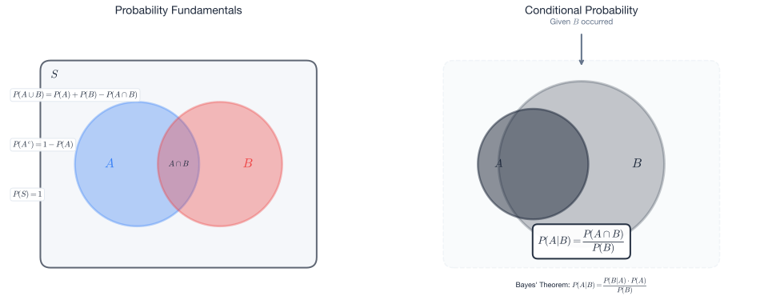
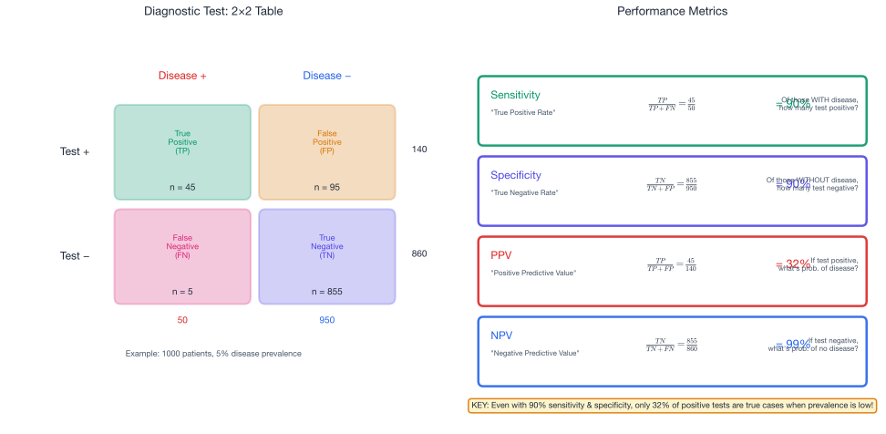

# Week 9: Probability Foundations

## Act III: Predicting Interactions — Chapter 2

> *"Uncertainty is not ignorance—it is information about what we don't know. Probability gives us a language to quantify the unknown with mathematical precision."*

---

## Theme: "Probability Foundations"

**Science Context:** Disease diagnosis, clinical trial interpretation, epidemiological risk assessment

**Learning Outcomes:** At the end of this week you should be able to:

1. Define probability using classical and frequentist interpretations
2. Apply the addition rule and multiplication rule for probability
3. Calculate conditional probabilities using $P(A|B) = P(A \cap B) / P(B)$
4. Apply Bayes' theorem to update probability estimates given new evidence
5. Interpret sensitivity, specificity, and predictive values of diagnostic tests
6. Construct sample spaces and event trees for multi-stage experiments

**Exam Alignment:** Q32, Q33

---

## 1. From Deterministic to Probabilistic Thinking

### The Story So Far

In Week 8, we studied deterministic systems where knowing the initial state and parameters completely determines the future:

| Model | Behavior |
|-------|----------|
| Lotka-Volterra | Trajectories determined by $(H_0, P_0)$ and parameters |
| Logistic growth | Approaches carrying capacity $K$ |
| Exponential | $N(t) = N_0 e^{rt}$ exactly |

**The limitation:** Real-world systems involve **uncertainty**:
- Will a patient test positive?
- Will a treatment be effective?
- How many people will be infected?

### This Week's Challenge

How do we **quantify uncertainty** and reason about events whose outcomes we cannot predict with certainty?

**Why probability matters in science:**
- Disease diagnosis (sensitivity, specificity)
- Clinical trials (treatment efficacy)
- Epidemiology (transmission rates, R₀)
- Genetics (inheritance patterns)
- Risk assessment (environmental, health)

---

## 2. Probability Fundamentals

### 2.1 Random Experiments and Sample Spaces

A **random experiment** is a process whose outcome cannot be predicted with certainty in advance.

**Examples:**
- Tossing a coin
- Testing a patient for a disease
- Contact tracing an infection

The **sample space** $S$ is the set of all possible outcomes.

**Example 2.1: Coin Tosses**

| Experiment | Sample Space |
|------------|--------------|
| One coin toss | $S = \{H, T\}$ |
| Two coin tosses | $S = \{HH, HT, TH, TT\}$ |
| Five coin tosses | $S = \{HHHHH, HHHHT, ...\}$, with $|S| = 2^5 = 32$ |

**Key insight for Q32:** For $n$ coin tosses, the sample space size is $|S| = 2^n$.

### 2.2 Events

An **event** is a subset of the sample space.

**Example 2.2:** Two coin tosses, $S = \{HH, HT, TH, TT\}$

| Event Description | Set Notation |
|-------------------|--------------|
| Two heads | $A = \{HH\}$ |
| At least one head | $B = \{HH, HT, TH\}$ |
| Exactly one head | $C = \{HT, TH\}$ |
| No heads | $D = \{TT\}$ |

An **elementary event** contains exactly one outcome (e.g., $\{HH\}$).

### 2.3 Computing Probabilities

For equally likely outcomes, the probability of event $A$ is:

$$\boxed{P(A) = \frac{\text{Number of outcomes favorable to } A}{\text{Total number of outcomes}} = \frac{|A|}{|S|}}$$

**Example 2.3:** Two fair coin tosses

$$P(\text{Two heads}) = P(\{HH\}) = \frac{1}{4} = 0.25$$

$$P(\text{At least one head}) = P(\{HH, HT, TH\}) = \frac{3}{4} = 0.75$$

$$P(\text{No heads}) = P(\{TT\}) = \frac{1}{4} = 0.25$$

---

## 3. Properties and Rules of Probability



### 3.1 Fundamental Properties

Every probability function satisfies these axioms:

| Property | Statement | Interpretation |
|----------|-----------|----------------|
| **P1** | $P(S) = 1$ | Something must happen |
| **P2** | $P(A) \geq 0$ for all events $A$ | Probabilities are non-negative |
| **P3** | If $A \cap B = \emptyset$, then $P(A \cup B) = P(A) + P(B)$ | Addition for disjoint events |

### 3.2 Derived Rules

From the axioms, we can prove:

**Rule P4 (Empty Event):**
$$\boxed{P(\emptyset) = 0}$$

**Rule P5 (Complement):**
$$\boxed{P(A^c) = 1 - P(A)}$$

This is extremely useful: to find $P(\text{at least one})$, compute $1 - P(\text{none})$.

**Rule P6 (Probability Bounds):**
$$\boxed{0 \leq P(A) \leq 1}$$

**Rule P7 (General Addition):**
$$\boxed{P(A \cup B) = P(A) + P(B) - P(A \cap B)}$$

We subtract $P(A \cap B)$ because outcomes in both $A$ and $B$ get counted twice otherwise.

### 3.3 Example: Applying Probability Rules

**Example 3.1:** Let $P(A) = 0.4$, $P(B) = 0.5$, and $P(A \cap B) = 0.3$.

**(a) Find $P(A \cup B)$ — probability that at least one occurs:**
$$P(A \cup B) = P(A) + P(B) - P(A \cap B) = 0.4 + 0.5 - 0.3 = 0.6$$

**(b) Find $P(A \cap B^c)$ — probability that only $A$ occurs:**
$$P(A) = P(A \cap B) + P(A \cap B^c)$$
$$P(A \cap B^c) = P(A) - P(A \cap B) = 0.4 - 0.3 = 0.1$$

**(c) Find $P((A \cup B)^c)$ — probability that neither occurs:**
$$P((A \cup B)^c) = 1 - P(A \cup B) = 1 - 0.6 = 0.4$$

---

## 4. Exam-Style Application: Coin Tosses (Q32)

### 4.1 Sample Space for Multiple Coin Tosses

For **five coin tosses**, each toss has 2 outcomes. By the multiplication principle:

$$|S| = 2 \times 2 \times 2 \times 2 \times 2 = 2^5 = 32$$

**NOT** $5 \times 2 = 10$ (this is a common error!).

### 4.2 Probability of Exactly $k$ Heads

To get exactly $k$ heads out of $n$ tosses:
1. Choose which $k$ positions are heads: $\binom{n}{k}$ ways
2. Each sequence has probability $(1/2)^n$

$$\boxed{P(\text{exactly } k \text{ heads in } n \text{ tosses}) = \binom{n}{k} \cdot \left(\frac{1}{2}\right)^n}$$

**Example 4.1:** Five fair coins, probability of exactly 3 heads:

$$P(X = 3) = \binom{5}{3} \cdot \left(\frac{1}{2}\right)^5 = 10 \cdot \frac{1}{32} = \frac{10}{32} = 0.3125$$

**Check:** Is this 0.60? No! (Common exam distractor)

### 4.3 Probability of Zero Heads

$$P(X = 0) = \binom{5}{0} \cdot \left(\frac{1}{2}\right)^5 = 1 \cdot \frac{1}{32} = 0.03125$$

**Check:** Is this 0.375? No! (Another exam distractor)

### 4.4 Combinatorial Formula

The binomial coefficient counts the number of ways to choose $k$ items from $n$:

$$\boxed{\binom{n}{k} = \frac{n!}{k!(n-k)!}}$$

where $n! = n \cdot (n-1) \cdot (n-2) \cdots 2 \cdot 1$ and $0! = 1$.

**Example calculations:**

$$\binom{5}{3} = \frac{5!}{3! \cdot 2!} = \frac{5 \cdot 4 \cdot 3!}{3! \cdot 2!} = \frac{5 \cdot 4}{2} = 10$$

$$\binom{5}{0} = \frac{5!}{0! \cdot 5!} = \frac{1}{1} = 1$$

$$\binom{5}{5} = \frac{5!}{5! \cdot 0!} = 1$$

---

## 5. Conditional Probability

### 5.1 Definition

The **conditional probability** of $A$ given that $B$ has occurred is:

$$\boxed{P(A|B) = \frac{P(A \cap B)}{P(B)}, \quad \text{provided } P(B) > 0}$$

**Interpretation:** We restrict our attention to outcomes where $B$ occurred, then ask what fraction of those also have $A$.

### 5.2 Example: Disease and Symptoms

**Example 5.1:** In a population:
- 5% have a disease ($D$)
- 90% of diseased people show symptoms ($S$)
- 10% of healthy people show symptoms

We can organize this information:

| | Disease ($D$) | No Disease ($D^c$) | Total |
|---|---|---|---|
| Symptoms ($S$) | $0.05 \times 0.90 = 0.045$ | $0.95 \times 0.10 = 0.095$ | $0.14$ |
| No Symptoms ($S^c$) | $0.05 \times 0.10 = 0.005$ | $0.95 \times 0.90 = 0.855$ | $0.86$ |
| **Total** | $0.05$ | $0.95$ | $1.00$ |

**(a) What is $P(S|D)$?**
This is given: 90% of diseased people show symptoms, so $P(S|D) = 0.90$.

**(b) What is $P(D|S)$?**
Given symptoms, what's the probability of disease?

$$P(D|S) = \frac{P(D \cap S)}{P(S)} = \frac{0.045}{0.14} \approx 0.321$$

**Key insight:** Even though the test is quite sensitive ($P(S|D) = 0.90$), only about 32% of symptomatic people actually have the disease!

### 5.3 The Multiplication Rule

Rearranging the conditional probability formula:

$$\boxed{P(A \cap B) = P(A|B) \cdot P(B) = P(B|A) \cdot P(A)}$$

This is useful for computing joint probabilities from conditional probabilities.

---

## 6. Bayes' Theorem

### 6.1 Derivation

From the multiplication rule:
$$P(A \cap B) = P(A|B) \cdot P(B) = P(B|A) \cdot P(A)$$

Solving for $P(A|B)$:

$$\boxed{P(A|B) = \frac{P(B|A) \cdot P(A)}{P(B)}}$$

### 6.2 The Law of Total Probability

When $A$ and $A^c$ partition the sample space:

$$\boxed{P(B) = P(B|A) \cdot P(A) + P(B|A^c) \cdot P(A^c)}$$

### 6.3 Bayes' Theorem (Full Form)

Combining these:

$$\boxed{P(A|B) = \frac{P(B|A) \cdot P(A)}{P(B|A) \cdot P(A) + P(B|A^c) \cdot P(A^c)}}$$

### 6.4 Medical Testing Application



**Terminology for diagnostic tests:**

| Term | Definition | Formula |
|------|------------|---------|
| **Sensitivity** | $P(\text{test}+|\text{disease})$ | True positive rate |
| **Specificity** | $P(\text{test}-|\text{no disease})$ | True negative rate |
| **PPV** | $P(\text{disease}|\text{test}+)$ | Positive predictive value |
| **NPV** | $P(\text{no disease}|\text{test}-)$ | Negative predictive value |
| **Prevalence** | $P(\text{disease})$ | Prior probability |

**Example 6.1: HIV Testing**

Consider an HIV test with:
- Sensitivity = 99.5% (catches 99.5% of infected people)
- Specificity = 99.9% (correctly identifies 99.9% of uninfected people)
- Prevalence = 0.1% (1 in 1000 people are infected)

**If you test positive, what is the probability you are infected?**

Let $D$ = infected, $T^+$ = positive test.

Given:
- $P(T^+|D) = 0.995$ (sensitivity)
- $P(T^-|D^c) = 0.999$ so $P(T^+|D^c) = 0.001$ (false positive rate)
- $P(D) = 0.001$

Using Bayes' theorem:

$$P(D|T^+) = \frac{P(T^+|D) \cdot P(D)}{P(T^+|D) \cdot P(D) + P(T^+|D^c) \cdot P(D^c)}$$

$$= \frac{0.995 \times 0.001}{0.995 \times 0.001 + 0.001 \times 0.999}$$

$$= \frac{0.000995}{0.000995 + 0.000999} = \frac{0.000995}{0.001994} \approx 0.499$$

**Surprising result:** Even with a highly accurate test, a positive result only gives about a 50% chance of actually being infected when the disease is rare!

**This is why confirmatory testing is essential.**

---

## 7. Independent Events

### 7.1 Definition

Events $A$ and $B$ are **independent** if:

$$\boxed{P(A \cap B) = P(A) \cdot P(B)}$$

Equivalently, $P(A|B) = P(A)$ — knowing $B$ occurred doesn't change the probability of $A$.

### 7.2 Independence vs. Disjoint Events

These are **different** concepts:

| Property | Definition | Implication |
|----------|------------|-------------|
| **Disjoint** (Mutually exclusive) | $A \cap B = \emptyset$ | If one occurs, the other cannot |
| **Independent** | $P(A \cap B) = P(A) \cdot P(B)$ | One occurring doesn't affect the other's probability |

**Key insight:** Disjoint events with positive probability are **never** independent!

If $A$ and $B$ are disjoint and $P(A), P(B) > 0$:
- $P(A \cap B) = 0$
- $P(A) \cdot P(B) > 0$
- Therefore $P(A \cap B) \neq P(A) \cdot P(B)$

### 7.3 Disease Transmission Example

**Example 7.1:** The probability of transmission upon contact is $p = 0.3$. If 5 independent contacts occur, what is the probability of at least one transmission?

**Method:** Use the complement rule.

$$P(\text{at least one}) = 1 - P(\text{none})$$

For independent events:
$$P(\text{no transmission in 5 contacts}) = (1-0.3)^5 = 0.7^5 = 0.16807$$

Therefore:
$$P(\text{at least one transmission}) = 1 - 0.16807 = 0.83193$$

---

## 8. Connection to Disease Spread

### 8.1 The Basic Reproduction Number Revisited

Recall from the lecture materials that $R_0$ depends on:

$$R_0 = \beta \cdot c \cdot D$$

where:
- $\beta$ = transmissibility (probability of infection per contact)
- $c$ = contact rate (contacts per unit time)
- $D$ = duration of infectiousness

**Probability perspective:** Each contact is a Bernoulli trial with success probability $\beta$.

### 8.2 Herd Immunity Threshold

From the SIR model (Week 9 lecture), the effective reproduction number is:

$$R_e = s \cdot R_0$$

where $s$ is the susceptible proportion.

For the epidemic to fade ($R_e < 1$):

$$s < \frac{1}{R_0} \quad \Rightarrow \quad \pi > 1 - \frac{1}{R_0}$$

where $\pi$ is the immune proportion.

**Example 8.1:** For measles with $R_0 = 15$:

$$\pi > 1 - \frac{1}{15} = 1 - 0.067 = 0.933$$

About 93.3% of the population must be immune to achieve herd immunity.

---

## 9. Tree Diagrams for Sequential Events

### 9.1 Structure

Tree diagrams visualize sequential random experiments:

```
Start
├── First outcome (prob p₁)
│   ├── Second outcome given first (prob p₁₁)
│   └── Alternative second outcome (prob p₁₂)
└── Alternative first outcome (prob p₂)
    ├── Second outcome given alternative first (prob p₂₁)
    └── Alternative second outcome (prob p₂₂)
```

### 9.2 Example: Two-Stage Testing

**Example 9.1:** A screening test has 95% sensitivity and 90% specificity. Those who test positive undergo a confirmatory test with 99% sensitivity and 98% specificity. If prevalence is 2%, what is the probability of being confirmed positive?

**Stage 1 (Screening):**
- $P(T_1^+ | D) = 0.95$
- $P(T_1^+ | D^c) = 0.10$ (false positive)

**Stage 2 (Confirmation, given $T_1^+$):**
- $P(T_2^+ | D) = 0.99$
- $P(T_2^+ | D^c) = 0.02$ (false positive)

**Path probabilities:**

Diseased and confirmed:
$$P(D \cap T_1^+ \cap T_2^+) = 0.02 \times 0.95 \times 0.99 = 0.01881$$

Not diseased but confirmed (false positive path):
$$P(D^c \cap T_1^+ \cap T_2^+) = 0.98 \times 0.10 \times 0.02 = 0.00196$$

Total confirmed positive:
$$P(\text{confirmed}+) = 0.01881 + 0.00196 = 0.02077$$

PPV of two-stage testing:
$$P(D | \text{confirmed}+) = \frac{0.01881}{0.02077} \approx 0.906$$

**Improvement:** The two-stage process increased PPV from approximately 16% (single test) to about 91%!

---

## 10. The Binomial Distribution

### 10.1 When to Use It

The **Binomial distribution** models the number of successes in $n$ **independent** trials, each with the same probability of success $p$. It applies when:

1. There are a **fixed number** of trials $n$
2. Each trial has exactly **two outcomes** (success/failure)
3. The probability of success $p$ is the **same** on every trial
4. The trials are **independent** of each other

### 10.2 The Probability Mass Function (PMF)

The probability of getting **exactly $k$ successes** in $n$ trials is:

$$\boxed{P(X = k) = \binom{n}{k} p^k (1-p)^{n-k}, \quad k = 0, 1, 2, \ldots, n}$$

where:
- $\binom{n}{k} = \frac{n!}{k!(n-k)!}$ counts the number of ways to choose which $k$ trials are successes
- $p^k$ is the probability that those $k$ trials are all successes
- $(1-p)^{n-k}$ is the probability that the remaining trials are all failures

We write $X \sim \text{Binomial}(n, p)$.

### 10.3 Mean and Variance

$$E[X] = np, \qquad \text{Var}(X) = np(1-p)$$

**Intuition:** If each trial succeeds with probability $p$, then on average $np$ out of $n$ trials will succeed. The variance is largest when $p = 0.5$ (maximum uncertainty per trial) and decreases as $p$ approaches 0 or 1.

### 10.4 Example: Disease Transmission

If the probability of transmission per contact is $p = 0.3$ and a person has $n = 10$ contacts:

$$P(X = 3) = \binom{10}{3}(0.3)^3(0.7)^7 = 120 \times 0.027 \times 0.0824 \approx 0.267$$

Expected infections: $E[X] = 10 \times 0.3 = 3$.

This formalises the coin-toss calculations from Section 4 into a general framework applicable to any repeated-trial experiment.

---

## 11. Connection to Scientific Method

### 10.1 Hypothesis Testing Preview

Probability provides the foundation for **statistical inference**—the process of drawing conclusions about populations from sample data.

The key question: *Is our observed data consistent with a hypothesis, or is the discrepancy too large to be due to chance?*

**Example from Q35 context:** If the old virus variant had a 50% transmission rate, and we observe 9 infections out of 11 contacts, is this evidence that the new variant is more infectious?

We'll develop the formal hypothesis testing framework in Week 10, using:
- Null hypothesis ($H_0$): The effect is not real (e.g., $p = 0.50$)
- Alternative hypothesis ($H_a$): The effect is real (e.g., $p > 0.50$)
- p-value: Probability of observing data this extreme if $H_0$ is true

### 10.2 Evidence Evaluation

Probability helps us evaluate evidence:
- **Low probability under $H_0$** → Evidence against $H_0$
- **High probability under $H_0$** → Data consistent with $H_0$

This connects to the scientific method:
1. **Observation:** 9 of 11 contacts resulted in infection
2. **Hypothesis:** New variant is more infectious ($p > 0.50$)
3. **Prediction:** Under $H_0: p = 0.50$, compute $P(X \geq 9)$
4. **Test:** Compare to significance threshold (typically 5%)

---

## 12. Summary: Key Formulas

| Concept | Formula |
|---------|---------|
| Sample space size ($n$ coins) | $|S| = 2^n$ |
| Basic probability | $P(A) = \frac{|A|}{|S|}$ |
| Complement rule | $P(A^c) = 1 - P(A)$ |
| Addition rule | $P(A \cup B) = P(A) + P(B) - P(A \cap B)$ |
| Conditional probability | $P(A|B) = \frac{P(A \cap B)}{P(B)}$ |
| Multiplication rule | $P(A \cap B) = P(A|B) \cdot P(B)$ |
| Independence | $P(A \cap B) = P(A) \cdot P(B)$ |
| Bayes' theorem | $P(A|B) = \frac{P(B|A) \cdot P(A)}{P(B)}$ |
| Binomial coefficient | $\binom{n}{k} = \frac{n!}{k!(n-k)!}$ |
| Binomial probability | $P(X=k) = \binom{n}{k}p^k(1-p)^{n-k}$ |

---

## Learning Outcomes

By the end of this week, you should be able to:

1. ✅ Define sample space, events, and compute probabilities for equally likely outcomes
2. ✅ Apply probability rules (complement, addition, multiplication)
3. ✅ Calculate sample space size for coin toss experiments ($2^n$)
4. ✅ Compute probabilities involving combinations (binomial coefficient)
5. ✅ Calculate and interpret conditional probabilities
6. ✅ Apply Bayes' theorem to medical testing scenarios
7. ✅ Distinguish between independent and disjoint events
8. ✅ Use tree diagrams for sequential probability problems
9. ✅ Connect probability concepts to disease transmission and herd immunity

---

## Exam Alignment

| Exam Question | Topic | Key Skills |
|---------------|-------|------------|
| Q32 | Coin toss probability | Sample space size ($2^n$), binomial probability calculation |
| Q35 (setup) | Conditional probability | Understanding probability statements for hypothesis testing |

---

## Preview: Week 10

Next week, we formalize the concept of **random variables** and develop the framework for **hypothesis testing**. We'll learn:
- Expected value: $E[X] = \sum_i x_i \cdot P(x_i)$
- Bernoulli and Binomial distributions
- One-tailed vs. two-tailed hypothesis tests
- Making decisions under uncertainty

The theme: "Making Decisions Under Uncertainty"

---

## References

- Guerra, F.M., et al. (2017). The basic reproduction number (R0) of measles: a systematic review.
- WHO Global Health Estimates (causes of death by income group)
- Plus Maths: Maths in a Minute - R₀ and Herd Immunity
- Rolland, M., et al. (2020). Molecular dating and viral load growth rates in HIV-1.
- SCIE1500 Lecture Materials (Khan, Hailu, Gaudieri)
