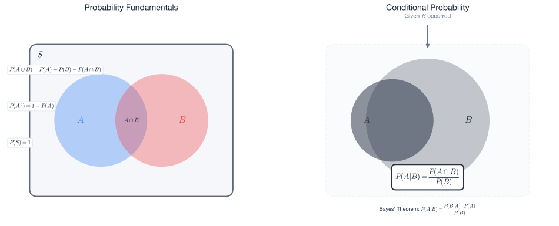
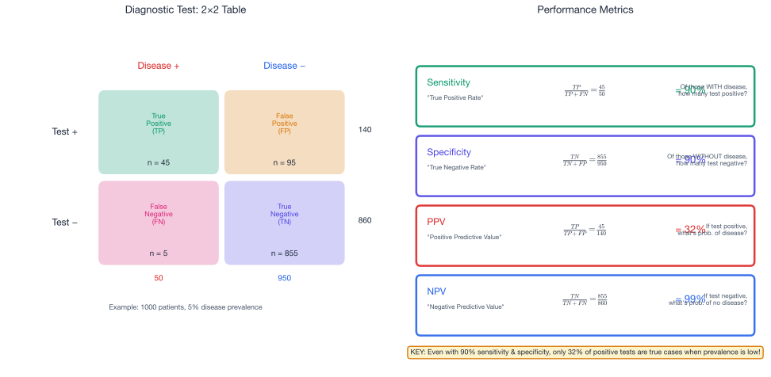

# Week 9: Probability Foundations

## Act III: Predicting Interactions — Chapter 2

> *"Uncertainty is not ignorance—it is information about what we don't know. Probability gives us a language to quantify the unknown with mathematical precision."*

---

## Theme: "Probability Foundations"

**Science Context:** Disease diagnosis, clinical trial interpretation, epidemiological risk assessment

**Learning Outcomes:** At the end of this week you should be able to:

1. Define probability using classical and frequentist interpretations
2. Apply the addition rule and multiplication rule for probability
3. Calculate conditional probabilities using $P(A|B) = P(A \cap B) / P(B)$
4. Apply Bayes' theorem to update probability estimates given new evidence
5. Interpret sensitivity, specificity, and predictive values of diagnostic tests
6. Construct sample spaces and event trees for multi-stage experiments

---

> **📓 About "Try it in Python" boxes:** Throughout this lesson, these boxes reference specific code examples by ID — e.g. **W9-CS03** means *Week 9, Code Snippet 3*. Find the matching code under **Notes → Python Code Snippets** for this week; each entry there is labelled with its ID.

## 1. From Deterministic to Probabilistic Thinking

### The Story So Far

In Week 8, we studied deterministic systems where knowing the initial state and parameters completely determines the future:

| Model           | Behavior                                               |
| --------------- | ------------------------------------------------------ |
| Lotka-Volterra  | Trajectories determined by $(H_0, P_0)$ and parameters |
| Logistic growth | Approaches carrying capacity $K$                       |
| Exponential     | $N(t) = N_0 e^{rt}$ exactly                            |

**The limitation:** Real-world systems involve **uncertainty**:
- Will a patient test positive?
- Will a treatment be effective?
- How many people will be infected?

### This Week's Challenge

How do we **quantify uncertainty** and reason about events whose outcomes we cannot predict with certainty?

**Why probability matters in science:**
- Disease diagnosis (sensitivity, specificity)
- Clinical trials (treatment efficacy)
- Epidemiology (transmission rates, R₀)
- Genetics (inheritance patterns)
- Risk assessment (environmental, health)

### 1.3 The Mathematical Foundation

For over 300 years, probability was used without a rigorous definition. That changed in **1933** when Russian mathematician **Andrey Kolmogorov** published a 62-page monograph that axiomatised the entire subject. His three axioms (Section 3.1 below) are the foundation of everything we do this week — and they have not been revised since. Every statistics textbook, medical test calculation, and AI system today rests on those same three axioms.

---

## 2. Probability Fundamentals

### 2.1 Random Experiments and Sample Spaces

A **random experiment** is a process whose outcome cannot be predicted with certainty in advance.

**Examples:**
- Tossing a coin
- Testing a patient for a disease
- Contact tracing an infection

The **sample space** $S$ is the set of all possible outcomes.

**Example 2.1: Coin Tosses**

| Experiment       | Sample Space                        |
| ---------------- | ----------------------------------- |
| One coin toss    | $S = \{H, T\}$                      |
| Two coin tosses  | $S = \{HH, HT, TH, TT\}$            |
| Five coin tosses | $S = \{HHHHH, HHHHT, ...\}$, with $ | S | = 2^5 = 32$ |

**Key insight:** For $n$ coin tosses, the sample space size is $|S| = 2^n$.

### 2.2 Events

An **event** is a subset of the sample space.

**Example 2.2:** Two coin tosses, $S = \{HH, HT, TH, TT\}$

| Event Description | Set Notation         |
| ----------------- | -------------------- |
| Two heads         | $A = \{HH\}$         |
| At least one head | $B = \{HH, HT, TH\}$ |
| Exactly one head  | $C = \{HT, TH\}$     |
| No heads          | $D = \{TT\}$         |

An **elementary event** contains exactly one outcome (e.g., $\{HH\}$).

### 2.3 Computing Probabilities

For equally likely outcomes, the probability of event $A$ is:

$$\boxed{P(A) = \frac{\text{Number of outcomes favorable to } A}{\text{Total number of outcomes}} = \frac{|A|}{|S|}}$$

**Example 2.3:** Two fair coin tosses

$$P(\text{Two heads}) = P(\{HH\}) = \frac{1}{4} = 0.25$$

$$P(\text{At least one head}) = P(\{HH, HT, TH\}) = \frac{3}{4} = 0.75$$

$$P(\text{No heads}) = P(\{TT\}) = \frac{1}{4} = 0.25$$

> **📓 Try it in Python**
>
> Set up the Python toolkit and compute basic probabilities:
> - **W9-CS01** — *Library Imports*: Load `numpy`, `scipy.stats`, `itertools`, and plotting tools.
> - **W9-CS08** — *Basic Probability Calculation*: Compute $P(A) = |A|/|S|$ from a sample space.
>
> Find these under **Notes → Python Code Snippets** for this week.

---

## 3. Properties and Rules of Probability



### 3.1 Fundamental Properties

Every probability function satisfies these axioms:

| Property | Statement                                                   | Interpretation                 |
| -------- | ----------------------------------------------------------- | ------------------------------ |
| **P1**   | $P(S) = 1$                                                  | Something must happen          |
| **P2**   | $P(A) \geq 0$ for all events $A$                            | Probabilities are non-negative |
| **P3**   | If $A \cap B = \emptyset$, then $P(A \cup B) = P(A) + P(B)$ | Addition for disjoint events   |

### 3.2 Derived Rules

From the axioms, we can prove:

**Rule P4 (Empty Event):**
$$\boxed{P(\emptyset) = 0}$$

**Rule P5 (Complement):**
$$\boxed{P(A^c) = 1 - P(A)}$$

This is extremely useful: to find $P(\text{at least one})$, compute $1 - P(\text{none})$.

**Rule P6 (Probability Bounds):**
$$\boxed{0 \leq P(A) \leq 1}$$

**Rule P7 (General Addition):**
$$\boxed{P(A \cup B) = P(A) + P(B) - P(A \cap B)}$$

We subtract $P(A \cap B)$ because outcomes in both $A$ and $B$ get counted twice otherwise.

### 3.3 Example: Applying Probability Rules

**Example 3.1:** Let $P(A) = 0.4$, $P(B) = 0.5$, and $P(A \cap B) = 0.3$.

**(a) Find $P(A \cup B)$ — probability that at least one occurs:**
$$P(A \cup B) = P(A) + P(B) - P(A \cap B) = 0.4 + 0.5 - 0.3 = 0.6$$

**(b) Find $P(A \cap B^c)$ — probability that only $A$ occurs:**
$$P(A) = P(A \cap B) + P(A \cap B^c)$$
$$P(A \cap B^c) = P(A) - P(A \cap B) = 0.4 - 0.3 = 0.1$$

**(c) Find $P((A \cup B)^c)$ — probability that neither occurs:**
$$P((A \cup B)^c) = 1 - P(A \cup B) = 1 - 0.6 = 0.4$$

> **📓 Try it in Python**
>
> Apply counting rules and enumeration to find probabilities:
> - **W9-CS02** — *Multiplication Principle*: Count outcomes via product of choices.
> - **W9-CS09** — *Enumeration Using Nested Loops*: Build the sample space directly.
> - **W9-CS10** — *Conditional Check in Enumeration*: Filter outcomes that satisfy an event.
> - **W9-CS11** — *Probability Using Combination Formula*: Use $\binom{n}{k}$ to count favourable outcomes.
>
> Find these under **Notes → Python Code Snippets** for this week.

---

## 4. Exam-Style Application: Coin Tosses

### 4.1 Sample Space for Multiple Coin Tosses

For **five coin tosses**, each toss has 2 outcomes. By the multiplication principle:

$$|S| = 2 \times 2 \times 2 \times 2 \times 2 = 2^5 = 32$$

**NOT** $5 \times 2 = 10$ (this is a common error!).

### 4.2 Probability of Exactly $k$ Heads

To get exactly $k$ heads out of $n$ tosses:
1. Choose which $k$ positions are heads: $\binom{n}{k}$ ways
2. Each sequence has probability $(1/2)^n$

$$\boxed{P(\text{exactly } k \text{ heads in } n \text{ tosses}) = \binom{n}{k} \cdot \left(\frac{1}{2}\right)^n}$$

**Example 4.1:** Five fair coins, probability of exactly 3 heads:

$$P(X = 3) = \binom{5}{3} \cdot \left(\frac{1}{2}\right)^5 = 10 \cdot \frac{1}{32} = \frac{10}{32} = 0.3125$$

**Check:** Is this 0.60? No! (Common exam distractor)

### 4.3 Probability of Zero Heads

$$P(X = 0) = \binom{5}{0} \cdot \left(\frac{1}{2}\right)^5 = 1 \cdot \frac{1}{32} = 0.03125$$

**Check:** Is this 0.375? No! (Another exam distractor)

### 4.3b Full Probability Distribution: Five Fair Coins

All six values for $X \sim \text{Binomial}(5,\ 0.5)$:

| Heads ($k$) | $\binom{5}{k}$ | $P(X = k)$       | Decimal     |
| ----------- | -------------- | ---------------- | ----------- |
| 0           | 1              | $1/32$           | 0.03125     |
| 1           | 5              | $5/32$           | 0.15625     |
| 2           | 10             | $10/32$          | 0.31250     |
| **3**       | **10**         | $\mathbf{10/32}$ | **0.31250** |
| 4           | 5              | $5/32$           | 0.15625     |
| 5           | 1              | $1/32$           | 0.03125     |
| **Total**   | **32**         |                  | **1.00000** |

The distribution is symmetric around $k = 2.5$ (because $p = 0.5$). The most likely outcomes are 2 or 3 heads (~31.25% each); getting all heads or all tails is very unlikely (~3% each). All probabilities sum to 1.

### 4.4 Combinatorial Formula

The binomial coefficient counts the number of ways to choose $k$ items from $n$:

$$\boxed{\binom{n}{k} = \frac{n!}{k!(n-k)!}}$$

where $n! = n \cdot (n-1) \cdot (n-2) \cdots 2 \cdot 1$ and $0! = 1$.

**Example calculations:**

$$\binom{5}{3} = \frac{5!}{3! \cdot 2!} = \frac{5 \cdot 4 \cdot 3!}{3! \cdot 2!} = \frac{5 \cdot 4}{2} = 10$$

$$\binom{5}{0} = \frac{5!}{0! \cdot 5!} = \frac{1}{1} = 1$$

$$\binom{5}{5} = \frac{5!}{5! \cdot 0!} = 1$$

> **📓 Try it in Python**
>
> Work through the coin-toss exam question with code:
> - **W9-CS03** — *Factorial Calculations*: Compute $n!$ and intermediate values.
> - **W9-CS04** — *Permutation Formula*: Calculate ordered arrangements.
> - **W9-CS05** — *Listing Permutations with itertools*: Enumerate all orderings.
> - **W9-CS06** — *Listing Combinations with itertools*: Enumerate subsets without order.
> - **W9-CS07** — *Committee Assignment Problem*: Apply combinations to a real selection task.
> - **W9-CS12** — *Exercise A: Specific Sequence Probability*: Compute $P(\text{exact sequence})$.
> - **W9-CS22** — *Exam Connection: Sample Space*: Tie code back to the exam-style question.
>
> Find these under **Notes → Python Code Snippets** for this week.

---

## 5. Conditional Probability

### 5.1 Definition

The **conditional probability** of $A$ given that $B$ has occurred is:

$$\boxed{P(A|B) = \frac{P(A \cap B)}{P(B)}, \quad \text{provided } P(B) > 0}$$

**Interpretation:** We restrict our attention to outcomes where $B$ occurred, then ask what fraction of those also have $A$.

### 5.2 Example: Disease and Symptoms

**Example 5.1:** In a population:
- 5% have a disease ($D$)
- 90% of diseased people show symptoms ($S$)
- 10% of healthy people show symptoms

We can organize this information:

|                     | Disease ($D$)              | No Disease ($D^c$)         | Total  |
| ------------------- | -------------------------- | -------------------------- | ------ |
| Symptoms ($S$)      | $0.05 \times 0.90 = 0.045$ | $0.95 \times 0.10 = 0.095$ | $0.14$ |
| No Symptoms ($S^c$) | $0.05 \times 0.10 = 0.005$ | $0.95 \times 0.90 = 0.855$ | $0.86$ |
| **Total**           | $0.05$                     | $0.95$                     | $1.00$ |

**(a) What is $P(S|D)$?**
This is given: 90% of diseased people show symptoms, so $P(S|D) = 0.90$.

**(b) What is $P(D|S)$?**
Given symptoms, what's the probability of disease?

$$P(D|S) = \frac{P(D \cap S)}{P(S)} = \frac{0.045}{0.14} \approx 0.321$$

**Key insight:** Even though the test is quite sensitive ($P(S|D) = 0.90$), only about 32% of symptomatic people actually have the disease!

### 5.3 The Multiplication Rule

Rearranging the conditional probability formula:

$$\boxed{P(A \cap B) = P(A|B) \cdot P(B) = P(B|A) \cdot P(A)}$$

This is useful for computing joint probabilities from conditional probabilities.

---

## 6. Bayes' Theorem

### 6.0 Thomas Bayes and the History of Inference

**Thomas Bayes** (c. 1701–1761) was a Presbyterian minister and amateur mathematician who solved a fundamental inference problem — and never published it. He wrote his key essay in the 1740s; it was found in his papers *after his death* and presented to the Royal Society in **1763** by his friend Richard Price. **Pierre-Simon Laplace** independently re-derived the result in 1812. **Alan Turing** used it at Bletchley Park in **1941** to crack the Enigma cipher (classified for decades). Today it powers medical diagnosis, spam filters, weather forecasting, and machine learning.

The core intuition:

$$\text{Posterior belief} \propto \text{Likelihood} \times \text{Prior}$$

The "frequentist vs. Bayesian" debate raged through the 20th century. Bayesian methods have since become dominant wherever prior information should update interpretation of new evidence — exactly the situation in medical testing.

### 6.1 Derivation

From the multiplication rule:
$$P(A \cap B) = P(A|B) \cdot P(B) = P(B|A) \cdot P(A)$$

Solving for $P(A|B)$:

$$\boxed{P(A|B) = \frac{P(B|A) \cdot P(A)}{P(B)}}$$

### 6.2 The Law of Total Probability

When $A$ and $A^c$ partition the sample space:

$$\boxed{P(B) = P(B|A) \cdot P(A) + P(B|A^c) \cdot P(A^c)}$$

### 6.3 Bayes' Theorem (Full Form)

Combining these:

$$\boxed{P(A|B) = \frac{P(B|A) \cdot P(A)}{P(B|A) \cdot P(A) + P(B|A^c) \cdot P(A^c)}}$$

### 6.4 Medical Testing Application



**Terminology for diagnostic tests:**

| Term            | Definition           | Formula             |
| --------------- | -------------------- | ------------------- |
| **Sensitivity** | $P(\text{test}+      | \text{disease})$    | True positive rate        |
| **Specificity** | $P(\text{test}-      | \text{no disease})$ | True negative rate        |
| **PPV**         | $P(\text{disease}    | \text{test}+)$      | Positive predictive value |
| **NPV**         | $P(\text{no disease} | \text{test}-)$      | Negative predictive value |
| **Prevalence**  | $P(\text{disease})$  | Prior probability   |

**Example 6.1: HIV Testing in Fiji (2024)**

**Context:** Fiji's HIV prevalence in the general population is approximately **0.1%** (WHO/UNAIDS estimate, 2024). A widely used rapid HIV test has sensitivity 99.5% and specificity 99.9%. In 1985, when HIV testing became available in the USA, the CDC faced the same question with a general-population prevalence of ~0.04% — and concluded that mass screening would produce far more false positives than true positives. Bayes' theorem drove that policy decision. The same mathematics applies to Fiji today.

**Per 100,000 people in Fiji's general population:**

|                       | Test +               | Test − | Total   |
| --------------------- | -------------------- | ------ | ------- |
| **Actually infected** | 100 (true positive)  | 1      | 100     |
| **Not infected**      | 100 (false positive) | 99,800 | 99,900  |
| **Total**             | 200                  | 99,801 | 100,000 |

Let $D$ = HIV positive, $T^+$ = positive rapid test.

Given:
- $P(T^+|D) = 0.995$ (sensitivity)
- $P(T^-|D^c) = 0.999$, so $P(T^+|D^c) = 0.001$ (false positive rate)
- $P(D) = 0.001$ (prevalence 0.1%)

Using Bayes' theorem:

$$P(D|T^+) = \frac{P(T^+|D) \cdot P(D)}{P(T^+|D) \cdot P(D) + P(T^+|D^c) \cdot P(D^c)}$$

$$= \frac{0.995 \times 0.001}{0.995 \times 0.001 + 0.001 \times 0.999}$$

$$= \frac{0.000995}{0.000995 + 0.000999} = \frac{0.000995}{0.001994} \approx 0.499$$

**Surprising result:** Despite 99.5% sensitivity and 99.9% specificity, a positive test in Fiji's general population indicates only a **~50% chance** of actually being infected. The 100 false positives from 99,900 healthy people cancel out the 100 true positives from 100 infected people. This is why confirmatory testing is essential.

### 6.5 Targeted Testing: Prevalence Changes Everything

The PPV of the same test changes dramatically depending on the population being tested. This is the mathematical case for **targeted public-health programmes**.

**Same HIV rapid test (Sens. = 99.5%, Spec. = 99.9%), two populations:**

|                              | General population | People who inject drugs |
| ---------------------------- | ------------------ | ----------------------- |
| Prevalence $P(D)$            | 0.1%               | ~5%                     |
| Per 100,000: infected        | 100                | 5,000                   |
| Per 100,000: true positives  | 100                | 4,975                   |
| Per 100,000: false positives | 100                | 95                      |
| **PPV**                      | **50%**            | **~98%**                |
| Interpretation               | Coin flip          | Nearly certain          |

**The policy insight:** Directing testing resources towards higher-prevalence groups is not just logistically sensible — it is *mathematically* optimal. The exact same test produces a 50% PPV in one population and a ~98% PPV in another, purely because of the difference in prevalence. This is Bayes' theorem as a guide to public-health decision-making.

> **Key rule:** PPV improves when (1) prevalence is higher, (2) specificity is higher, or (3) confirmatory (two-stage) testing is used.

---

## 7. Independent Events

### 7.1 Definition

Events $A$ and $B$ are **independent** if:

$$\boxed{P(A \cap B) = P(A) \cdot P(B)}$$

Equivalently, $P(A|B) = P(A)$ — knowing $B$ occurred doesn't change the probability of $A$.

### 7.2 Independence vs. Disjoint Events

These are **different** concepts:

| Property                          | Definition                      | Implication                                          |
| --------------------------------- | ------------------------------- | ---------------------------------------------------- |
| **Disjoint** (Mutually exclusive) | $A \cap B = \emptyset$          | If one occurs, the other cannot                      |
| **Independent**                   | $P(A \cap B) = P(A) \cdot P(B)$ | One occurring doesn't affect the other's probability |

**Key insight:** Disjoint events with positive probability are **never** independent!

If $A$ and $B$ are disjoint and $P(A), P(B) > 0$:
- $P(A \cap B) = 0$
- $P(A) \cdot P(B) > 0$
- Therefore $P(A \cap B) \neq P(A) \cdot P(B)$

### 7.3 Disease Transmission Example

**Example 7.1:** The probability of transmission upon contact is $p = 0.3$. If 5 independent contacts occur, what is the probability of at least one transmission?

**Method:** Use the complement rule.

$$P(\text{at least one}) = 1 - P(\text{none})$$

For independent events:
$$P(\text{no transmission in 5 contacts}) = (1-0.3)^5 = 0.7^5 = 0.16807$$

Therefore:
$$P(\text{at least one transmission}) = 1 - 0.16807 = 0.83193$$

---

## 8. Connection to Disease Spread

### 8.1 The Basic Reproduction Number Revisited

Recall from the lecture materials that $R_0$ depends on:

$$R_0 = \beta \cdot c \cdot D$$

where:
- $\beta$ = transmissibility (probability of infection per contact)
- $c$ = contact rate (contacts per unit time)
- $D$ = duration of infectiousness

**Probability perspective:** Each contact is a Bernoulli trial with success probability $\beta$.

### 8.2 Herd Immunity Threshold

From the SIR model (Week 9 lecture), the effective reproduction number is:

$$R_e = s \cdot R_0$$

where $s$ is the susceptible proportion.

For the epidemic to fade ($R_e < 1$):

$$s < \frac{1}{R_0} \quad \Rightarrow \quad \pi > 1 - \frac{1}{R_0}$$

where $\pi$ is the immune proportion.

**Example 8.1:** For measles with $R_0 = 15$:

$$\pi > 1 - \frac{1}{15} = 1 - 0.067 = 0.933$$

About 93.3% of the population must be immune to achieve herd immunity.

### 8.3 $R_0$ in Practice: Disease Comparisons

| Disease             | $\beta$ | $c$ | $D$     | $R_0$  | Herd immunity threshold $\pi$ |
| ------------------- | ------- | --- | ------- | ------ | ----------------------------- |
| Measles             | 0.125   | 15  | 8 days  | ~12–18 | **93.3%**                     |
| COVID-19 (original) | 0.025   | 10  | 10 days | ~2–3   | **60%**                       |
| Influenza           | 0.030   | 10  | 5 days  | ~1.5   | **33%**                       |
| Ebola               | 0.100   | 2   | 10 days | ~2     | **50%**                       |

Higher $R_0$ requires a larger vaccinated fraction $\pi > 1 - 1/R_0$ to break transmission chains. Measles requires near-universal immunity (≥93%) because each case contacts so many people; influenza needs only one-third.

---

## 9. Tree Diagrams for Sequential Events

### 9.1 Structure

Tree diagrams visualize sequential random experiments:

```
Start
├── First outcome (prob p₁)
│   ├── Second outcome given first (prob p₁₁)
│   └── Alternative second outcome (prob p₁₂)
└── Alternative first outcome (prob p₂)
    ├── Second outcome given alternative first (prob p₂₁)
    └── Alternative second outcome (prob p₂₂)
```

### 9.2 Example: Two-Stage Testing

**Example 9.1:** A screening test has 95% sensitivity and 90% specificity. Those who test positive undergo a confirmatory test (e.g., a **PCR** — Polymerase Chain Reaction — test that detects viral genetic material) with 99% sensitivity and 98% specificity. If prevalence is 2%, what is the probability of being confirmed positive?

**Stage 1 (Screening):**
- $P(T_1^+ | D) = 0.95$
- $P(T_1^+ | D^c) = 0.10$ (false positive)

**Stage 2 (Confirmation, given $T_1^+$):**
- $P(T_2^+ | D) = 0.99$
- $P(T_2^+ | D^c) = 0.02$ (false positive)

**Path probabilities:**

Diseased and confirmed:
$$P(D \cap T_1^+ \cap T_2^+) = 0.02 \times 0.95 \times 0.99 = 0.01881$$

Not diseased but confirmed (false positive path):
$$P(D^c \cap T_1^+ \cap T_2^+) = 0.98 \times 0.10 \times 0.02 = 0.00196$$

Total confirmed positive:
$$P(\text{confirmed}+) = 0.01881 + 0.00196 = 0.02077$$

PPV of two-stage testing:
$$P(D | \text{confirmed}+) = \frac{0.01881}{0.02077} \approx 0.906$$

**Improvement:** The two-stage process increased PPV from approximately 16% (single test) to about 91%!

> **📓 Try it in Python**
>
> Compute and visualise binomial distributions, then apply to exam-style questions:
> - **W9-CS13** — *Manual Binomial Probability*: Implement the formula from scratch.
> - **W9-CS14** — *Using `scipy.stats.binom.pmf`*: Use the library function.
> - **W9-CS15** — *Binomial Distribution Bar Plot*: Visualise PMF.
> - **W9-CS16** — *Complete Binomial Distribution Loop*: Tabulate $P(X=k)$ for all $k$.
> - **W9-CS17 – CS19** — *Exercise B: Infection Analysis*: Compare $p = 0.45$ vs $p = 0.60$.
> - **W9-CS20** — *Comparing Distributions Side-by-Side*: Two PMFs in one figure.
> - **W9-CS21** — *Distribution Observations Summary*: Summarise mean, mode, spread.
> - **W9-CS23** — *Exam Connection: Hypothesis Testing*: Bridge to next week's content.
> - **W9-CS24** — *Complete Lab Template*: End-to-end starter for the lab notebook.
>
> Find these under **Notes → Python Code Snippets** for this week.

---

## 10. The Binomial Distribution

### 10.1 When to Use It

The **Binomial distribution** models the number of successes in $n$ **independent** trials, each with the same probability of success $p$. It applies when:

1. There are a **fixed number** of trials $n$
2. Each trial has exactly **two outcomes** (success/failure)
3. The probability of success $p$ is the **same** on every trial
4. The trials are **independent** of each other

### 10.2 The Probability Mass Function (PMF)

The probability of getting **exactly $k$ successes** in $n$ trials is:

$$\boxed{P(X = k) = \binom{n}{k} p^k (1-p)^{n-k}, \quad k = 0, 1, 2, \ldots, n}$$

where:
- $\binom{n}{k} = \frac{n!}{k!(n-k)!}$ counts the number of ways to choose which $k$ trials are successes
- $p^k$ is the probability that those $k$ trials are all successes
- $(1-p)^{n-k}$ is the probability that the remaining trials are all failures

We write $X \sim \text{Binomial}(n, p)$.

### 10.3 Mean and Variance

$$E[X] = np, \qquad \text{Var}(X) = np(1-p)$$

**Intuition:** If each trial succeeds with probability $p$, then on average $np$ out of $n$ trials will succeed. The variance is largest when $p = 0.5$ (maximum uncertainty per trial) and decreases as $p$ approaches 0 or 1.

### 10.4 Example: Disease Transmission

If the probability of transmission per contact is $p = 0.3$ and a person has $n = 10$ contacts:

$$P(X = 3) = \binom{10}{3}(0.3)^3(0.7)^7 = 120 \times 0.027 \times 0.0824 \approx 0.267$$

Expected infections: $E[X] = 10 \times 0.3 = 3$.

This formalises the coin-toss calculations from Section 4 into a general framework applicable to any repeated-trial experiment.

> **Looking ahead.** In Week 10 we use distributions like this to compute *expected values* and *variances*, and later (Week 11) we will use them as the basis for **hypothesis testing** — deciding whether observed data are compatible with a theoretical model.

---

## 10.5 Hypothesis Testing: A Preview

The binomial distribution gives us the tools to ask a fundamental scientific question: **Is this result surprising?**

### The Scenario

A pharmaceutical company claims their drug cures **at least 80%** of patients. In a clinical trial of **20 patients**, only **12** are cured.

- $H_0$: $p = 0.80$ — the **null hypothesis**: the drug works exactly as claimed
- $H_a$: $p < 0.80$ — the **alternative hypothesis**: the drug is less effective

The null hypothesis is the default assumption — nothing unusual is happening. We ask whether the observed data provide enough evidence to *reject* this assumption.

### The Binomial Connection

If $H_0$ is true, the number of cures $X \sim \text{Binomial}(20,\, 0.80)$, with:

$$E[X] = 20 \times 0.80 = 16$$

We observed $X = 12$, which is **4 below** the expected value. How surprising is this?

### The p-value

The **p-value** is the probability of observing a result *at least as extreme* as what we saw, assuming $H_0$ is true:

$$p\text{-value} = P(X \leq 12 \mid H_0) \approx 0.032$$

A p-value of 0.032 means: *if the drug really cured 80% of patients, we would observe 12 or fewer cures in only about 3.2% of trials.* This is relatively unlikely — the data are *surprising* under $H_0$.

### Interpreting the p-value

| p-value             | Interpretation                                                  |
| ------------------- | --------------------------------------------------------------- |
| Small (e.g. < 0.05) | Data would be unlikely under $H_0$; evidence against $H_0$      |
| Large (e.g. > 0.05) | Data are consistent with $H_0$; no strong evidence to reject it |

> **Important:** The p-value is **not** the probability that $H_0$ is true. It is the probability of the observed data (or more extreme) *given* that $H_0$ is true.

> **Week 10** formalises the full framework: significance levels ($\alpha$), Type I and Type II errors, and the decision rule for rejecting $H_0$.

## 11. Summary: Key Formulas

| Concept                       | Formula                                              |
| ----------------------------- | ---------------------------------------------------- |
| Sample space size ($n$ coins) | $\lvert S \rvert = 2^n$                              |
| Basic probability             | $P(A) = \dfrac{\lvert A \rvert}{\lvert S \rvert}$    |
| Complement rule               | $P(A^c) = 1 - P(A)$                                  |
| Addition rule                 | $P(A \cup B) = P(A) + P(B) - P(A \cap B)$            |
| Conditional probability       | $P(A \mid B) = \dfrac{P(A \cap B)}{P(B)}$            |
| Multiplication rule           | $P(A \cap B) = P(A \mid B) \cdot P(B)$               |
| Independence                  | $P(A \cap B) = P(A) \cdot P(B)$                      |
| Bayes' theorem                | $P(A \mid B) = \dfrac{P(B \mid A) \cdot P(A)}{P(B)}$ |
| Binomial coefficient          | $\binom{n}{k} = \dfrac{n!}{k!(n-k)!}$                |
| Binomial probability          | $P(X=k) = \binom{n}{k}p^k(1-p)^{n-k}$                |

---
